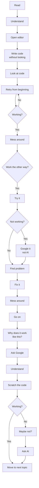

04th Feb, 2026 => Project is much readable now and removed lot of jargon. 

```mermaid
flowchart TD
    A[Read] --> B[Understand]
    B --> C[Open editor]
    C --> D[Write code<br/>without looking]
    D --> E[Look at code]
    E --> F[Retry from beginning]
    F --> G{Working?}
    G -->|Yes| H[Mess around]
    H --> I{Work the other way?}
    I -->|Yes| J[Try it]
    J --> K{Not working?}
    K -->|Yes| L[Google it<br/>not AI]
    K -->|No| M[Find problem]
    L --> M
    M --> N[Fix it]
    N --> O[Mess around]
    O --> P[Go on]
    P --> Q[Why does it work<br/>like this?]
    Q --> R[Ask Google]
    R --> S[Understand]
    S --> T[Scratch the code]
    T --> U{Working?}
    U -->|Yes| V[Move to next topic]
    U -->|No| W[Maybe not?]
    W --> X[Ask AI]
    X --> V
    G -->|No| F
```

~~Thank you~~
Arigato!
