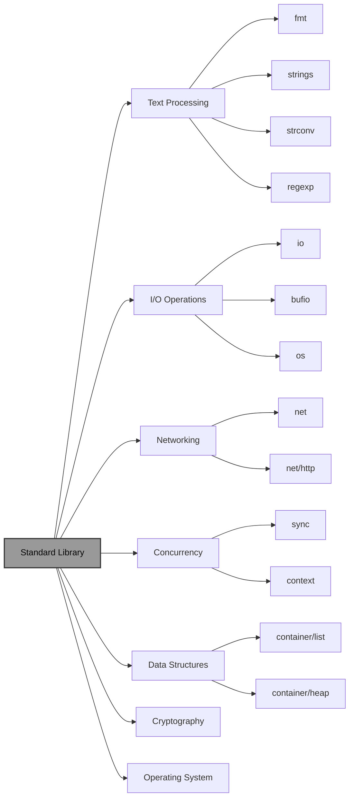

# Go Standard Library

!!! abstract "Overview"
    Learn more about the Go standard library, a powerful collection of packages that provides a vast array of functionalities out of the box. This guide extends our basic Go tutorials by exploring the rich ecosystem of packages available to every Go developer.

!!! tip "Key Points"
    - Go's standard library is comprehensive and well-designed
    - Provides ready-to-use solutions for common programming tasks
    - Eliminates the need for external dependencies in many cases
    - Follows Go's philosophy of simplicity and clarity

## Standard Library

The Go standard library is a collection of packages that are included with every Go installation. It provides a rich set of tools for common programming tasks, from handling I/O to networking and text manipulation.

!!! info "Why it Matters"
    - **Efficiency**: No need to write common functionalities from scratch.
    - **Reliability**: Packages are well-tested and maintained by the Go team.
    - **Consistency**: Provides a standard way of performing common tasks.

The standard library is structured as a hierarchy of packages, each serving a specific purpose:



These are few of the packages that are available in the standard library. There are many more packages available in the standard library. You can find the complete list of packages in the [Go documentation](https://go.dev/doc/).

## Navigating the Standard Library

The standard library is organized into packages, each focusing on a specific area of functionality.

### Key Categories

!!! example "Commonly Used Packages"

    === "Text Processing"
        - `fmt`: Formatted I/O (printing, scanning).
        - `strings`: String manipulation functions.
        - `strconv`: String conversions to and from basic data types.
        - `regexp`: Regular expression support.
        - `encoding/json`: JSON encoding and decoding.
        - `encoding/xml`: XML encoding and decoding.
        - `text/template`: Template generation for text output.

    === "I/O"
        - `io`: Core I/O interfaces.
        - `bufio`: Buffered I/O for improved performance.
        - `os`: Platform-independent operating system functions.
        - `io/ioutil`: Convenience I/O utilities.
        - `filepath`: Platform-independent path manipulation.

    === "Networking"
        - `net`: Networking primitives (TCP/IP, UDP, etc.).
        - `net/http`: HTTP client and server implementations.
        - `net/url`: URL parsing and querying.
        - `net/mail`: Mail message parsing.

    === "Concurrency"
        - `sync`: Synchronization primitives like mutexes and waitgroups.
        - `context`: Managing deadlines, cancellation signals, and other request-scoped values.
        - `atomic`: Low-level atomic memory primitives.
        - `time`: Time measurement and display.

    === "Data Structures"
        - `container/list`: Doubly-linked lists.
        - `container/heap`: Heap implementation.
        - `container/ring`: Circular lists.

### Code Examples

Let's see some of these packages in action with practical examples.

!!! example "Code Snippets"

    === "`fmt`"
        The `fmt` package is one of Go's most popular packages for formatted I/O.

        ```go title="fmt_example.go" linenums="1" hl_lines="3 8 12 15"
        package main

        import "fmt"

        func main() {
            name := "Go"
            year := 2009
            fmt.Printf("%s was released in %d\n", name, year)
            
            // Using formatted verbs
            pi := 3.14159
            fmt.Printf("Pi is approximately %.2f\n", pi)
            
            // Using Println for automatic line breaks
            fmt.Println("Hello,", "world!")
        }
        ```

    === "`strings`"
        The `strings` package provides a rich set of functions for string manipulation.

        ```go title="strings_example.go" linenums="1"
        package main

        import (
            "fmt"
            "strings"
        )

        func main() {
            phrase := "Go is awesome!"
            fmt.Println("Uppercase:", strings.ToUpper(phrase))
            fmt.Println("Contains 'awesome':", strings.Contains(phrase, "awesome"))
            
            // Splitting strings
            csv := "apple,banana,cherry"
            fruits := strings.Split(csv, ",")
            fmt.Println("Fruits:", fruits)
            
            // Joining strings
            words := []string{"Go", "is", "fun"}
            sentence := strings.Join(words, " ")
            fmt.Println("Sentence:", sentence)
        }
        ```

    === "`net/http`"
        With `net/http`, you can create a simple web server in just a few lines of code.

        ```go title="http_server.go" linenums="1"
        package main

        import (
            "fmt"
            "net/http"
        )

        func helloHandler(w http.ResponseWriter, r *http.Request) {
            fmt.Fprint(w, "Hello, Web!")
        }

        func main() {
            http.HandleFunc("/", helloHandler)
            fmt.Println("Server starting on port 8080...")
            http.ListenAndServe(":8080", nil)
        }
        ```

    === "`sync`"
        The `sync` package provides basic synchronization primitives.

        ```go title="sync_example.go" linenums="1"
        package main

        import (
            "fmt"
            "sync"
            "time"
        )

        func worker(id int, wg *sync.WaitGroup) {
            defer wg.Done()
            fmt.Printf("Worker %d starting\n", id)
            time.Sleep(time.Second)
            fmt.Printf("Worker %d done\n", id)
        }

        func main() {
            var wg sync.WaitGroup
            
            for i := 1; i <= 5; i++ {
                wg.Add(1)
                go worker(i, &wg)
            }
            
            wg.Wait()
            fmt.Println("All workers completed")
        }
        ```

## Mastering `import` Statements
To use a package from the standard library (or any other package), you need to `import` it. Understanding the different ways to import packages is crucial for effective Go programming.

### Basic Import

You can import a single package like this:

```go
import "fmt"
```

### Factored Imports

For multiple packages, it's idiomatic to use a factored import statement:

```go title="factored_import.go" hl_lines="4 5 6"
package main

import (
    "fmt"
    "math"
    "strings"
)

func main() {
    fmt.Println(math.Pi)
    fmt.Println(strings.ToUpper("hello"))
}
```

### Import Aliasing

If you need to import a package with a conflicting name or want to use a shorter name, you can use an alias:

```go title="aliased_import.go" hl_lines="4"
package main

import (
    f "fmt" // f is now an alias for the fmt package
)

func main() {
    f.Println("Hello from an alias!")
}
```

### Side-effect Imports

Sometimes you need to import a package solely for its side effects (e.g., initializing a database driver). In this case, you can use the blank identifier `_`:

```go title="side_effect_import.go" hl_lines="5"
package main

import (
    "database/sql"
    _ "github.com/go-sql-driver/mysql" // The driver is registered as a side effect
)

func main() {
    // Your database logic here
}
```

### Import Methods Comparison

!!! example "Import Types and Their Use Cases"
    | Import Type | Syntax | Use Case | Example |
    |:-----------|:-------|:---------|:--------|
    | Single | `import "fmt"` | Simple programs with few dependencies | Basic "Hello World" |
    | Factored | `import (<br>  "fmt"<br>  "math"<br>)` | Most programs with multiple dependencies | Standard practice |
    | Aliased | `import f "fmt"` | Resolving conflicts or shortening names | `import t "time"` |
    | Side-effect | `import _ "driver"` | Registering drivers or initialization | Database drivers |

## Best Practices

!!! tip "Organize Your Imports"
    It's a common convention to group imports into three categories, separated by a blank line:
    1.  Standard library packages
    2.  Third-party packages
    3.  Internal project packages

    ```go
    import (
        "fmt"
        "net/http"

        "github.com/gin-gonic/gin"

        "my-project/internal/models"
    )
    ```

!!! success "Working with the Standard Library"
    1. **Read the Documentation**
        - Official Go docs are excellent
        - Package documentation includes examples
        - Use `go doc` command for quick reference

    2. **Explore Before Creating**
        - Check if functionality already exists
        - Standard library is well-optimized
        - Avoid reinventing the wheel

    3. **Keep Dependencies Minimal**
        - Prefer standard library over third-party
        - Reduces security risks
        - Simplifies maintenance

    4. **Experiment with Examples**
        - Try out package examples
        - Modify them to understand behavior
        - Build confidence before implementation

!!! warning "Common Pitfalls"
    - :x: **Ignoring Package Idioms**
        - Each package has design patterns
        - Using them incorrectly leads to bugs
        - Read package documentation carefully
    
    - :x: **Overusing Aliases**
        - Makes code harder to understand
        - Only use when necessary
        - Stick to standard package names when possible

## Advanced Techniques

!!! example "Power User Features"

    === "Conditional Imports"
        Use build tags to import packages only in specific environments:
        
        ```go
        // +build linux
        
        package main
        
        import (
            "fmt"
            "syscall" // Only available on Unix-like systems
        )
        
        func main() {
            fmt.Println("Running on a Unix-like system")
        }
        ```

    === "Package Documentation"
        Generate documentation for your own packages:
        
        ```bash
        # Generate documentation for a package
        go doc fmt
        
        # Start a local documentation server
        godoc -http=:6060
        ```

    === "Exploring Package Source"
        View the source code of standard library packages:
        
        ```bash
        # Find the source location of a package
        go fmt -print fmt
        
        # Navigate to the source directory
        cd $(go env GOROOT)/src/fmt
        ```

## Quick Reference 

!!! success "Key Takeaways"
    1. **Standard Library**
        - Comprehensive and well-designed
        - First choice for common functionality
        - Reduces external dependencies
    
    2. **Importing Packages**
        - Use factored imports for multiple packages
        - Organize imports by category
        - Use aliases and side-effect imports when needed
    
    3. **Exploration**
        - Read official documentation
        - Experiment with examples
        - Check source code for deeper understanding

!!! quote "Remember"
    > "The standard library is Go's killer feature. It's comprehensive, consistent, and well-designed. Make it your first stop when solving any problem."