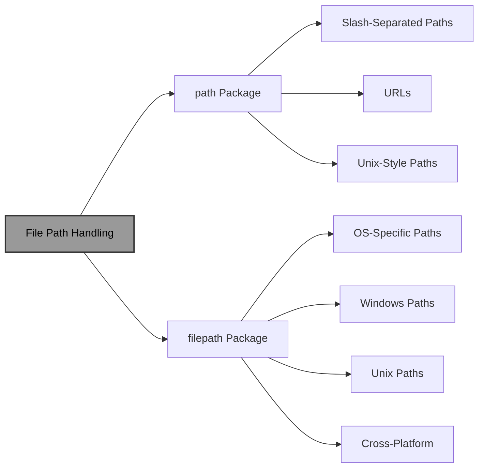
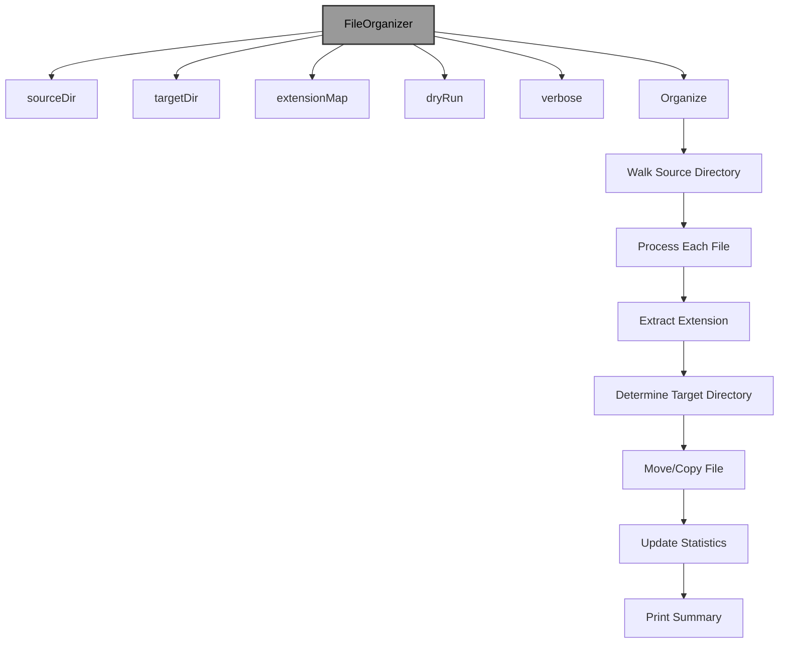

# File Paths in Go: A Comprehensive Guide

!!! abstract "Overview"
Master file path manipulation in Go using the `path` and `filepath` packages. Learn to handle cross-platform path operations, directory management, and build robust file system utilities that work seamlessly across different operating systems.

!!! tip "Key Points"
- Use `path` for slash-separated paths (URLs, Unix-like) and `filepath` for OS-specific paths
- Always use `filepath` for file system operations to ensure cross-platform compatibility
- Clean paths before using them to remove redundant separators and resolve relative references
- Implement proper path validation to prevent security issues like directory traversal
- Leverage `filepath.Walk` for efficient directory traversal with filtering

## Understanding File Paths in Go

File paths are fundamental to working with file systems. Go provides two packages for handling paths:
- `path`: For slash-separated paths (URLs, Unix-like paths)
- `path/filepath`: For operating system-specific file paths (handles both Windows and Unix-style paths)

Understanding how to manipulate file paths correctly is crucial for building cross-platform applications that work seamlessly across different operating systems.

!!! info "Path Packages in Go"


## Basic Path Operations

### 1. Joining Paths

!!! example "Joining Paths"
```go title="path_joining.go" linenums="1" hl_lines="8-18"
package main

import (
	"fmt"
	"path"
	"path/filepath"
)

func main() {
	// Using path package (slash-separated)
	p := path.Join("dir", "subdir", "file.txt")
	fmt.Println("path.Join:", p) // dir/subdir/file.txt

	// Using filepath package (OS-specific)
	fp := filepath.Join("dir", "subdir", "file.txt")
	fmt.Println("filepath.Join:", fp) // On Unix: dir/subdir/file.txt, On Windows: dir\subdir\file.txt
}
```

### 2. Splitting Paths

!!! example "Splitting Paths"
```go title="path_splitting.go" linenums="1" hl_lines="8-20"
package main

import (
	"fmt"
	"path/filepath"
	"strings"
)

func main() {
	// Split into directory and file
	dir, file := path.Split("dir/subdir/file.txt")
	fmt.Printf("dir: %q, file: %q\n", dir, file) // dir: "dir/subdir/", file: "file.txt"

	// Split into components (path package)
	components := strings.Split("dir/subdir/file.txt", "/")
	fmt.Println("Split components:", components) // [dir subdir file.txt]

	// Split into components (filepath package)
	components = strings.Split(filepath.Join("dir", "subdir", "file.txt"), string(filepath.Separator))
	fmt.Println("filepath split components:", components)
}
```

### 3. Cleaning Paths

!!! example "Cleaning Paths"
```go title="path_cleaning.go" linenums="1" hl_lines="8-18"
package main

import (
	"fmt"
	"path"
	"path/filepath"
)

func main() {
	// Clean removes redundant separators and resolves . and ..
	messyPath := "dir//subdir/./file.txt/../other.txt"
	cleaned := path.Clean(messyPath)
	fmt.Println("Original:", messyPath) // dir//subdir/./file.txt/../other.txt
	fmt.Println("Cleaned:", cleaned) // dir/subdir/other.txt

	// filepath.Clean also handles OS-specific separators
	messyPath = filepath.Join("dir", "", "subdir", ".", "file.txt", "..", "other.txt")
	cleaned = filepath.Clean(messyPath)
	fmt.Println("filepath cleaned:", cleaned)
}
```

## Path Components

### 1. Extracting Path Components

!!! example "Extracting Path Components"
```go title="path_components.go" linenums="1" hl_lines="8-20"
package main

import (
	"fmt"
	"path/filepath"
)

func main() {
	fullPath := "/home/user/documents/report.txt"

	// Get directory path
	dir := filepath.Dir(fullPath)
	fmt.Println("Dir:", dir) // /home/user/documents

	// Get file name with extension
	file := filepath.Base(fullPath)
	fmt.Println("Base:", file) // report.txt

	// Get file name without extension
	name := filepath.Base(fullPath[:len(fullPath)-len(filepath.Ext(fullPath))])
	fmt.Println("Name without ext:", name) // report

	// Get extension
	ext := filepath.Ext(fullPath)
	fmt.Println("Extension:", ext) // .txt
}
```

### 2. Working with Extensions

!!! example "Working with Extensions"
```go title="path_extensions.go" linenums="1" hl_lines="8-18"
package main

import (
	"fmt"
	"path/filepath"
	"strings"
)

func main() {
	// Check if path has extension
	path1 := "document.pdf"
	path2 := "document"
	fmt.Println("Has extension:", filepath.Ext(path1) != "") // true
	fmt.Println("Has extension:", filepath.Ext(path2) != "") // false

	// Change extension
	newPath := strings.TrimSuffix(path1, filepath.Ext(path1)) + ".docx"
	fmt.Println("Changed extension:", newPath) // document.docx
}
```

## Absolute and Relative Paths

### 1. Converting Between Path Types

!!! example "Converting Path Types"
```go title="path_types.go" linenums="1" hl_lines="8-22"
package main

import (
	"fmt"
	"os"
	"path/filepath"
)

func main() {
	// Get current working directory
	cwd, err := os.Getwd()
	if err != nil {
		fmt.Println("Error:", err)
		return
	}
	fmt.Println("Current working directory:", cwd)

	// Create relative path
	relPath := "documents/report.txt"
	fmt.Println("Relative path:", relPath)

	// Convert to absolute path
	absPath, err := filepath.Abs(relPath)
	if err != nil {
		fmt.Println("Error:", err)
		return
	}
	fmt.Println("Absolute path:", absPath)

	// Check if path is absolute
	fmt.Println("Is absolute:", filepath.IsAbs(absPath))   // true
	fmt.Println("Is absolute:", filepath.IsAbs(relPath)) // false
}
```

### 2. Relative Path Calculations

!!! example "Relative Path Calculations"
```go title="relative_paths.go" linenums="1" hl_lines="8-18"
package main

import (
	"fmt"
	"path/filepath"
)

func main() {
	// Get relative path between two absolute paths
	path1 := "/home/user/documents"
	path2 := "/home/user/downloads/report.txt"

	relPath, err := filepath.Rel(path1, path2)
	if err != nil {
		fmt.Println("Error:", err)
		return
	}
	fmt.Printf("Relative path from %s to %s: %s\n", path1, path2, relPath)
	// Output: ../downloads/report.txt
}
```

## Directory Operations

### 1. Creating Directories

!!! example "Creating Directories"
```go title="creating_directories.go" linenums="1" hl_lines="8-20"
package main

import (
	"fmt"
	"os"
)

func main() {
	// Create single directory
	err := os.Mkdir("testdir", 0755)
	if err != nil {
		fmt.Println("Error:", err)
	}

	// Create nested directories (MkdirAll)
	err = os.MkdirAll("testdir/nested1/nested2", 0755)
	if err != nil {
		fmt.Println("Error:", err)
	}

	// Clean up
	os.RemoveAll("testdir")
}
```

### 2. Listing Directory Contents

!!! example "Listing Directory Contents"
```go title="listing_directories.go" linenums="1" hl_lines="8-25"
package main

import (
	"fmt"
	"os"
)

func main() {
	// List directory contents
	dir := "."
	entries, err := os.ReadDir(dir)
	if err != nil {
		fmt.Println("Error:", err)
		return
	}

	fmt.Println("Contents of", dir, ":")
	for _, entry := range entries {
		info, err := entry.Info()
		if err != nil {
			fmt.Println("Error getting info:", err)
			continue
		}

		if info.IsDir() {
			fmt.Printf("DIR  %s\n", entry.Name())
		} else {
			fmt.Printf("FILE %s (%d bytes)\n", entry.Name(), info.Size())
		}
	}
}
```

### 3. Walking Directory Trees

!!! example "Walking Directory Trees"
```go title="walking_directories.go" linenums="1" hl_lines="8-30"
package main

import (
	"fmt"
	"os"
	"path/filepath"
	"strings"
)

func main() {
	// Walk directory tree
	root := "."
	fmt.Println("Walking directory tree starting from", root, ":")

	err := filepath.Walk(root, func(path string, info os.FileInfo, err error) error {
		if err != nil {
			return err
		}

		// Skip hidden files (Unix-like)
		if strings.HasPrefix(filepath.Base(path), ".") {
			return nil
		}

		relPath, err := filepath.Rel(root, path)
		if err != nil {
			return err
		}

		depth := strings.Count(relPath, string(filepath.Separator))
		indent := strings.Repeat("  ", depth)

		if info.IsDir() {
			fmt.Printf("%sDIR  %s\n", indent, info.Name())
		} else {
			fmt.Printf("%sFILE %s (%d bytes)\n", indent, info.Name(), info.Size())
		}

		return nil
	})

	if err != nil {
		fmt.Println("Error walking directory:", err)
	}
}
```

## Cross-Platform Considerations

### 1. Path Separator

!!! example "Path Separator"
```go title="path_separator.go" linenums="1" hl_lines="8-15"
package main

import (
	"fmt"
	"path/filepath"
)

func main() {
	// filepath.Separator is OS-specific
	fmt.Println("Path separator:", string(filepath.Separator))
	// On Unix: /
	// On Windows: \

	// filepath.ListSeparator is for PATH environment variable
	fmt.Println("List separator:", string(filepath.ListSeparator))
	// On Unix: :
	// On Windows: ;
}
```

### 2. Volume Names (Windows)

!!! example "Volume Names"
```go title="volume_names.go" linenums="1" hl_lines="8-16"
package main

import (
	"fmt"
	"path/filepath"
)

func main() {
	// Volume names are Windows-specific
	volume := filepath.VolumeName("C:\\Windows\\System32")
	fmt.Println("Volume name:", volume) // C:

	// On Unix, VolumeName returns empty string
	volume = filepath.VolumeName("/usr/bin")
	fmt.Println("Volume name:", volume) // (empty)
}
```

### 3. Handling Different Path Styles

!!! example "Different Path Styles"
```go title="path_styles.go" linenums="1" hl_lines="8-22"
package main

import (
	"fmt"
	"path/filepath"
)

func main() {
	// Match function works with both styles
	unixPath := "/home/user/file.txt"
	windowsPath := "C:\\Users\\user\\file.txt"

	// Match returns true if the pattern matches
	matched, err := filepath.Match("*.txt", unixPath)
	if err != nil {
		fmt.Println("Error:", err)
		return
	}
	fmt.Printf("Match %s: %v\n", unixPath, matched)

	matched, err = filepath.Match("*.txt", windowsPath)
	if err != nil {
		fmt.Println("Error:", err)
		return
	}
	fmt.Printf("Match %s: %v\n", windowsPath, matched)
}
```

## Real-World Example: File Organizer

Let's build a file organizer that sorts files into directories based on their extensions:

!!! example "File Organizer"
```go title="file_organizer.go" linenums="1" hl_lines="8-60"
package main

import (
	"fmt"
	"io"
	"os"
	"path/filepath"
	"strings"
)

// FileOrganizer organizes files into directories based on extensions
type FileOrganizer struct {
	sourceDir      string
	targetDir      string
	extensionMap   map[string]string
	dryRun         bool
	verbose        bool
	movedFiles     int
	skippedFiles   int
	errorFiles     int
}

// NewFileOrganizer creates a new file organizer
func NewFileOrganizer(source, target string) *FileOrganizer {
	return &FileOrganizer{
		sourceDir:    source,
		targetDir:    target,
		extensionMap: map[string]string{
			".txt":  "Documents",
			".doc":  "Documents",
			".docx": "Documents",
			".pdf":  "Documents",
			".jpg":  "Images",
			".jpeg": "Images",
			".png":  "Images",
			".gif":  "Images",
			".mp3":  "Music",
			".wav":  "Music",
			".mp4":  "Videos",
			".avi":  "Videos",
			".mkv":  "Videos",
			".zip":  "Archives",
			".tar":  "Archives",
			".gz":   "Archives",
			".exe":  "Programs",
			".dll":  "Programs",
			".go":   "Source",
			".py":   "Source",
			".js":   "Source",
			".html": "Web",
			".css":  "Web",
		},
		dryRun: false,
		verbose: false,
	}
}

// SetDryRun enables dry run mode (no actual file operations)
func (fo *FileOrganizer) SetDryRun(dryRun bool) {
	fo.dryRun = dryRun
}

// SetVerbose enables verbose output
func (fo *FileOrganizer) SetVerbose(verbose bool) {
	fo.verbose = verbose
}

// AddCustomExtension adds a custom extension mapping
func (fo *FileOrganizer) AddCustomExtension(ext, dir string) {
	if !strings.HasPrefix(ext, ".") {
		ext = "." + ext
	}
	fo.extensionMap[ext] = dir
}

// Organize starts the file organization process
func (fo *FileOrganizer) Organize() error {
	// Create target directory if it doesn't exist
	if err := os.MkdirAll(fo.targetDir, 0755); err != nil {
		return fmt.Errorf("failed to create target directory: %w", err)
	}

	// Walk through source directory
	err := filepath.Walk(fo.sourceDir, func(path string, info os.FileInfo, err error) error {
		if err != nil {
			return err
		}

		// Skip directories
		if info.IsDir() {
			return nil
		}

		// Skip hidden files
		if strings.HasPrefix(filepath.Base(path), ".") {
			return nil
		}

		// Process file
		return fo.processFile(path, info)
	})

	if err != nil {
		return fmt.Errorf("error walking directory: %w", err)
	}

	// Print summary
	fo.printSummary()
	return nil
}

// processFile handles individual file processing
func (fo *FileOrganizer) processFile(path string, info os.FileInfo) error {
	// Get file extension
	ext := strings.ToLower(filepath.Ext(path))

	// Determine target directory
	targetDir := fo.extensionMap[ext]
	if targetDir == "" {
		targetDir = "Other"
	}

	// Create full target path
	relPath, err := filepath.Rel(fo.sourceDir, path)
	if err != nil {
		fo.errorFiles++
		if fo.verbose {
			fmt.Printf("Error getting relative path for %s: %v\n", path, err)
		}
		return nil
	}

	targetPath := filepath.Join(fo.targetDir, targetDir, filepath.Base(relPath))

	// Create target directory if it doesn't exist
	targetDirPath := filepath.Join(fo.targetDir, targetDir)
	if err := os.MkdirAll(targetDirPath, 0755); err != nil {
		fo.errorFiles++
		if fo.verbose {
			fmt.Printf("Error creating directory %s: %v\n", targetDirPath, err)
		}
		return nil
	}

	// Move the file
	if fo.dryRun {
		if fo.verbose {
			fmt.Printf("[DRY RUN] Would move: %s -> %s\n", path, targetPath)
		}
		fo.movedFiles++
	} else {
		if err := os.Rename(path, targetPath); err != nil {
			// If rename fails (cross-device?), try copy and delete
			if err := fo.copyAndDelete(path, targetPath, info); err != nil {
				fo.errorFiles++
				if fo.verbose {
					fmt.Printf("Error moving %s: %v\n", path, err)
				}
				return nil
			}
		}
		if fo.verbose {
			fmt.Printf("Moved: %s -> %s\n", path, targetPath)
		}
		fo.movedFiles++
	}

	return nil
}

// copyAndDelete copies a file and then deletes the original
func (fo *FileOrganizer) copyAndDelete(src, dst string, info os.FileInfo) error {
	// Copy file
	if err := fo.copyFile(src, dst, info); err != nil {
		return err
	}

	// Delete original
	if err := os.Remove(src); err != nil {
		return fmt.Errorf("failed to delete original file: %w", err)
	}

	return nil
}

// copyFile copies a file preserving permissions
func (fo *FileOrganizer) copyFile(src, dst string, info os.FileInfo) error {
	// Open source file
	source, err := os.Open(src)
	if err != nil {
		return err
	}
	defer source.Close()

	// Create destination file
	destination, err := os.OpenFile(dst, os.O_WRONLY|os.O_CREATE|os.O_TRUNC, info.Mode())
	if err != nil {
		return err
	}
	defer destination.Close()

	// Copy content
	_, err = io.Copy(destination, source)
	if err != nil {
		return err
	}

	return nil
}

// printSummary prints the organization summary
func (fo *FileOrganizer) printSummary() {
	fmt.Println("\n=== File Organization Summary ===")
	fmt.Printf("Files moved: %d\n", fo.movedFiles)
	fmt.Printf("Files skipped: %d\n", fo.skippedFiles)
	fmt.Printf("Errors encountered: %d\n", fo.errorFiles)
}

func main() {
	// Create sample directory structure for testing
	sourceDir := "test_source"
	targetDir := "test_target"

	// Create source directory with sample files
	if err := createTestFiles(sourceDir); err != nil {
		fmt.Println("Error creating test files:", err)
		return
	}
	defer os.RemoveAll(sourceDir)
	defer os.RemoveAll(targetDir)

	// Create file organizer
	organizer := NewFileOrganizer(sourceDir, targetDir)
	organizer.SetVerbose(true)
	organizer.SetDryRun(false) // Set to true to test without moving files

	// Add custom extension
	organizer.AddCustomExtension(".log", "Logs")

	// Organize files
	fmt.Println("Organizing files...")
	if err := organizer.Organize(); err != nil {
		fmt.Println("Error organizing files:", err)
		return
	}
}

// createTestFiles creates a directory structure with sample files
func createTestFiles(baseDir string) error {
	// Create base directory
	if err := os.MkdirAll(baseDir, 0755); err != nil {
		return err
	}

	// Create subdirectories
	subdirs := []string{"docs", "images", "music"}
	for _, subdir := range subdirs {
		dirPath := filepath.Join(baseDir, subdir)
		if err := os.Mkdir(dirPath, 0755); err != nil {
			return err
		}
	}

	// Create sample files
	files := map[string]string{
		filepath.Join(baseDir, "document.txt"):         "This is a text document",
		filepath.Join(baseDir, "image.jpg"):           "JPEG image data",
		filepath.Join(baseDir, "music.mp3"):           "MP3 audio data",
		filepath.Join(baseDir, "archive.zip"):          "ZIP archive data",
		filepath.Join(baseDir, "program.go"):          "Go source code",
		filepath.Join(baseDir, "app.log"):             "Application log",
		filepath.Join(baseDir, "docs", "report.pdf"):  "PDF report",
		filepath.Join(baseDir, "images", "photo.png"): "PNG image data",
		filepath.Join(baseDir, "music", "song.wav"):    "WAV audio data",
	}

	for path, content := range files {
		if err := os.WriteFile(path, []byte(content), 0644); err != nil {
			return err
		}
	}

	return nil
}
```

### How This Example Works:

1. **File Organization Logic**:
   - Maps file extensions to target directories
   - Walks through the source directory tree
   - Moves files to appropriate subdirectories based on extensions
   - Handles cross-device moves with copy-and-delete fallback

2. **Path Manipulation**:
   - Uses `filepath.Join` for OS-specific path construction
   - Extracts file extensions with `filepath.Ext`
   - Creates relative paths with `filepath.Rel`
   - Handles directory creation with `os.MkdirAll`

3. **Cross-Platform Support**:
   - Works on both Windows and Unix-like systems
   - Uses `filepath` functions for OS-specific path handling
   - Preserves file permissions during copy operations

4. **Safety Features**:
   - Dry run mode for testing without actual file operations
   - Verbose output for debugging
   - Error handling and reporting
   - Summary statistics

!!! info "File Organizer Architecture"


## Best Practices

!!! tip "Use filepath for File System Paths"
Always use `filepath` for file system operations to ensure cross-platform compatibility.

!!! example "Filepath Usage"
```go title="filepath_usage.go" linenums="1" hl_lines="8-14"
package main

import (
	"fmt"
	"path/filepath"
)

func main() {
	// Good: Use filepath for file system operations
	path := filepath.Join("dir", "subdir", "file.txt")
	absPath, err := filepath.Abs(path)
	
	// Bad: Use path package for file system
	// path = path.Join("dir", "subdir", "file.txt") // May not work on Windows
	fmt.Println("Absolute path:", absPath)
}
```

!!! tip "Clean Paths Before Using"
Clean paths to remove redundant separators and resolve relative references.

!!! example "Path Cleaning"
```go title="path_cleaning_practice.go" linenums="1" hl_lines="8-14"
package main

import (
	"fmt"
	"path/filepath"
)

func main() {
	// Good: Clean paths to remove redundant separators
	messyPath := "dir//subdir/./file.txt/../other.txt"
	cleanPath := filepath.Clean(messyPath)
	fmt.Println("Cleaned path:", cleanPath)
	
	// Bad: Use paths without cleaning
	// May cause issues with redundant separators or relative references
}
```

!!! tip "Handle Path Separators Correctly"
Use `filepath.Separator` for OS-specific separator instead of hardcoding.

!!! example "Path Separators"
```go title="path_separators.go" linenums="1" hl_lines="8-14"
package main

import (
	"fmt"
	"path/filepath"
)

func main() {
	// Good: Use filepath.Separator for OS-specific separator
	separator := string(filepath.Separator)
	fmt.Println("Path separator:", separator)
	
	// Bad: Hardcode separators
	// separator := "/" // Won't work on Windows
	// separator := "\\" // Won't work on Unix
}
```

!!! tip "Check Path Types Before Operations"
Check if a path is absolute or relative before performing operations.

!!! example "Path Type Checking"
```go title="path_type_checking.go" linenums="1" hl_lines="8-16"
package main

import (
	"fmt"
	"path/filepath"
)

func main() {
	path := "documents/report.txt"
	
	// Good: Check if path is absolute or relative
	if filepath.IsAbs(path) {
		fmt.Println("Handling absolute path")
		// Handle absolute path
	} else {
		fmt.Println("Handling relative path")
		// Handle relative path
	}
}
```

## Security Considerations

!!! warning "Path Traversal Prevention"
Validate paths to prevent directory traversal attacks.

!!! example "Path Traversal Prevention"
```go title="path_traversal_prevention.go" linenums="1" hl_lines="8-25"
package main

import (
	"fmt"
	"path/filepath"
	"strings"
)

// Good: Validate paths to prevent directory traversal
func safeJoin(base, path string) (string, error) {
	// Clean the path
	cleanPath := filepath.Clean(filepath.Join(base, path))
	
	// Check if the result is still within base directory
	relPath, err := filepath.Rel(base, cleanPath)
	if err != nil {
		return "", err
	}
	
	// Check if path tries to escape base directory
	if strings.HasPrefix(relPath, ".."+string(filepath.Separator)) {
		return "", fmt.Errorf("invalid path: attempts to escape base directory")
	}
	
	return cleanPath, nil
}

// Bad: Join paths without validation
func unsafeJoin(base, path string) string {
	return filepath.Join(base, path) // May allow directory traversal
}
```

!!! warning "Sanitize User Input"
Always sanitize user-provided paths to prevent security issues.

!!! example "Input Sanitization"
```go title="input_sanitization.go" linenums="1" hl_lines="8-16"
package main

import (
	"fmt"
	"path/filepath"
)

// Good: Sanitize user-provided paths
func sanitizeUserInput(userPath string) string {
	// Clean the path
	return filepath.Clean(userPath)
}

// Bad: Use user input directly
func processUserPath(userPath string) {
	path := filepath.Join("/base", userPath) // Dangerous!
	fmt.Println("Processing path:", path)
}
```

## Performance Considerations

!!! tip "Efficient Directory Walking"
Skip unnecessary files during directory traversal to improve performance.

!!! example "Efficient Directory Walking"
```go title="efficient_directory_walking.go" linenums="1" hl_lines="8-25"
package main

import (
	"fmt"
	"os"
	"path/filepath"
)

// Good: Skip unnecessary files during walk
func walkDirectory(root string, filter func(string) bool) error {
	return filepath.Walk(root, func(path string, info os.FileInfo, err error) error {
		if err != nil {
			return err
		}
		
		// Skip directories
		if info.IsDir() {
			return nil
		}
		
		// Apply filter
		if !filter(path) {
			return nil
		}
		
		// Process file
		return processFile(path)
	})
}

func processFile(path string) error {
	fmt.Println("Processing file:", path)
	return nil
}
```

!!! tip "Cache Path Operations"
Cache frequently used path operations to avoid repeated calculations.

!!! example "Path Operation Caching"
```go title="path_caching.go" linenums="1" hl_lines="8-35"
package main

import (
	"fmt"
	"path/filepath"
	"sync"
)

// Good: Cache frequently used path operations
type PathCache struct {
	baseDir string
	cache   map[string]string
	mu      sync.RWMutex
}

func (pc *PathCache) GetRelativePath(absPath string) (string, error) {
	pc.mu.RLock()
	if relPath, ok := pc.cache[absPath]; ok {
		pc.mu.RUnlock()
		return relPath, nil
	}
	pc.mu.RUnlock()
	
	relPath, err := filepath.Rel(pc.baseDir, absPath)
	if err != nil {
		return "", err
	}
	
	pc.mu.Lock()
	pc.cache[absPath] = relPath
	pc.mu.Unlock()
	
	return relPath, nil
}

// Bad: Recalculate paths every time
func getRelativePathBad(base, absPath string) (string, error) {
	return filepath.Rel(base, absPath) // No caching
}
```

## Quick Reference

!!! success "Key Takeaways"
- **Package Selection**: Use `path` for slash-separated paths (URLs, Unix-like) and `filepath` for OS-specific paths
- **Path Construction**: Always use `filepath.Join` for file system paths to ensure cross-platform compatibility
- **Path Cleaning**: Use `filepath.Clean` to remove redundant separators and resolve relative references
- **Path Components**: Extract directory, filename, and extension with `filepath.Dir`, `filepath.Base`, and `filepath.Ext`
- **Path Types**: Check if paths are absolute or relative with `filepath.IsAbs` and convert between them with `filepath.Abs` and `filepath.Rel`
- **Directory Operations**: Create directories with `os.Mkdir` and `os.MkdirAll`, list contents with `os.ReadDir`, and traverse trees with `filepath.Walk`
- **Cross-Platform**: Use `filepath.Separator` and `filepath.ListSeparator` for OS-specific separators
- **Security**: Validate paths to prevent directory traversal and sanitize user input
- **Performance**: Filter files during directory walks and cache frequently used path operations

!!! quote "Remember"
"File path manipulation is a critical aspect of many Go applications. By using the appropriate packages and following best practices, you can build robust, cross-platform file system utilities that work seamlessly across different operating systems. Always validate paths to prevent security issues and consider performance implications when working with large directory structures."