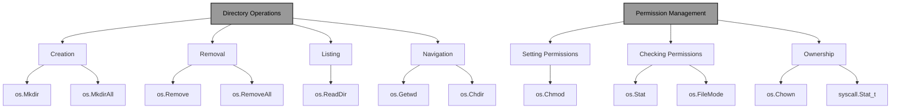
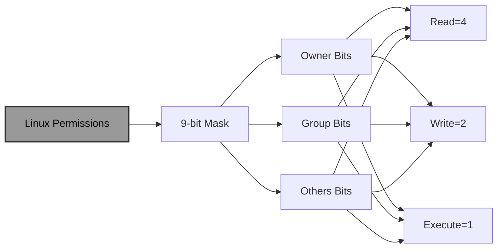
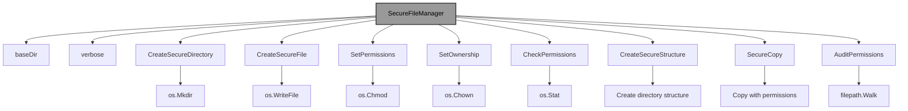

# Directories and Linux Permission Codes in Go: A Comprehensive Guide

!!! abstract "Overview"
Master directory operations and Linux permission management in Go. Learn to create, manage, and secure directories and files using the os package, understand permission codes, implement security best practices, and build cross-platform file system utilities.

!!! tip "Key Points"
- Use `os.Mkdir` and `os.MkdirAll` for creating directories with appropriate permissions
- Linux permissions use octal notation (e.g., 0755 = rwxr-xr-x) and control access for owner, group, and others
- Implement the principle of least privilege when setting file and directory permissions
- Validate paths to prevent directory traversal attacks
- Handle cross-platform differences gracefully, especially for Unix-specific operations

## Understanding Directories and Permissions

In Go, working with directories and file permissions is essential for building robust system utilities and applications. While Go provides cross-platform support, understanding Linux permission codes is crucial for applications targeting Unix-like systems. This guide covers directory operations, permission management, and the intricacies of Linux permission codes.

!!! info "Directory Operations and Permissions"


## Directory Operations

### 1. Creating Directories

!!! example "Creating Directories"
```go title="creating_directories.go" linenums="1" hl_lines="8-25"
package main

import (
	"fmt"
	"os"
)

func main() {
	// Create a single directory
	err := os.Mkdir("mydir", 0755) // 0755 = rwxr-xr-x
	if err != nil {
		fmt.Println("Error creating directory:", err)
		return
	}
	fmt.Println("Directory created successfully")

	// Create nested directories (MkdirAll)
	err = os.MkdirAll("mydir/nested1/nested2", 0755)
	if err != nil {
		fmt.Println("Error creating nested directories:", err)
		return
	}
	fmt.Println("Nested directories created successfully")

	// Clean up
	os.RemoveAll("mydir")
}
```

### 2. Removing Directories

!!! example "Removing Directories"
```go title="removing_directories.go" linenums="1" hl_lines="8-20"
package main

import (
	"fmt"
	"os"
)

func main() {
	// Create test directory structure
	os.MkdirAll("testdir/subdir", 0755)
	
	// Remove empty directory
	err := os.Remove("testdir/subdir")
	if err != nil {
		fmt.Println("Error removing directory:", err)
	}
	
	// Remove directory and all contents (RemoveAll)
	err = os.RemoveAll("testdir")
	if err != nil {
		fmt.Println("Error removing directory tree:", err)
	}
	
	fmt.Println("Directories removed successfully")
}
```

### 3. Listing Directory Contents

!!! example "Listing Directory Contents"
```go title="listing_directory_contents.go" linenums="1" hl_lines="8-35"
package main

import (
	"fmt"
	"os"
)

func main() {
	// Create test directory with files
	os.MkdirAll("testdir", 0755)
	os.WriteFile("testdir/file1.txt", []byte("content1"), 0644)
	os.WriteFile("testdir/file2.txt", []byte("content2"), 0644)
	os.Mkdir("testdir/subdir", 0755)
	
	// Read directory contents
	entries, err := os.ReadDir("testdir")
	if err != nil {
		fmt.Println("Error reading directory:", err)
		return
	}
	
	fmt.Println("Contents of testdir:")
	for _, entry := range entries {
		info, err := entry.Info()
		if err != nil {
			fmt.Println("Error getting info:", err)
			continue
		}
		
		if info.IsDir() {
			fmt.Printf("DIR  %s/\n", entry.Name())
		} else {
			fmt.Printf("FILE %s (%d bytes)\n", entry.Name(), info.Size())
		}
	}
	
	// Clean up
	os.RemoveAll("testdir")
}
```

### 4. Changing Current Directory

!!! example "Changing Current Directory"
```go title="changing_directory.go" linenums="1" hl_lines="8-35"
package main

import (
	"fmt"
	"os"
)

func main() {
	// Get current working directory
	originalDir, err := os.Getwd()
	if err != nil {
		fmt.Println("Error getting current directory:", err)
		return
	}
	fmt.Println("Original directory:", originalDir)
	
	// Create and change to test directory
	os.Mkdir("testdir", 0755)
	err = os.Chdir("testdir")
	if err != nil {
		fmt.Println("Error changing directory:", err)
		return
	}
	
	// Get new current directory
	currentDir, err := os.Getwd()
	if err != nil {
		fmt.Println("Error getting current directory:", err)
		return
	}
	fmt.Println("Current directory:", currentDir)
	
	// Change back to original directory
	err = os.Chdir(originalDir)
	if err != nil {
		fmt.Println("Error changing directory:", err)
		return
	}
	
	// Clean up
	os.RemoveAll("testdir")
}
```

## Understanding Linux Permission Codes

### 1. Permission Basics

Linux permissions are represented by a 9-bit mask divided into three sets of 3 bits each:
- **Owner** (user): rwx
- **Group**: rwx
- **Others**: rwx

Each permission has a numeric value:
- **r** (read) = 4
- **w** (write) = 2
- **x** (execute) = 1

!!! info "Linux Permission Structure"


### 2. Octal Permission Notation

!!! example "Octal Permission Notation"
```go title="octal_permissions.go" linenums="1" hl_lines="8-22"
package main

import (
	"fmt"
)

func main() {
	// Common permission codes and their meanings
	permissions := map[int]string{
		000: "--- --- ---", // No permissions
		400: "r-- --- ---", // Read only for owner
		600: "rw- --- ---", // Read/write for owner
		644: "rw- r-- r--", // Read/write for owner, read for group and others
		700: "rwx --- ---", // Full permissions for owner
		755: "rwxr-xr-x", // Full for owner, read/execute for group and others
		777: "rwxrwxrwx", // Full permissions for everyone
	}
	
	fmt.Println("Common Linux Permission Codes:")
	for code, desc := range permissions {
		fmt.Printf("%03d: %s\n", code, desc)
	}
}
```

### 3. Symbolic Notation

!!! example "Symbolic Notation"
```go title="symbolic_notation.go" linenums="1" hl_lines="8-20"
package main

import (
	"fmt"
)

func main() {
	// Symbolic notation examples
	symbolic := map[string]string{
		"u=rwx":   "Owner: read, write, execute",
		"g=rx":   "Group: read, execute",
		"o=r":     "Others: read",
		"u=rwx,g=rx,o=r": "Owner: rwx, Group: rx, Others: r",
		"a=rwx":   "All: read, write, execute",
	}
	
	fmt.Println("Symbolic Permission Notation:")
	for sym, desc := range symbolic {
		fmt.Printf("%-15s: %s\n", sym, desc)
	}
}
```

## Working with Permissions in Go

### 1. Setting File Permissions

!!! example "Setting File Permissions"
```go title="setting_file_permissions.go" linenums="1" hl_lines="8-30"
package main

import (
	"fmt"
	"os"
)

func main() {
	// Create a file with specific permissions
	content := []byte("Hello, World!")
	
	// Create file with 644 permissions (rw-r--r--)
	err := os.WriteFile("test.txt", content, 0644)
	if err != nil {
		fmt.Println("Error creating file:", err)
		return
	}
	
	// Get file info to check permissions
	info, err := os.Stat("test.txt")
	if err != nil {
		fmt.Println("Error getting file info:", err)
		return
	}
	
	fmt.Printf("File mode: %04o\n", info.Mode().Perm())
	
	// Change permissions to 755 (rwxr-xr-x)
	err = os.Chmod("test.txt", 0755)
	if err != nil {
		fmt.Println("Error changing permissions:", err)
		return
	}
	
	// Verify the change
	info, err = os.Stat("test.txt")
	if err != nil {
		fmt.Println("Error getting file info:", err)
		return
	}
	
	fmt.Printf("New file mode: %04o\n", info.Mode().Perm())
	
	// Clean up
	os.Remove("test.txt")
}
```

### 2. Checking File Permissions

!!! example "Checking File Permissions"
```go title="checking_file_permissions.go" linenums="1" hl_lines="8-60"
package main

import (
	"fmt"
	"os"
)

func main() {
	// Create test files with different permissions
	files := map[string]os.FileMode{
		"readonly.txt":  0444, // r--r--r--
		"readwrite.txt": 0666, // rw-rw-rw-
		"executable.txt": 0755, // rwxr-xr-x
		"private.txt":   0600, // rw-------
	}
	
	for filename, mode := range files {
		os.WriteFile(filename, []byte("test"), mode)
	}
	
	// Check permissions for each file
	for filename := range files {
		info, err := os.Stat(filename)
		if err != nil {
			fmt.Printf("Error getting info for %s: %v\n", filename, err)
			continue
		}
		
		mode := info.Mode().Perm()
		fmt.Printf("%-15s: %04o (%s)\n", filename, mode, permissionString(mode))
	}
	
	// Clean up
	for filename := range files {
		os.Remove(filename)
	}
}

// permissionString converts numeric permissions to symbolic notation
func permissionString(mode os.FileMode) string {
	var result [9]byte
	
	// Owner permissions
	result[0] = 'r'
	if mode&0400 == 0 {
		result[0] = '-'
	}
	result[1] = 'w'
	if mode&0200 == 0 {
		result[1] = '-'
	}
	result[2] = 'x'
	if mode&0100 == 0 {
		result[2] = '-'
	}
	
	// Group permissions
	result[3] = 'r'
	if mode&0040 == 0 {
		result[3] = '-'
	}
	result[4] = 'w'
	if mode&0020 == 0 {
		result[4] = '-'
	}
	result[5] = 'x'
	if mode&0010 == 0 {
		result[5] = '-'
	}
	
	// Others permissions
	result[6] = 'r'
	if mode&0004 == 0 {
		result[6] = '-'
	}
	result[7] = 'w'
	if mode&0002 == 0 {
		result[7] = '-'
	}
	result[8] = 'x'
	if mode&0001 == 0 {
		result[8] = '-'
	}
	
	return string(result[:3]) + " " + string(result[3:6]) + " " + string(result[6:])
}
```

### 3. Checking File Accessibility

!!! example "Checking File Accessibility"
```go title="checking_file_accessibility.go" linenums="1" hl_lines="8-30"
package main

import (
	"fmt"
	"os"
)

func main() {
	// Create test file
	os.WriteFile("test.txt", []byte("test"), 0644)
	
	// Check if file exists
	if _, err := os.Stat("test.txt"); err == nil {
		fmt.Println("File exists")
	}
	
	// Check if file is readable
	file, err := os.Open("test.txt")
	if err == nil {
		fmt.Println("File is readable")
		file.Close()
	}
	
	// Check if file is writable
	file, err = os.OpenFile("test.txt", os.O_WRONLY, 0)
	if err == nil {
		fmt.Println("File is writable")
		file.Close()
	}
	
	// Check if file is executable
	info, _ := os.Stat("test.txt")
	if info.Mode().Perm()&0111 != 0 {
		fmt.Println("File is executable")
	}
	
	// Clean up
	os.Remove("test.txt")
}
```

## Advanced Permission Operations

### 1. Changing Ownership (Unix/Linux only)

!!! example "Changing Ownership"
```go title="changing_ownership.go" linenums="1" hl_lines="8-30"
package main

import (
	"fmt"
	"os"
	"syscall"
)

func main() {
	// Note: This example only works on Unix-like systems
	// You need appropriate permissions to change ownership
	
	// Create test file
	os.WriteFile("test.txt", []byte("test"), 0644)
	
	// Change owner (requires root privileges)
	// err := os.Chown("test.txt", 1000, 1000) // UID=1000, GID=1000
	// if err != nil {
	//     fmt.Println("Error changing ownership:", err)
	// }
	
	// Get file info
	info, err := os.Stat("test.txt")
	if err != nil {
		fmt.Println("Error getting file info:", err)
		return
	}
	
	// Get owner and group (Unix specific)
	if stat, ok := info.Sys().(*syscall.Stat_t); ok {
		fmt.Printf("UID: %d, GID: %d\n", stat.Uid, stat.Gid)
	}
	
	// Clean up
	os.Remove("test.txt")
}
```

### 2. Setting Sticky Bit, SetUID, SetGID

!!! example "Special Permission Bits"
```go title="special_permission_bits.go" linenums="1" hl_lines="8-30"
package main

import (
	"fmt"
	"os"
)

func main() {
	// Create test file
	os.WriteFile("test.txt", []byte("test"), 0644)
	
	// Set sticky bit (used for shared directories)
	err := os.Chmod("test.txt", 01644) // 1000 (sticky bit) + 644
	if err != nil {
		fmt.Println("Error setting sticky bit:", err)
	}
	
	// Set SetUID bit
	err = os.Chmod("test.txt", 04644) // 4000 (SetUID) + 644
	if err != nil {
		fmt.Println("Error setting SetUID bit:", err)
	}
	
	// Set SetGID bit
	err = os.Chmod("test.txt", 02644) // 2000 (SetGID) + 644
	if err != nil {
		fmt.Println("Error setting SetGID bit:", err)
	}
	
	// Check final permissions
	info, err := os.Stat("test.txt")
	if err != nil {
		fmt.Println("Error getting file info:", err)
		return
	}
	
	fmt.Printf("Final mode: %04o\n", info.Mode().Perm())
	
	// Clean up
	os.Remove("test.txt")
}
```

## Real-World Example: Secure File Manager

Let's build a secure file manager that demonstrates directory operations and permission management:

!!! example "Secure File Manager"
```go title="secure_file_manager.go" linenums="1" hl_lines="8-60"
package main

import (
	"fmt"
	"os"
	"path/filepath"
	"strconv"
	"strings"
	"syscall"
)

// SecureFileManager handles file operations with permission management
type SecureFileManager struct {
	baseDir string
	verbose bool
}

// NewSecureFileManager creates a new secure file manager
func NewSecureFileManager(baseDir string, verbose bool) *SecureFileManager {
	return &SecureFileManager{
		baseDir: baseDir,
		verbose: verbose,
	}
}

// CreateSecureDirectory creates a directory with secure permissions
func (sfm *SecureFileManager) CreateSecureDirectory(path string, perm os.FileMode) error {
	fullPath := filepath.Join(sfm.baseDir, path)
	
	if sfm.verbose {
		fmt.Printf("Creating directory: %s with permissions %04o\n", fullPath, perm)
	}
	
	err := os.Mkdir(fullPath, perm)
	if err != nil {
		return fmt.Errorf("failed to create directory: %w", err)
	}
	
	return nil
}

// CreateSecureFile creates a file with secure permissions
func (sfm *SecureFileManager) CreateSecureFile(path string, content []byte, perm os.FileMode) error {
	fullPath := filepath.Join(sfm.baseDir, path)
	
	if sfm.verbose {
		fmt.Printf("Creating file: %s with permissions %04o\n", fullPath, perm)
	}
	
	err := os.WriteFile(fullPath, content, perm)
	if err != nil {
		return fmt.Errorf("failed to create file: %w", err)
	}
	
	return nil
}

// SetPermissions sets file or directory permissions
func (sfm *SecureFileManager) SetPermissions(path string, perm os.FileMode) error {
	fullPath := filepath.Join(sfm.baseDir, path)
	
	if sfm.verbose {
		fmt.Printf("Setting permissions for %s to %04o\n", fullPath, perm)
	}
	
	err := os.Chmod(fullPath, perm)
	if err != nil {
		return fmt.Errorf("failed to set permissions: %w", err)
	}
	
	return nil
}

// SetOwnership sets file ownership (Unix/Linux only)
func (sfm *SecureFileManager) SetOwnership(path string, uid, gid int) error {
	fullPath := filepath.Join(sfm.baseDir, path)
	
	if sfm.verbose {
		fmt.Printf("Setting ownership for %s to UID:%d GID:%d\n", fullPath, uid, gid)
	}
	
	err := os.Chown(fullPath, uid, gid)
	if err != nil {
		return fmt.Errorf("failed to set ownership: %w", err)
	}
	
	return nil
}

// CheckPermissions checks and reports file permissions
func (sfm *SecureFileManager) CheckPermissions(path string) error {
	fullPath := filepath.Join(sfm.baseDir, path)
	
	info, err := os.Stat(fullPath)
	if err != nil {
		return fmt.Errorf("failed to stat file: %w", err)
	}
	
	mode := info.Mode().Perm()
	fmt.Printf("Permissions for %s:\n", fullPath)
	fmt.Printf("  Octal: %04o\n", mode)
	fmt.Printf("  Symbolic: %s\n", permissionString(mode))
	
	// Check accessibility
	sfm.checkAccessibility(fullPath, mode)
	
	return nil
}

// checkAccessibility checks if file is readable/writable/executable
func (sfm *SecureFileManager) checkAccessibility(path string, mode os.FileMode) {
	// Check readability
	file, err := os.Open(path)
	if err == nil {
		fmt.Println("  Readable: Yes")
		file.Close()
	} else {
		fmt.Println("  Readable: No")
	}
	
	// Check writability
	file, err = os.OpenFile(path, os.O_WRONLY, 0)
	if err == nil {
		fmt.Println("  Writable: Yes")
		file.Close()
	} else {
		fmt.Println("  Writable: No")
	}
	
	// Check executability
	if mode&0111 != 0 {
		fmt.Println("  Executable: Yes")
	} else {
		fmt.Println("  Executable: No")
	}
}

// CreateSecureStructure creates a secure directory structure
func (sfm *SecureFileManager) CreateSecureStructure() error {
	// Create base directory
	if err := sfm.CreateSecureDirectory("", 0755); err != nil {
		return err
	}
	
	// Create subdirectories with appropriate permissions
	dirs := map[string]os.FileMode{
		"docs":       0755, // rwxr-xr-x
		"bin":        0755, // rwxr-xr-x
		"etc":        0755, // rwxr-xr-x
		"var":        0755, // rwxr-xr-x
		"tmp":        01777, // rwxrwxrwt (sticky bit)
		"logs":       0750, // rwxr-x---
		"config":     0750, // rwxr-x---
	}
	
	for dir, perm := range dirs {
		if err := sfm.CreateSecureDirectory(dir, perm); err != nil {
			return err
		}
	}
	
	// Create configuration files with secure permissions
	configFiles := map[string]string{
		"config/app.conf":    "app configuration",
		"config/database.conf": "database configuration",
		"logs/app.log":       "application log",
	}
	
	for path, content := range configFiles {
		perm := os.FileMode(0640) // rw-r-----
		if strings.Contains(path, "logs") {
			perm = 0640 // rw-r-----
		}
		if err := sfm.CreateSecureFile(path, []byte(content), perm); err != nil {
			return err
		}
	}
	
	// Create executable scripts
	scripts := map[string]string{
		"bin/start.sh": "#!/bin/bash\necho \"Starting application\"",
		"bin/stop.sh":  "#!/bin/bash\necho \"Stopping application\"",
	}
	
	for path, content := range scripts {
		if err := sfm.CreateSecureFile(path, []byte(content), 0755); err != nil {
			return err
		}
	}
	
	return nil
}

// SecureCopy copies a file with preserved permissions
func (sfm *SecureFileManager) SecureCopy(src, dst string) error {
	srcPath := filepath.Join(sfm.baseDir, src)
	dstPath := filepath.Join(sfm.baseDir, dst)
	
	if sfm.verbose {
		fmt.Printf("Secure copying %s to %s\n", srcPath, dstPath)
	}
	
	// Get source file info
	info, err := os.Stat(srcPath)
	if err != nil {
		return fmt.Errorf("failed to stat source file: %w", err)
	}
	
	// Copy file content
	content, err := os.ReadFile(srcPath)
	if err != nil {
		return fmt.Errorf("failed to read source file: %w", err)
	}
	
	// Create destination file with same permissions
	err = os.WriteFile(dstPath, content, info.Mode())
	if err != nil {
		return fmt.Errorf("failed to write destination file: %w", err)
	}
	
	// Copy ownership if possible
	if stat, ok := info.Sys().(*syscall.Stat_t); ok {
		err = os.Chown(dstPath, stat.Uid, stat.Gid)
		if err != nil {
			fmt.Printf("Warning: Failed to copy ownership: %v\n", err)
		}
	}
	
	return nil
}

// AuditPermissions audits all files and directories
func (sfm *SecureFileManager) AuditPermissions() error {
	return filepath.Walk(sfm.baseDir, func(path string, info os.FileInfo, err error) error {
		if err != nil {
			return err
		}
		
		relPath, err := filepath.Rel(sfm.baseDir, path)
		if err != nil {
			return err
		}
		
		if info.IsDir() {
			fmt.Printf("Directory: %s\n", relPath)
		} else {
			fmt.Printf("File: %s\n", relPath)
		}
		
		mode := info.Mode().Perm()
		fmt.Printf("  Permissions: %04o (%s)\n", mode, permissionString(mode))
		
		// Check for potential security issues
		if info.IsDir() && mode&0022 != 0 {
			fmt.Printf("  WARNING: Directory is writable by group/others\n")
		}
		
		if !info.IsDir() && mode&0111 != 0 {
			fmt.Printf("  INFO: File is not executable\n")
		}
		
		if mode&0002 != 0 && !info.IsDir() {
			fmt.Printf("  WARNING: File is writable by others\n")
		}
		
		return nil
	})
}

// permissionString converts numeric permissions to symbolic notation
func permissionString(mode os.FileMode) string {
	var result [9]byte
	
	// Owner permissions
	result[0] = 'r'
	if mode&0400 == 0 {
		result[0] = '-'
	}
	result[1] = 'w'
	if mode&0200 == 0 {
		result[1] = '-'
	}
	result[2] = 'x'
	if mode&0100 == 0 {
		result[2] = '-'
	}
	
	// Group permissions
	result[3] = 'r'
	if mode&0040 == 0 {
		result[3] = '-'
	}
	result[4] = 'w'
	if mode&0020 == 0 {
		result[4] = '-'
	}
	result[5] = 'x'
	if mode&0010 == 0 {
		result[5] = '-'
	}
	
	// Others permissions
	result[6] = 'r'
	if mode&0004 == 0 {
		result[6] = '-'
	}
	result[7] = 'w'
	if mode&0002 == 0 {
		result[7] = '-'
	}
	result[8] = 'x'
	if mode&0001 == 0 {
		result[8] = '-'
	}
	
	return string(result[:3]) + " " + string(result[3:6]) + " " + string(result[6:])
}

func main() {
	// Create secure file manager
	manager := NewSecureFileManager("secure_app", true)
	
	// Create secure directory structure
	fmt.Println("Creating secure directory structure...")
	if err := manager.CreateSecureStructure(); err != nil {
		fmt.Printf("Error creating structure: %v\n", err)
		return
	}
	
	// Check permissions of a specific file
	fmt.Println("\nChecking permissions of config/app.conf:")
	if err := manager.CheckPermissions("config/app.conf"); err != nil {
		fmt.Printf("Error: %v\n", err)
	}
	
	// Secure copy example
	fmt.Println("\nPerforming secure copy...")
	if err := manager.SecureCopy("config/app.conf", "config/app.conf.bak"); err != nil {
		fmt.Printf("Error: %v\n", err)
	}
	
	// Audit all permissions
	fmt.Println("\nAuditing permissions...")
	if err := manager.AuditPermissions(); err != nil {
		fmt.Printf("Error during audit: %v\n", err)
	}
	
	// Clean up
	fmt.Println("\nCleaning up...")
	os.RemoveAll("secure_app")
}
```

### How This Example Works:

1. **Secure Directory Creation**:
   - Creates directories with appropriate permissions
   - Uses standard Unix permission conventions
   - Implements special permissions (like sticky bit for /tmp)

2. **File Permission Management**:
   - Creates files with secure default permissions
   - Provides methods to change permissions
   - Supports ownership changes (on Unix systems)

3. **Permission Auditing**:
   - Analyzes all files and directories
   - Identifies potential security issues
   - Reports permissions in both octal and symbolic notation

4. **Secure Operations**:
   - Copies files while preserving permissions
   - Maintains ownership when possible
   - Verifies accessibility (read/write/execute)

!!! info "Secure File Manager Architecture"


## Best Practices

!!! tip "Use Principle of Least Privilege"
Always use the minimal necessary permissions for files and directories.

!!! example "Principle of Least Privilege"
```go title="least_privilege.go" linenums="1" hl_lines="8-14"
package main

import (
	"fmt"
	"os"
)

// Good: Use minimal necessary permissions
func createConfigFile() error {
	return os.WriteFile("config.json", configData, 0600) // rw-------
}

// Bad: Use overly permissive permissions
func createConfigFileBad() error {
	return os.WriteFile("config.json", configData, 0666) // rw-rw-rw-
}
```

!!! tip "Secure Directory Permissions"
Use appropriate directory permissions to prevent unauthorized access.

!!! example "Secure Directory Permissions"
```go title="secure_directory_permissions.go" linenums="1" hl_lines="8-14"
package main

import (
	"fmt"
	"os"
)

// Good: Use appropriate directory permissions
func createAppDirectory() error {
	return os.Mkdir("app", 0755) // rwxr-xr-x
}

// Bad: Use world-writable directories
func createAppDirectoryBad() error {
	return os.Mkdir("app", 0777) // rwxrwxrwx
}
```

!!! tip "Handle Cross-Platform Differences"
Check platform before performing Unix-specific operations.

!!! example "Cross-Platform Handling"
```go title="cross_platform_handling.go" linenums="1" hl_lines="8-18"
package main

import (
	"fmt"
	"os"
	"runtime"
)

// Good: Check platform before Unix-specific operations
func setOwnership(path string, uid, gid int) error {
	if runtime.GOOS != "windows" {
		return os.Chown(path, uid, gid)
	}
	return nil // Ownership not applicable on Windows
}

// Bad: Assume Unix-like system
func setOwnershipBad(path string, uid, gid int) error {
	return os.Chown(path, uid, gid) // Will fail on Windows
}
```

!!! tip "Validate Paths Before Operations"
Validate paths to prevent directory traversal attacks.

!!! example "Path Validation"
```go title="path_validation.go" linenums="1" hl_lines="8-20"
package main

import (
	"fmt"
	"path/filepath"
	"strings"
)

// Good: Validate paths to prevent directory traversal
func safeJoin(base, path string) (string, error) {
	cleanPath := filepath.Clean(filepath.Join(base, path))
	if !strings.HasPrefix(cleanPath, base) {
		return "", fmt.Errorf("invalid path: attempts to escape base directory")
	}
	return cleanPath, nil
}

// Bad: Join paths without validation
func unsafeJoin(base, path string) string {
	return filepath.Join(base, path) // Potentially unsafe
}
```

## Security Considerations

!!! warning "Directory Traversal Prevention"
Validate and sanitize paths to prevent directory traversal attacks.

!!! example "Directory Traversal Prevention"
```go title="directory_traversal_prevention.go" linenums="1" hl_lines="8-22"
package main

import (
	"fmt"
	"path/filepath"
	"strings"
)

// Good: Validate and sanitize paths
func safeFilePath(baseDir, userPath string) (string, error) {
	// Remove any .. components
	cleanPath := filepath.Clean(filepath.Join(baseDir, userPath))
	
	// Ensure the result is still within baseDir
	relPath, err := filepath.Rel(baseDir, cleanPath)
	if err != nil || strings.HasPrefix(relPath, "..") {
		return "", fmt.Errorf("invalid path: %s", userPath)
	}
	
	return cleanPath, nil
}

// Bad: Directly use user input
func unsafeFilePath(baseDir, userPath string) string {
	return filepath.Join(baseDir, userPath) // Vulnerable to traversal
}
```

!!! warning "Permission Validation"
Validate permissions before operations to ensure proper access control.

!!! example "Permission Validation"
```go title="permission_validation.go" linenums="1" hl_lines="8-22"
package main

import (
	"fmt"
	"os"
)

// Good: Validate permissions before operations
func validatePermissions(path string, required os.FileMode) error {
	info, err := os.Stat(path)
	if err != nil {
		return err
	}
	
	currentMode := info.Mode().Perm()
	if currentMode&required != required {
		return fmt.Errorf("insufficient permissions: have %o, need %o", currentMode, required)
	}
	
	return nil
}

// Bad: Assume permissions are correct
func unsafeWrite(path string, data []byte) error {
	return os.WriteFile(path, data, 0644) // May fail due to permissions
}
```

!!! warning "Sensitive File Handling"
Handle sensitive files with secure permissions to prevent unauthorized access.

!!! example "Sensitive File Handling"
```go title="sensitive_file_handling.go" linenums="1" hl_lines="8-28"
package main

import (
	"fmt"
	"os"
	"runtime"
)

// Good: Handle sensitive files with secure permissions
func createSecureConfig(config []byte) error {
	// Create with restrictive permissions
	err := os.WriteFile("config.json", config, 0600) // rw-------
	if err != nil {
		return err
	}
	
	// Set ownership to application user if possible
	if runtime.GOOS != "windows" {
		uid, gid := getAppUserIDs()
		return os.Chown("config.json", uid, gid)
	}
	
	return nil
}

// Bad: Create sensitive files with default permissions
func createSecureConfigBad(config []byte) error {
	return os.WriteFile("config.json", config, 0644) // Readable by group/others
}

func getAppUserIDs() (int, int) {
	// Implementation would get current user's UID and GID
	return 1000, 1000
}
```

## Quick Reference

!!! success "Key Takeaways"
- **Directory Operations**: Use `os.Mkdir` for single directories and `os.MkdirAll` for nested structures
- **Permission Codes**: Linux permissions use octal notation (e.g., 0755 = rwxr-xr-x) with separate bits for owner, group, and others
- **Permission Values**: Read=4, Write=2, Execute=1 (add them together for combined permissions)
- **File Operations**: Use `os.Chmod` to change permissions and `os.Stat` to check current permissions
- **Ownership**: Use `os.Chown` on Unix systems to change file ownership (requires appropriate privileges)
- **Special Bits**: Use sticky bit (1000), SetUID (4000), and SetGID (2000) for special permission cases
- **Security**: Always validate paths to prevent directory traversal and use the principle of least privilege
- **Cross-Platform**: Check platform before using Unix-specific features like ownership changes

!!! quote "Remember"
"Directory operations and permission management are crucial for building secure and robust system utilities in Go. By understanding Linux permission codes and following security best practices, you can create applications that properly protect sensitive data and maintain system integrity. Always use the principle of least privilege, validate paths to prevent traversal attacks, and handle cross-platform differences gracefully."