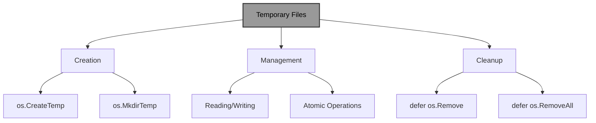
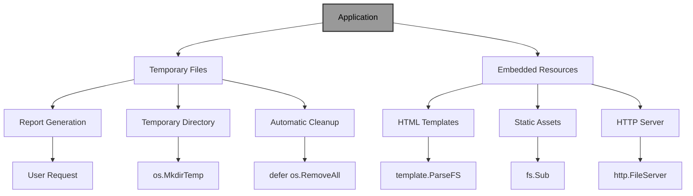

# Temporary Files and Directories and the Embed Directive in Go

!!! abstract "Overview"
Master temporary file management and resource embedding in Go. Learn to create and manage temporary files and directories for intermediate data processing, and utilize the embed directive to bundle assets directly into your binary for simplified deployment and distribution.

!!! tip "Key Points"
- Use `os.CreateTemp` and `os.MkdirTemp` for creating temporary files and directories with automatic cleanup
- Always clean up temporary resources using `defer` to prevent disk space issues
- The embed directive (Go 1.16+) allows bundling files and directories directly into the binary
- Embedded files are read-only and available at compile time, making them ideal for static assets
- Combine temporary files with embedded resources to create self-contained, robust applications

## Understanding Temporary Files and Directories

Working with temporary files and directories is a common requirement in many applications, such as:
- Storing intermediate data during processing
- Creating scratch files for complex operations
- Handling file uploads in web applications
- Testing file operations without affecting the main file system

Go provides the `os` package for creating and managing temporary files and directories.

!!! info "Temporary File Operations"


## Creating Temporary Files

!!! example "Creating Temporary Files"
```go title="creating_temp_files.go" linenums="1" hl_lines="8-18"
package main

import (
    "fmt"
    "io"
    "log"
    "os"
)

func main() {
    // Create a temporary file
    tmpFile, err := os.CreateTemp("", "example-*.txt")
    if err != nil {
        log.Fatal(err)
    }
    defer os.Remove(tmpFile.Name()) // Clean up the file afterwards
    defer tmpFile.Close()

    fmt.Printf("Created temporary file: %s\n", tmpFile.Name())

    // Write some data to the temporary file
    _, err = io.WriteString(tmpFile, "This is temporary data\n")
    if err != nil {
        log.Fatal(err)
    }

    // Read the data back
    _, err = tmpFile.Seek(0, 0)
    if err != nil {
        log.Fatal(err)
    }

    content, err := io.ReadAll(tmpFile)
    if err != nil {
        log.Fatal(err)
    }

    fmt.Printf("File content: %s", string(content))
}
```

## Creating Temporary Directories

!!! example "Creating Temporary Directories"
```go title="creating_temp_directories.go" linenums="1" hl_lines="8-22"
package main

import (
    "fmt"
    "log"
    "os"
    "path/filepath"
)

func main() {
    // Create a temporary directory
    tmpDir, err := os.MkdirTemp("", "example-dir-*")
    if err != nil {
        log.Fatal(err)
    }
    defer os.RemoveAll(tmpDir) // Clean up the directory afterwards

    fmt.Printf("Created temporary directory: %s\n", tmpDir)

    // Create a file inside the temporary directory
    filePath := filepath.Join(tmpDir, "testfile.txt")
    file, err := os.Create(filePath)
    if err != nil {
        log.Fatal(err)
    }
    defer file.Close()

    // Write to the file
    _, err = file.WriteString("Hello, temporary directory!")
    if err != nil {
        log.Fatal(err)
    }

    fmt.Printf("Created file: %s\n", filePath)
}
```

## Best Practices for Temporary Files

!!! tip "Best Practices"
Always follow these practices when working with temporary files to ensure security and proper resource management.

!!! example "Best Practices Implementation"
```go title="temp_files_best_practices.go" linenums="1" hl_lines="8-25"
package main

import (
    "fmt"
    "log"
    "os"
    "path/filepath"
)

func main() {
    // Create a temporary file with a specific pattern
    tmpFile, err := os.CreateTemp("", "report-*.csv")
    if err != nil {
        log.Fatal(err)
    }
    defer os.Remove(tmpFile.Name())
    defer tmpFile.Close()

    // Write CSV data
    csvData := "Name,Age,City\nJohn,30,New York\nJane,25,Chicago\n"
    _, err = tmpFile.WriteString(csvData)
    if err != nil {
        log.Fatal(err)
    }

    // For final storage, we can rename the file atomically
    finalPath := filepath.Join(os.TempDir(), "final_report.csv")
    err = os.Rename(tmpFile.Name(), finalPath)
    if err != nil {
        log.Fatal(err)
    }

    fmt.Printf("Report saved to: %s\n", finalPath)
}
```

## Understanding the Embed Directive

The `embed` package, introduced in Go 1.16, allows programs to embed files and directories into the binary at compile time. This is useful for:
- Including static assets (like HTML, CSS, images) in web applications
- Bundling configuration files
- Distributing a single binary without external dependencies

!!! info "Embed Directive Capabilities"
```mermaid
graph TD
A[Embed Directive] --> B[Single Files]
A --> C[Multiple Files]
A --> D[Directories]
B --> E[string/[]byte]
C --> F[embed.FS]
D --> F
F --> G[ReadFile]
F --> H[ReadDir]
F --> I[Open]
style A fill:#999,stroke:#333,stroke-width:2px,color:#000
```

## Basic Usage of Embed Directive

To use the embed directive:
1. Import the `embed` package
2. Declare a variable of type `embed.FS` (for a file system) or `string`, `[]byte` (for a single file)
3. Use the `//go:embed` directive to specify which files to embed

### Embedding a Single File

!!! example "Embedding a Single File"
```go title="single_file_embed.go" linenums="1" hl_lines="5-8"
package main

import (
    _ "embed"
    "fmt"
)

//go:embed hello.txt
var s string

func main() {
    fmt.Println(s)
}
```

### Embedding Multiple Files

!!! example "Embedding Multiple Files"
```go title="multiple_files_embed.go" linenums="1" hl_lines="5-9"
package main

import (
    "embed"
    "fmt"
)

//go:embed static/*
var staticFS embed.FS

func main() {
    // Read a file from the embedded file system
    content, err := staticFS.ReadFile("static/style.css")
    if err != nil {
        panic(err)
    }
    fmt.Printf("CSS content:\n%s\n", string(content))
}
```

## Accessing Embedded Files

For a file system (`embed.FS`), you can use methods like:
- `ReadFile`: Read the contents of a file
- `ReadDir`: List directory contents
- `Open`: Open a file for reading

!!! example "Accessing Embedded Files"
```go title="accessing_embedded_files.go" linenums="1" hl_lines="8-25"
package main

import (
    "embed"
    "fmt"
    "io/fs"
    "log"
)

//go:embed templates/*
var templatesFS embed.FS

func main() {
    // List all files in the embedded directory
    entries, err := fs.ReadDir(templatesFS, "templates")
    if err != nil {
        log.Fatal(err)
    }

    fmt.Println("Embedded templates:")
    for _, entry := range entries {
        fmt.Printf("- %s\n", entry.Name())
    }

    // Read a specific template
    content, err := templatesFS.ReadFile("templates/home.html")
    if err != nil {
        log.Fatal(err)
    }
    fmt.Printf("\nHome template content:\n%s\n", string(content))
}
```

## Real-World Example: Web Server with Embedded Assets

Let's create a web server that serves HTML, CSS, and JavaScript from embedded files:

!!! example "Web Server with Embedded Assets"
```go title="web_server_embed.go" linenums="1" hl_lines="8-22"
package main

import (
    "embed"
    "io/fs"
    "log"
    "net/http"
)

//go:embed static/*
var staticFS embed.FS

func main() {
    // Create a sub FS that points to the static directory
    static, err := fs.Sub(staticFS, "static")
    if err != nil {
        log.Fatal(err)
    }

    // Serve static files
    http.Handle("/", http.FileServer(http.FS(static)))

    log.Println("Server started at http://localhost:8080")
    log.Fatal(http.ListenAndServe(":8080", nil))
}
```

## Advanced Embedding Patterns

### Embedding Multiple Specific Files

!!! example "Multiple Specific Files"
```go title="multiple_specific_files.go" linenums="1" hl_lines="5-9"
package main

import (
    "embed"
)

//go:embed config.json
//go:embed default.yaml
//go:embed .env.example
var configFiles embed.FS
```

### Recursive Embedding

!!! example "Recursive Embedding"
```go title="recursive_embedding.go" linenums="1" hl_lines="5-7"
package main

import (
    "embed"
)

//go:embed assets/**/*
var allAssets embed.FS
```

### Embedding with Variables

!!! example "Embedding with Variables"
```go title="embedding_with_variables.go" linenums="1" hl_lines="5-10"
package main

import (
    "embed"
)

//go:embed version.txt
var version string

//go:embed banner.txt
var banner []byte
```

## Benefits and Limitations of Using Embed

!!! success "Benefits of Using Embed"
1. **Simplified deployment**: Single binary without external files
2. **Improved portability**: No need to manage file paths
3. **Better security**: No risk of missing files or tampering
4. **Consistent environments**: Same files across development, testing, and production

!!! warning "Limitations and Considerations"
1. **Binary size**: Increases binary size with embedded content
2. **Read-only**: Embedded files are read-only at runtime
3. **No runtime modification**: Cannot be modified after compilation
4. **Build-time only**: Files are embedded at compile time, not runtime

## Real-World Example: Application with Temporary Files and Embedded Resources

Let's create a practical example that combines both temporary files and embedded resources:

!!! example "Combined Application Example"
```go title="combined_app_example.go" linenums="1" hl_lines="8-45"
package main

import (
    "embed"
    "fmt"
    "io"
    "log"
    "net/http"
    "os"
    "path/filepath"
    "text/template"
)

//go:embed templates/*
var templateFS embed.FS

//go:embed static/*
var staticFS embed.FS

func main() {
    // Parse embedded templates
    tmpl, err := template.ParseFS(templateFS, "templates/*.html")
    if err != nil {
        log.Fatal(err)
    }

    // Create a temporary directory for generated reports
    tmpDir, err := os.MkdirTemp("", "report-generator-*")
    if err != nil {
        log.Fatal(err)
    }
    defer os.RemoveAll(tmpDir)

    // Setup HTTP handlers
    http.HandleFunc("/", func(w http.ResponseWriter, r *http.Request) {
        tmpl.ExecuteTemplate(w, "home.html", map[string]string{
            "Title": "Report Generator",
        })
    })

    http.HandleFunc("/generate", func(w http.ResponseWriter, r *http.Request) {
        // Generate a temporary report file
        reportPath := filepath.Join(tmpDir, "report.txt")
        reportFile, err := os.Create(reportPath)
        if err != nil {
            http.Error(w, err.Error(), http.StatusInternalServerError)
            return
        }
        defer reportFile.Close()

        // Write report content
        _, err = io.WriteString(reportFile, "Generated Report\n")
        if err != nil {
            http.Error(w, err.Error(), http.StatusInternalServerError)
            return
        }

        // Read the report back
        content, err := os.ReadFile(reportPath)
        if err != nil {
            http.Error(w, err.Error(), http.StatusInternalServerError)
            return
        }

        // Display the report
        tmpl.ExecuteTemplate(w, "report.html", map[string]string{
            "Title":   "Generated Report",
            "Content": string(content),
        })
    })

    // Serve static files
    static, err := fs.Sub(staticFS, "static")
    if err != nil {
        log.Fatal(err)
    }
    http.Handle("/static/", http.StripPrefix("/static/", http.FileServer(http.FS(static))))

    fmt.Println("Server started at http://localhost:8080")
    log.Fatal(http.ListenAndServe(":8080", nil))
}
```

### How This Example Demonstrates Both Concepts:

1. **Temporary Files and Directories**:
   - Creates a temporary directory for report generation
   - Generates temporary report files
   - Ensures cleanup with `defer os.RemoveAll(tmpDir)`
   - Uses atomic file operations for report generation

2. **Embed Directive**:
   - Embeds HTML templates in the binary
   - Embeds static assets (CSS, JS, images)
   - Uses `template.ParseFS` to parse embedded templates
   - Serves embedded static files via HTTP

!!! info "Combined Application Architecture"


## Best Practices

!!! tip "For Temporary Files"
1. **Always clean up**: Use `defer` to ensure temporary files and directories are removed
2. **Use meaningful patterns**: Helps with debugging and identification
3. **Handle permissions**: Be aware of security implications when using temporary files
4. **Consider atomic operations**: For critical applications, use `os.Rename` for atomic file operations

!!! tip "For Embed Directive"
1. **Organize embedded files**: Use logical directory structures for embedded assets
2. **Use patterns effectively**: Leverage wildcards and recursive embedding
3. **Consider binary size**: Be mindful of the impact on binary size
4. **Remember read-only nature**: Plan for the fact that embedded files cannot be modified at runtime

## Quick Reference

!!! success "Key Takeaways"
- **Temporary Files**: Use `os.CreateTemp(dir, pattern)` to create temporary files with automatic cleanup
- **Temporary Directories**: Use `os.MkdirTemp(dir, pattern)` to create temporary directories
- **Cleanup**: Always use `defer os.Remove()` and `defer os.RemoveAll()` for cleanup
- **Embed Directive**: Use `//go:embed` to include files and directories in the binary
- **Embed Types**: Use `string`/`[]byte` for single files, `embed.FS` for multiple files/directories
- **Access Methods**: Use `ReadFile()`, `ReadDir()`, and `Open()` with `embed.FS`
- **Web Applications**: Combine embedded templates and static files for single-binary deployment
- **Security**: Temporary files need proper permission handling; embedded files are secure from tampering

!!! quote "Remember"
"Temporary files and the embed directive are powerful features that complement each other perfectly in Go. Temporary files provide secure, short-term storage for processing data, while the embed directive enables self-contained applications with all necessary resources bundled directly in the binary. By mastering both concepts, you can create robust, portable Go applications that are easy to deploy and maintain."