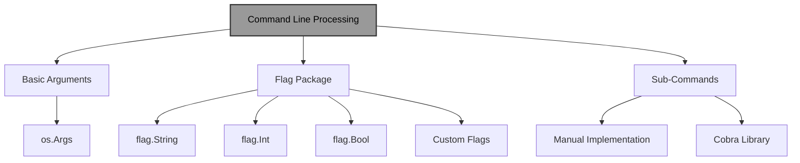
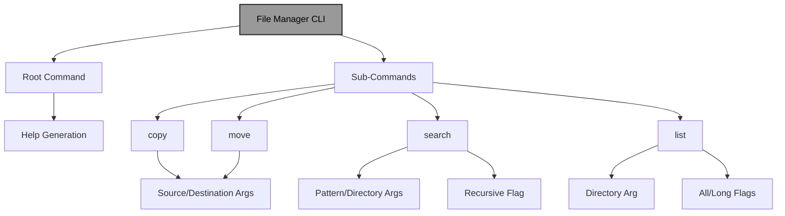

# Command Line Arguments/Flags and Sub-Commands in Go

!!! abstract "Overview"
Master command-line interface development in Go using the standard `flag` package and third-party libraries like Cobra. Learn to parse arguments, implement flags, create sub-commands, and build powerful CLI tools with proper validation, help generation, and error handling.

!!! tip "Key Points"
- Use `os.Args` for basic argument access and the `flag` package for structured flag parsing
- Implement sub-commands manually with `flag.NewFlagSet` or use Cobra for complex applications
- Validate arguments and provide clear error messages for better user experience
- Follow CLI conventions like consistent flag naming and proper help text
- Test CLI applications thoroughly, including both success and error scenarios

## Understanding Command Line Arguments in Go

Command-line interfaces (CLIs) are essential for many applications, allowing users to interact with programs through text-based commands. Go provides robust support for handling command-line arguments and flags, enabling developers to create powerful CLI tools.

!!! info "Command Line Processing in Go"


## Basic Command Line Arguments

The simplest way to access command-line arguments in Go is through the `os.Args` slice, which contains all arguments passed to the program:

!!! example "Basic Command Line Arguments"
```go title="basic_args.go" linenums="1" hl_lines="8-20"
package main

import (
    "fmt"
    "os"
)

func main() {
    // os.Args[0] is the program name
    // os.Args[1:] are the actual arguments
    if len(os.Args) < 2 {
        fmt.Println("Please provide at least one argument")
        os.Exit(1)
    }

    fmt.Println("Program name:", os.Args[0])
    fmt.Println("Arguments:")
    for i, arg := range os.Args[1:] {
        fmt.Printf("  %d: %s\n", i+1, arg)
    }
}
```

## The flag Package

Go's standard `flag` package provides a more structured way to parse command-line options (flags). It supports various data types and automatically generates help messages.

### Basic Flag Usage

!!! example "Basic Flag Usage"
```go title="basic_flags.go" linenums="1" hl_lines="8-30"
package main

import (
    "flag"
    "fmt"
)

func main() {
    // Define flags
    name := flag.String("name", "World", "Name to greet")
    age := flag.Int("age", 0, "Your age")
    verbose := flag.Bool("verbose", false, "Enable verbose output")
    
    // Parse the command-line flags
    flag.Parse()
    
    // Use the flag values
    if *verbose {
        fmt.Println("Running in verbose mode")
    }
    
    fmt.Printf("Hello, %s!\n", *name)
    if *age > 0 {
        fmt.Printf("You are %d years old.\n", *age)
    }
    
    // Access non-flag arguments
    args := flag.Args()
    if len(args) > 0 {
        fmt.Println("Additional arguments:")
        for i, arg := range args {
            fmt.Printf("  %d: %s\n", i, arg)
        }
    }
}
```

### Flag Types and Functions

The `flag` package provides functions for different data types:

| Function | Description | Example |
|----------|-------------|---------|
| `flag.String()` | String flag | `name := flag.String("name", "default", "help")` |
| `flag.Int()` | Integer flag | `port := flag.Int("port", 8080, "Port number")` |
| `flag.Bool()` | Boolean flag | `debug := flag.Bool("debug", false, "Debug mode")` |
| `flag.Float64()` | Float flag | `threshold := flag.Float64("threshold", 0.5, "Threshold value")` |
| `flag.Duration()` | Duration flag | `timeout := flag.Duration("timeout", 30*time.Second, "Timeout duration")` |

### Custom Flag Types

You can also define custom flag types by implementing the `flag.Value` interface:

!!! example "Custom Flag Types"
```go title="custom_flags.go" linenums="1" hl_lines="8-25"
package main

import (
    "flag"
    "fmt"
    "strings"
)

// Custom type for a list of strings
type stringList []string

func (s *stringList) String() string {
    return fmt.Sprintf("%v", *s)
}

func (s *stringList) Set(value string) error {
    *s = strings.Split(value, ",")
    return nil
}

func main() {
    var languages stringList
    flag.Var(&languages, "lang", "Comma-separated list of languages")
    flag.Parse()
    
    fmt.Println("Languages:", languages)
}
```

## Command Line Sub-Commands

Sub-commands allow you to create CLI tools with multiple actions, similar to `git` (with commands like `commit`, `push`, etc.) or `docker` (with commands like `run`, `build`, etc.).

### Implementing Sub-Commands with the flag Package

While the standard `flag` package doesn't have built-in support for sub-commands, you can implement them manually:

!!! example "Manual Sub-Commands Implementation"
```go title="manual_subcommands.go" linenums="1" hl_lines="8-60"
package main

import (
    "flag"
    "fmt"
    "os"
)

func main() {
    // Check if we have at least one sub-command
    if len(os.Args) < 2 {
        fmt.Println("Usage: myapp <command> [options]")
        os.Exit(1)
    }
    
    // Extract the sub-command
    cmd := os.Args[1]
    
    // Create a new flag set for each sub-command
    switch cmd {
    case "greet":
        greetCmd := flag.NewFlagSet("greet", flag.ExitOnError)
        name := greetCmd.String("name", "World", "Name to greet")
        formal := greetCmd.Bool("formal", false, "Use formal greeting")
        
        // Parse the flags for this sub-command
        greetCmd.Parse(os.Args[2:])
        
        // Execute the sub-command
        if *formal {
            fmt.Printf("Good day, %s.\n", *name)
        } else {
            fmt.Printf("Hello, %s!\n", *name)
        }
        
    case "calculate":
        calcCmd := flag.NewFlagSet("calculate", flag.ExitOnError)
        operation := calcCmd.String("op", "add", "Operation to perform (add, subtract, multiply, divide)")
        x := calcCmd.Float64("x", 0, "First operand")
        y := calcCmd.Float64("y", 0, "Second operand")
        
        // Parse the flags for this sub-command
        calcCmd.Parse(os.Args[2:])
        
        // Execute the sub-command
        var result float64
        switch *operation {
        case "add":
            result = *x + *y
        case "subtract":
            result = *x - *y
        case "multiply":
            result = *x * *y
        case "divide":
            if *y == 0 {
                fmt.Println("Error: Division by zero")
                os.Exit(1)
            }
            result = *x / *y
        default:
            fmt.Printf("Unknown operation: %s\n", *operation)
            os.Exit(1)
        }
        
        fmt.Printf("Result: %f\n", result)
        
    default:
        fmt.Printf("Unknown command: %s\n", cmd)
        os.Exit(1)
    }
}
```

### Using Third-Party Libraries for Sub-Commands

While the manual approach works, it can become cumbersome for complex applications. Third-party libraries like `cobra` and `urfave/cli` provide more powerful features for building CLI applications.

#### Introduction to Cobra

Cobra is a popular library for building powerful CLI applications in Go. It's used by many well-known projects including Kubernetes, Hugo, and Docker.

First, install Cobra:
```bash
go get -u github.com/spf13/cobra@latest
```

#### Basic Cobra Example

!!! example "Basic Cobra Implementation"
```go title="basic_cobra.go" linenums="1" hl_lines="8-50"
package main

import (
    "fmt"
    "github.com/spf13/cobra"
)

func main() {
    var rootCmd = &cobra.Command{
        Use:   "myapp",
        Short: "My application does amazing things",
        Long:  `My application is a powerful CLI tool that demonstrates Cobra's capabilities.`,
    }
    
    var greetCmd = &cobra.Command{
        Use:   "greet",
        Short: "Greets someone",
        Run: func(cmd *cobra.Command, args []string) {
            name, _ := cmd.Flags().GetString("name")
            formal, _ := cmd.Flags().GetBool("formal")
            
            if formal {
                fmt.Printf("Good day, %s.\n", name)
            } else {
                fmt.Printf("Hello, %s!\n", name)
            }
        },
    }
    
    greetCmd.Flags().StringP("name", "n", "World", "Name to greet")
    greetCmd.Flags().BoolP("formal", "f", false, "Use formal greeting")
    
    var calculateCmd = &cobra.Command{
        Use:   "calculate",
        Short: "Performs a calculation",
        Run: func(cmd *cobra.Command, args []string) {
            operation, _ := cmd.Flags().GetString("operation")
            x, _ := cmd.Flags().GetFloat64("x")
            y, _ := cmd.Flags().GetFloat64("y")
            
            var result float64
            switch operation {
            case "add":
                result = x + y
            case "subtract":
                result = x - y
            case "multiply":
                result = x * y
            case "divide":
                if y == 0 {
                    fmt.Println("Error: Division by zero")
                    return
                }
                result = x / y
            default:
                fmt.Printf("Unknown operation: %s\n", operation)
                return
            }
            
            fmt.Printf("Result: %f\n", result)
        },
    }
    
    calculateCmd.Flags().StringP("operation", "o", "add", "Operation to perform")
    calculateCmd.Flags().Float64P("x", "x", 0, "First operand")
    calculateCmd.Flags().Float64P("y", "y", 0, "Second operand")
    
    rootCmd.AddCommand(greetCmd, calculateCmd)
    
    if err := rootCmd.Execute(); err != nil {
        fmt.Println(err)
        os.Exit(1)
    }
}
```

#### Advanced Cobra Features

Cobra provides many advanced features:

1. **Automatic Help Generation**:
   ```go
   var helpCmd = &cobra.Command{
       Use:   "help [command]",
       Short: "Help about any command",
       Long: `Help provides help for any command in the application.
   Simply type ` + "`myapp help [command]`" + ` for full details.`,
       
       Run: func(cmd *cobra.Command, args []string) {
           // Cobra automatically handles help
       },
   }
   ```

2. **Validation of Arguments**:
   ```go
   var cmd = &cobra.Command{
       Use:   "create [name]",
       Short: "Create a resource",
       Args:  cobra.ExactArgs(1),
       Run: func(cmd *cobra.Command, args []string) {
           name := args[0]
           fmt.Printf("Creating resource: %s\n", name)
       },
   }
   ```

3. **Persistent Flags**:
   ```go
   var verbose bool
   
   func init() {
       rootCmd.PersistentFlags().BoolVarP(&verbose, "verbose", "v", false, "verbose output")
   }
   ```

4. **Pre-run and Post-run Hooks**:
   ```go
   var cmd = &cobra.Command{
       Use:   "example",
       Short: "An example command",
       PreRun: func(cmd *cobra.Command, args []string) {
           fmt.Println("Pre-run hook")
       },
       Run: func(cmd *cobra.Command, args []string) {
           fmt.Println("Running command")
       },
       PostRun: func(cmd *cobra.Command, args []string) {
           fmt.Println("Post-run hook")
       },
   }
   ```

## Real-World Example: A Complete CLI Application

Let's create a more realistic example: a file management tool with multiple sub-commands.

!!! example "File Management CLI Tool"
```go title="file_manager.go" linenums="1" hl_lines="8-80"
package main

import (
    "fmt"
    "io"
    "os"
    "path/filepath"
    "strings"
    
    "github.com/spf13/cobra"
)

var rootCmd = &cobra.Command{
    Use:   "filemanager",
    Short: "A simple file management tool",
    Long:  `Filemanager is a CLI tool for basic file operations like copying, moving, and searching.`,
}

var copyCmd = &cobra.Command{
    Use:   "copy [source] [destination]",
    Short: "Copy a file from source to destination",
    Args:  cobra.ExactArgs(2),
    Run: func(cmd *cobra.Command, args []string) {
        source := args[0]
        destination := args[1]
        
        // Open source file
        srcFile, err := os.Open(source)
        if err != nil {
            fmt.Printf("Error opening source file: %v\n", err)
            return
        }
        defer srcFile.Close()
        
        // Create destination file
        destFile, err := os.Create(destination)
        if err != nil {
            fmt.Printf("Error creating destination file: %v\n", err)
            return
        }
        defer destFile.Close()
        
        // Copy file contents
        _, err = io.Copy(destFile, srcFile)
        if err != nil {
            fmt.Printf("Error copying file: %v\n", err)
            return
        }
        
        fmt.Printf("File copied from %s to %s\n", source, destination)
    },
}

var moveCmd = &cobra.Command{
    Use:   "move [source] [destination]",
    Short: "Move a file from source to destination",
    Args:  cobra.ExactArgs(2),
    Run: func(cmd *cobra.Command, args []string) {
        source := args[0]
        destination := args[1]
        
        err := os.Rename(source, destination)
        if err != nil {
            fmt.Printf("Error moving file: %v\n", err)
            return
        }
        
        fmt.Printf("File moved from %s to %s\n", source, destination)
    },
}

var searchCmd = &cobra.Command{
    Use:   "search [pattern] [directory]",
    Short: "Search for files matching a pattern in a directory",
    Args:  cobra.ExactArgs(2),
    Run: func(cmd *cobra.Command, args []string) {
        pattern := args[0]
        directory := args[1]
        
        recursive, _ := cmd.Flags().GetBool("recursive")
        
        err := filepath.Walk(directory, func(path string, info os.FileInfo, err error) error {
            if err != nil {
                return err
            }
            
            // Skip directories if not recursive
            if info.IsDir() && path != directory && !recursive {
                return filepath.SkipDir
            }
            
            // Check if the filename matches the pattern
            matched, err := filepath.Match(pattern, info.Name())
            if err != nil {
                return err
            }
            
            if matched {
                relPath, err := filepath.Rel(directory, path)
                if err != nil {
                    return err
                }
                fmt.Println(relPath)
            }
            
            return nil
        })
        
        if err != nil {
            fmt.Printf("Error searching directory: %v\n", err)
        }
    },
}

var listCmd = &cobra.Command{
    Use:   "list [directory]",
    Short: "List files in a directory",
    Args:  cobra.MaximumNArgs(1),
    Run: func(cmd *cobra.Command, args []string) {
        directory := "."
        if len(args) > 0 {
            directory = args[0]
        }
        
        showHidden, _ := cmd.Flags().GetBool("all")
        longFormat, _ := cmd.Flags().GetBool("long")
        
        files, err := os.ReadDir(directory)
        if err != nil {
            fmt.Printf("Error reading directory: %v\n", err)
            return
        }
        
        for _, file := range files {
            // Skip hidden files unless -a is specified
            if !showHidden && strings.HasPrefix(file.Name(), ".") {
                continue
            }
            
            if longFormat {
                info, err := file.Info()
                if err != nil {
                    fmt.Printf("Error getting file info: %v\n", err)
                    continue
                }
                
                size := info.Size()
                mode := info.Mode()
                fmt.Printf("%-10s %8d %s\n", mode, size, file.Name())
            } else {
                fmt.Println(file.Name())
            }
        }
    },
}

func init() {
    searchCmd.Flags().BoolP("recursive", "r", false, "Search recursively")
    listCmd.Flags().BoolP("all", "a", false, "Show hidden files")
    listCmd.Flags().BoolP("long", "l", false, "Use long listing format")
    
    rootCmd.AddCommand(copyCmd, moveCmd, searchCmd, listCmd)
}

func main() {
    if err := rootCmd.Execute(); err != nil {
        fmt.Println(err)
        os.Exit(1)
    }
}
```

### How This Example Demonstrates CLI Concepts:

1. **Multiple Sub-Commands**:
   - `copy`: Copies files from source to destination
   - `move`: Moves/renames files
   - `search`: Searches for files matching a pattern
   - `list`: Lists files in a directory

2. **Flag Handling**:
   - Boolean flags for options like `recursive`, `all`, and `long`
   - Proper flag parsing for each sub-command

3. **Argument Validation**:
   - Using `cobra.ExactArgs` to ensure the correct number of arguments
   - Using `cobra.MaximumNArgs` for optional arguments

4. **Error Handling**:
   - Proper error messages for file operations
   - Graceful handling of missing files or directories

5. **File Operations**:
   - Demonstrates real file operations like copying, moving, and listing
   - Shows how to walk directory trees recursively

!!! info "File Manager CLI Architecture"


## Best Practices for CLI Applications

!!! tip "Consistent Interface"
Follow common conventions and maintain consistency across your CLI tool.

!!! example "Consistent Interface Implementation"
```go title="consistent_interface.go" linenums="1" hl_lines="8-15"
package main

import (
    "github.com/spf13/cobra"
)

// Use consistent flag naming across commands
var verbose bool

func init() {
    // Common verbose flag for all commands
    rootCmd.PersistentFlags().BoolVarP(&verbose, "verbose", "v", false, "verbose output")
}
```

!!! tip "Clear Help Messages"
Provide concise and helpful descriptions for commands and flags.

!!! example "Clear Help Messages"
```go title="help_messages.go" linenums="1" hl_lines="8-20"
package main

import (
    "fmt"
    "github.com/spf13/cobra"
)

var cmd = &cobra.Command{
    Use:   "process",
    Short: "Process a file",
    Long: `Process reads a file, applies transformations, and outputs the result.
    
Examples:
  myapp process input.txt         # Process with default settings
  myapp process -f json input.txt # Process with JSON format`,
    Run: func(cmd *cobra.Command, args []string) {
        // Command implementation
    },
}
```

!!! tip "Argument Validation"
Validate the number and type of arguments, and provide clear error messages.

!!! example "Argument Validation"
```go title="argument_validation.go" linenums="1" hl_lines="8-25"
package main

import (
    "fmt"
    "github.com/spf13/cobra"
)

var createCmd = &cobra.Command{
    Use:   "create [name]",
    Short: "Create a new resource",
    Args:  cobra.ExactArgs(1), // Require exactly one argument
    Run: func(cmd *cobra.Command, args []string) {
        name := args[0]
        
        // Validate the name format
        if len(name) < 3 {
            fmt.Println("Error: Name must be at least 3 characters long")
            return
        }
        
        fmt.Printf("Creating resource: %s\n", name)
    },
}
```

!!! tip "Error Handling"
Return appropriate exit codes and provide meaningful error messages.

!!! example "Error Handling"
```go title="error_handling.go" linenums="1" hl_lines="8-25"
package main

import (
    "fmt"
    "os"
    "github.com/spf13/cobra"
)

var processCmd = &cobra.Command{
    Use:   "process [file]",
    Short: "Process a file",
    Args:  cobra.ExactArgs(1),
    Run: func(cmd *cobra.Command, args []string) {
        file := args[0]
        
        // Try to open the file
        f, err := os.Open(file)
        if err != nil {
            fmt.Printf("Error: Cannot open file '%s': %v\n", file, err)
            os.Exit(1) // Non-zero exit code indicates error
        }
        defer f.Close()
        
        // Process the file...
        fmt.Printf("Successfully processed: %s\n", file)
    },
}
```

!!! tip "Testing"
Write tests for your CLI commands, including both successful execution and error conditions.

!!! example "CLI Testing"
```go title="cli_testing.go" linenums="1" hl_lines="8-30"
package main

import (
    "bytes"
    "testing"
    "github.com/spf13/cobra"
)

func TestProcessCommand(t *testing.T) {
    // Create a test file
    testFile := "test.txt"
    // ... setup code ...
    
    // Create a buffer to capture output
    var buf bytes.Buffer
    rootCmd.SetOut(&buf)
    
    // Set arguments
    args := []string{"process", testFile}
    rootCmd.SetArgs(args)
    
    // Execute the command
    err := rootCmd.Execute()
    if err != nil {
        t.Errorf("Command failed with error: %v", err)
    }
    
    // Check the output
    output := buf.String()
    expected := "Successfully processed"
    if !contains(output, expected) {
        t.Errorf("Expected output to contain %q, got %q", expected, output)
    }
    
    // ... cleanup code ...
}

func contains(s, substr string) bool {
    // Implementation of contains function
    return true
}
```

## Quick Reference

!!! success "Key Takeaways"
- **Basic Arguments**: Access via `os.Args` slice, where `os.Args[0]` is the program name
- **Flag Package**: Use `flag.String()`, `flag.Int()`, `flag.Bool()` etc. to define flags
- **Flag Parsing**: Call `flag.Parse()` to process command-line arguments
- **Custom Flags**: Implement the `flag.Value` interface for custom flag types
- **Sub-Commands**: Implement manually with `flag.NewFlagSet` or use Cobra for complex applications
- **Cobra Features**: Automatic help generation, argument validation, persistent flags, and hooks
- **Error Handling**: Return appropriate exit codes (0 for success, non-zero for errors)
- **Best Practices**: Consistent interface, clear help messages, argument validation, and testing

!!! quote "Remember"
"Command-line interfaces are a powerful way to interact with applications. Go provides excellent tools for building CLIs, from the simple `flag` package to advanced libraries like Cobra. By following best practices and implementing proper validation, error handling, and testing, you can create professional CLI tools that users will find intuitive and reliable. Whether you're building simple utilities or complex multi-command applications, Go's CLI ecosystem has you covered."