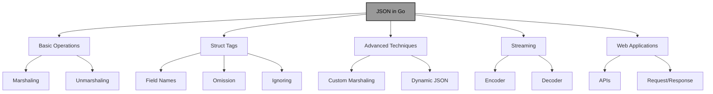
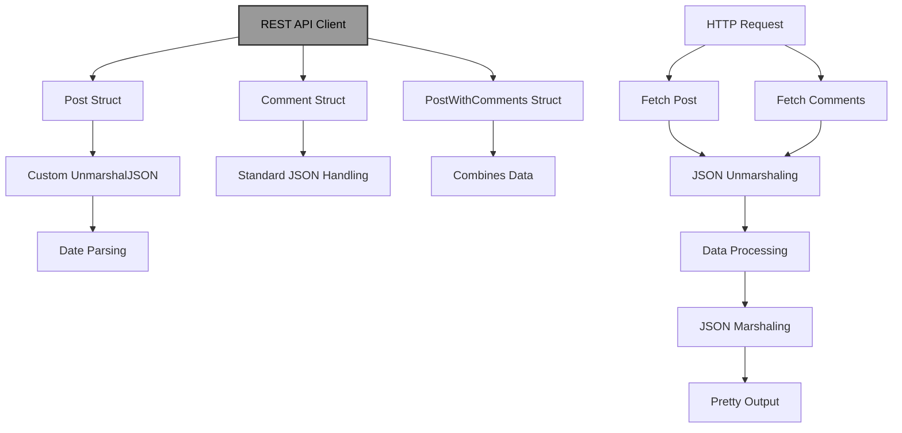

# JSON in Go: A Comprehensive Guide

!!! abstract "Overview"
Master JSON handling in Go using the `encoding/json` package. Learn to marshal and unmarshal data, work with struct tags, handle dynamic JSON, implement custom marshaling, stream large documents, and build robust web APIs with proper error handling and validation.

!!! tip "Key Points"
- Use `json.Marshal` and `json.Unmarshal` for basic JSON operations with Go structs
- Struct tags control JSON field names and behavior (e.g., `json:"name"`, `json:"omitempty"`, `json:"-"`)
- Implement custom marshaling/unmarshaling by implementing `json.Marshaler` and `json.Unmarshaler` interfaces
- Use streaming with `json.Encoder` and `json.Decoder` for large JSON documents to improve memory efficiency
- Handle dynamic JSON with `map[string]interface{}` or `interface{}` for unknown structures
- Always validate JSON input and handle errors gracefully in production code

## Understanding JSON in Go

JSON (JavaScript Object Notation) is a lightweight data-interchange format that is easy for humans to read and write and easy for machines to parse and generate. In Go, the `encoding/json` package provides robust support for working with JSON data.

!!! info "JSON Operations in Go"


## Basic JSON Operations

### Marshaling (Go to JSON)

Marshaling converts Go data structures into JSON format:

!!! example "Marshaling Go Structs to JSON"
```go title="marshaling.go" linenums="1" hl_lines="8-20"
package main

import (
    "encoding/json"
    "fmt"
    "log"
)

type Person struct {
    Name  string `json:"name"`
    Age   int    `json:"age"`
    Email string `json:"email,omitempty"`
}

func main() {
    person := Person{
        Name: "Alice",
        Age:  30,
        // Email is left empty to demonstrate omitempty
    }
    
    // Marshal to JSON
    jsonData, err := json.Marshal(person)
    if err != nil {
        log.Fatal(err)
    }
    
    fmt.Println(string(jsonData))
    // Output: {"name":"Alice","age":30}
}
```

### Unmarshaling (JSON to Go)

Unmarshaling converts JSON data into Go data structures:

!!! example "Unmarshaling JSON to Go Structs"
```go title="unmarshaling.go" linenums="1" hl_lines="8-20"
package main

import (
    "encoding/json"
    "fmt"
    "log"
)

type Person struct {
    Name  string `json:"name"`
    Age   int    `json:"age"`
    Email string `json:"email,omitempty"`
}

func main() {
    jsonStr := `{"name":"Bob","age":25,"email":"bob@example.com"}`
    
    var person Person
    err := json.Unmarshal([]byte(jsonStr), &person)
    if err != nil {
        log.Fatal(err)
    }
    
    fmt.Printf("%+v\n", person)
    // Output: {Name:Bob Age:25 Email:bob@example.com}
}
```

## Struct Tags

Struct tags provide metadata that control how fields are encoded and decoded:

!!! example "Using Struct Tags for JSON Control"
```go title="struct_tags.go" linenums="1" hl_lines="8-30"
package main

import (
    "encoding/json"
    "fmt"
    "log"
)

type Employee struct {
    ID        int      `json:"id"`
    FirstName string   `json:"first_name"`
    LastName  string   `json:"last_name"`
    Email     string   `json:"email,omitempty"`
    IsActive  bool     `json:"is_active"`
    Roles     []string `json:"roles"`
    Salary    float64  `json:"salary,omitempty"`
    // Field will be ignored
    password string `json:"-"`
}

func main() {
    employee := Employee{
        ID:        1001,
        FirstName: "John",
        LastName:  "Doe",
        IsActive:  true,
        Roles:     []string{"admin", "developer"},
        password:  "secret",
    }
    
    jsonData, err := json.Marshal(employee)
    if err != nil {
        log.Fatal(err)
    }
    
    fmt.Println(string(jsonData))
    // Output: {"id":1001,"first_name":"John","last_name":"Doe","is_active":true,"roles":["admin","developer"]}
}
```

### Common Struct Tags

| Tag | Description |
|-----|-------------|
| `json:"field_name"` | Specifies the JSON key name |
| `json:"-"` | Omits the field from JSON output |
| `json:"omitempty"` | Omits the field if it has a zero value |
| `json:",string"` | Encodes the field as a string (useful for numbers) |

## Working with Dynamic JSON

Sometimes you need to work with JSON that doesn't have a fixed structure:

!!! example "Handling Dynamic JSON"
```go title="dynamic_json.go" linenums="1" hl_lines="8-35"
package main

import (
    "encoding/json"
    "fmt"
    "log"
)

func main() {
    // JSON with unknown structure
    jsonStr := `{
        "name": "Alice",
        "age": 30,
        "address": {
            "street": "123 Main St",
            "city": "New York"
        },
        "hobbies": ["reading", "hiking"]
    }`
    
    // Unmarshal into map[string]interface{}
    var data map[string]interface{}
    err := json.Unmarshal([]byte(jsonStr), &data)
    if err != nil {
        log.Fatal(err)
    }
    
    // Access data dynamically
    fmt.Println("Name:", data["name"])
    fmt.Println("Age:", data["age"])
    
    // Type assertion for nested objects
    if address, ok := data["address"].(map[string]interface{}); ok {
        fmt.Println("City:", address["city"])
    }
    
    // Type assertion for arrays
    if hobbies, ok := data["hobbies"].([]interface{}); ok {
        fmt.Println("First hobby:", hobbies[0])
    }
}
```

## Custom Marshaling and Unmarshaling

You can implement custom JSON encoding and decoding by implementing the `json.Marshaler` and `json.Unmarshaler` interfaces:

!!! example "Custom Marshaling and Unmarshaling"
```go title="custom_marshaling.go" linenums="1" hl_lines="8-50"
package main

import (
    "encoding/json"
    "fmt"
    "strings"
    "time"
)

type Date struct {
    time.Time
}

// Implement Marshaler interface
func (d Date) MarshalJSON() ([]byte, error) {
    return json.Marshal(d.Time.Format("2006-01-02"))
}

// Implement Unmarshaler interface
func (d *Date) UnmarshalJSON(data []byte) error {
    var s string
    if err := json.Unmarshal(data, &s); err != nil {
        return err
    }
    
    t, err := time.Parse("2006-01-02", s)
    if err != nil {
        return err
    }
    
    d.Time = t
    return nil
}

type Event struct {
    Name string `json:"name"`
    Date Date   `json:"date"`
}

func main() {
    // Custom marshaling
    event := Event{
        Name: "Conference",
        Date: Date{time.Date(2023, 10, 15, 0, 0, 0, 0, time.UTC)},
    }
    
    jsonData, err := json.Marshal(event)
    if err != nil {
        panic(err)
    }
    
    fmt.Println(string(jsonData))
    // Output: {"name":"Conference","date":"2023-10-15"}
    
    // Custom unmarshaling
    jsonStr := `{"name":"Meeting","date":"2023-11-20"}`
    var newEvent Event
    err = json.Unmarshal([]byte(jsonStr), &newEvent)
    if err != nil {
        panic(err)
    }
    
    fmt.Printf("%+v\n", newEvent)
    // Output: {Name:Meeting Date:{Time:2023-11-20 00:00:00 +0000 UTC}}
}
```

## Streaming JSON

For large JSON documents, streaming can be more memory-efficient:

!!! example "Streaming JSON"
```go title="streaming_json.go" linenums="1" hl_lines="8-45"
package main

import (
    "encoding/json"
    "fmt"
    "log"
    "os"
)

type Product struct {
    ID    int     `json:"id"`
    Name  string  `json:"name"`
    Price float64 `json:"price"`
}

func main() {
    // Create a file for demonstration
    file, err := os.Create("products.json")
    if err != nil {
        log.Fatal(err)
    }
    defer file.Close()
    
    // Create a JSON encoder
    encoder := json.NewEncoder(file)
    
    // Write multiple JSON objects
    products := []Product{
        {ID: 1, Name: "Laptop", Price: 999.99},
        {ID: 2, Name: "Phone", Price: 699.99},
        {ID: 3, Name: "Tablet", Price: 399.99},
    }
    
    // Write as a JSON array
    err = encoder.Encode(products)
    if err != nil {
        log.Fatal(err)
    }
    
    // Reset file position for reading
    _, err = file.Seek(0, 0)
    if err != nil {
        log.Fatal(err)
    }
    
    // Create a JSON decoder
    decoder := json.NewDecoder(file)
    
    // Read the JSON array
    var decodedProducts []Product
    err = decoder.Decode(&decodedProducts)
    if err != nil {
        log.Fatal(err)
    }
    
    fmt.Printf("%+v\n", decodedProducts)
}
```

## Working with JSON in Web Applications

JSON is commonly used in web applications for APIs:

!!! example "JSON in Web Applications"
```go title="web_json.go" linenums="1" hl_lines="8-40"
package main

import (
    "encoding/json"
    "net/http"
)

type User struct {
    ID    int    `json:"id"`
    Name  string `json:"name"`
    Email string `json:"email"`
}

var users = []User{
    {ID: 1, Name: "Alice", Email: "alice@example.com"},
    {ID: 2, Name: "Bob", Email: "bob@example.com"},
}

func main() {
    http.HandleFunc("/users", func(w http.ResponseWriter, r *http.Request) {
        w.Header().Set("Content-Type", "application/json")
        json.NewEncoder(w).Encode(users)
    })
    
    http.HandleFunc("/user", func(w http.ResponseWriter, r *http.Request) {
        // Parse JSON from request body
        var newUser User
        err := json.NewDecoder(r.Body).Decode(&newUser)
        if err != nil {
            http.Error(w, err.Error(), http.StatusBadRequest)
            return
        }
        
        // Add new user
        newUser.ID = len(users) + 1
        users = append(users, newUser)
        
        // Return the created user
        w.Header().Set("Content-Type", "application/json")
        w.WriteHeader(http.StatusCreated)
        json.NewEncoder(w).Encode(newUser)
    })
    
    http.ListenAndServe(":8080", nil)
}
```

## Handling JSON Errors

Proper error handling is crucial when working with JSON:

!!! example "JSON Error Handling"
```go title="json_errors.go" linenums="1" hl_lines="8-35"
package main

import (
    "encoding/json"
    "fmt"
    "log"
)

func main() {
    // Invalid JSON
    invalidJSON := `{"name": "Alice", "age": 30,` // Missing closing brace
    
    var person struct {
        Name string `json:"name"`
        Age  int    `json:"age"`
    }
    
    err := json.Unmarshal([]byte(invalidJSON), &person)
    if err != nil {
        // Type assertion to get more details about the error
        if syntaxErr, ok := err.(*json.SyntaxError); ok {
            fmt.Printf("Syntax error at offset %d: %v\n", syntaxErr.Offset, syntaxErr)
        } else if unmarshalErr, ok := err.(*json.UnmarshalTypeError); ok {
            fmt.Printf("Unmarshal type error: field %s, value %v, expected %v\n", 
                unmarshalErr.Field, unmarshalErr.Value, unmarshalErr.Type)
        } else {
            fmt.Printf("Error unmarshaling JSON: %v\n", err)
        }
        return
    }
    
    fmt.Printf("%+v\n", person)
}
```

## Pretty-Printing JSON

For debugging or display purposes, you might want to format JSON:

!!! example "Pretty-Printing JSON"
```go title="pretty_print.go" linenums="1" hl_lines="8-25"
package main

import (
    "encoding/json"
    "fmt"
)

type Person struct {
    Name    string   `json:"name"`
    Age     int      `json:"age"`
    Hobbies []string `json:"hobbies"`
}

func main() {
    person := Person{
        Name:    "Alice",
        Age:     30,
        Hobbies: []string{"reading", "hiking", "coding"},
    }
    
    // Marshal with indentation
    jsonData, err := json.MarshalIndent(person, "", "  ")
    if err != nil {
        panic(err)
    }
    
    fmt.Println(string(jsonData))
    /*
    Output:
    {
      "name": "Alice",
      "age": 30,
      "hobbies": [
        "reading",
        "hiking",
        "coding"
      ]
    }
    */
}
```

## Working with JSON Numbers

JSON doesn't distinguish between integer and floating-point numbers, but Go does:

!!! example "JSON Numbers"
```go title="json_numbers.go" linenums="1" hl_lines="8-35"
package main

import (
    "encoding/json"
    "fmt"
    "log"
    "strings"
)

func main() {
    // JSON with numbers
    jsonStr := `{"count": 42, "price": 19.99, "big_number": 1234567890123456789}`
    
    // Use json.Number to preserve exact representation
    var data map[string]json.Number
    err := json.Unmarshal([]byte(jsonStr), &data)
    if err != nil {
        log.Fatal(err)
    }
    
    // Access numbers
    count, err := data["count"].Int64()
    if err != nil {
        log.Fatal(err)
    }
    
    price, err := data["price"].Float64()
    if err != nil {
        log.Fatal(err)
    }
    
    bigNumber := data["big_number"].String()
    
    fmt.Printf("Count: %d\n", count)
    fmt.Printf("Price: %f\n", price)
    fmt.Printf("Big Number: %s\n", bigNumber)
}
```

## JSON and Time

Time values require special handling in JSON:

!!! example "JSON and Time"
```go title="json_time.go" linenums="1" hl_lines="8-35"
package main

import (
    "encoding/json"
    "fmt"
    "time"
)

type Event struct {
    Name      string    `json:"name"`
    Timestamp time.Time `json:"timestamp"`
}

func main() {
    // Default time format
    event := Event{
        Name:      "Conference",
        Timestamp: time.Date(2023, 10, 15, 9, 30, 0, 0, time.UTC),
    }
    
    jsonData, err := json.Marshal(event)
    if err != nil {
        panic(err)
    }
    
    fmt.Println("Default time format:", string(jsonData))
    // Output: {"name":"Conference","timestamp":"2023-10-15T09:30:00Z"}
    
    // Custom time format
    type CustomEvent struct {
        Name      string `json:"name"`
        Timestamp string `json:"timestamp"`
    }
    
    customEvent := CustomEvent{
        Name:      "Meeting",
        Timestamp: "2023-11-20 14:00:00",
    }
    
    customJsonData, err := json.Marshal(customEvent)
    if err != nil {
        panic(err)
    }
    
    fmt.Println("Custom time format:", string(customJsonData))
    // Output: {"name":"Meeting","timestamp":"2023-11-20 14:00:00"}
}
```

## Real-World Example: REST API Client

Let's create a more comprehensive example that demonstrates various JSON handling techniques:

!!! example "REST API Client"
```go title="api_client.go" linenums="1" hl_lines="8-100"
package main

import (
    "encoding/json"
    "fmt"
    "io"
    "net/http"
    "time"
)

// Post represents a blog post
type Post struct {
    ID        int       `json:"id"`
    Title     string    `json:"title"`
    Body      string    `json:"body"`
    UserID    int       `json:"userId"`
    CreatedAt time.Time `json:"createdAt"`
    UpdatedAt time.Time `json:"updatedAt"`
}

// Comment represents a comment on a post
type Comment struct {
    ID        int    `json:"id"`
    PostID    int    `json:"postId"`
    Name      string `json:"name"`
    Email     string `json:"email"`
    Body      string `json:"body"`
}

// PostWithComments combines a post with its comments
type PostWithComments struct {
    Post     Post      `json:"post"`
    Comments []Comment `json:"comments"`
}

// Custom UnmarshalJSON for Post to handle date parsing
func (p *Post) UnmarshalJSON(data []byte) error {
    type Alias Post
    aux := &struct {
        CreatedAt string `json:"createdAt"`
        UpdatedAt string `json:"updatedAt"`
        *Alias
    }{
        Alias: (*Alias)(p),
    }
    
    if err := json.Unmarshal(data, &aux); err != nil {
        return err
    }
    
    // Parse dates
    var err error
    p.CreatedAt, err = time.Parse(time.RFC3339, aux.CreatedAt)
    if err != nil {
        return err
    }
    
    p.UpdatedAt, err = time.Parse(time.RFC3339, aux.UpdatedAt)
    if err != nil {
        return err
    }
    
    return nil
}

func main() {
    // Fetch a post from JSONPlaceholder API
    resp, err := http.Get("https://jsonplaceholder.typicode.com/posts/1")
    if err != nil {
        panic(err)
    }
    defer resp.Body.Close()
    
    body, err := io.ReadAll(resp.Body)
    if err != nil {
        panic(err)
    }
    
    var post Post
    err = json.Unmarshal(body, &post)
    if err != nil {
        panic(err)
    }
    
    fmt.Printf("Post: %+v\n", post)
    
    // Fetch comments for the post
    commentsURL := fmt.Sprintf("https://jsonplaceholder.typicode.com/posts/%d/comments", post.ID)
    resp, err = http.Get(commentsURL)
    if err != nil {
        panic(err)
    }
    defer resp.Body.Close()
    
    body, err = io.ReadAll(resp.Body)
    if err != nil {
        panic(err)
    }
    
    var comments []Comment
    err = json.Unmarshal(body, &comments)
    if err != nil {
        panic(err)
    }
    
    fmt.Printf("Found %d comments\n", len(comments))
    
    // Combine post and comments
    postWithComments := PostWithComments{
        Post:     post,
        Comments: comments,
    }
    
    // Marshal to JSON with indentation
    jsonData, err := json.MarshalIndent(postWithComments, "", "  ")
    if err != nil {
        panic(err)
    }
    
    fmt.Println("Post with comments:")
    fmt.Println(string(jsonData))
}
```

### How This Example Demonstrates JSON Concepts:

1. **Custom Unmarshaling**:
   - Implements `UnmarshalJSON` to handle date parsing
   - Uses an alias type to avoid infinite recursion

2. **API Integration**:
   - Fetches JSON data from a REST API
   - Handles HTTP responses and errors

3. **Data Transformation**:
   - Combines multiple API responses into a single structure
   - Creates a new JSON representation of the combined data

4. **Pretty-Printing**:
   - Uses `json.MarshalIndent` for readable output
   - Demonstrates formatting JSON for display

!!! info "REST API Client Architecture"


## Best Practices for JSON in Go

!!! tip "Use Struct Tags Effectively"
Use struct tags to control JSON field names and behavior.

!!! example "Effective Struct Tags"
```go title="effective_struct_tags.go" linenums="1" hl_lines="8-15"
package main

type User struct {
    ID       int    `json:"id"`
    Username string `json:"username"`
    Email    string `json:"email,omitempty"`
    Password string `json:"-"` // Never expose passwords
}
```

!!! tip "Handle Errors Gracefully"
Always handle JSON errors properly in production code.

!!! example "Graceful Error Handling"
```go title="error_handling.go" linenums="1" hl_lines="8-20"
package main

import (
    "encoding/json"
    "net/http"
)

func handleJSON(w http.ResponseWriter, r *http.Request) {
    var data Data
    if err := json.NewDecoder(r.Body).Decode(&data); err != nil {
        http.Error(w, "Invalid JSON", http.StatusBadRequest)
        return
    }
    
    // Process data...
}
```

!!! tip "Use Pointers for Optional Fields"
Use pointers to distinguish between zero values and omitted fields.

!!! example "Pointers for Optional Fields"
```go title="optional_fields.go" linenums="1" hl_lines="8-15"
package main

type Config struct {
    Timeout *int `json:"timeout,omitempty"`
    // This allows distinguishing between "not provided" and "provided as 0"
}
```

!!! tip "Consider Performance for Large Data"
Use streaming for large JSON documents to improve memory efficiency.

!!! example "Streaming Large JSON"
```go title="streaming_large_json.go" linenums="1" hl_lines="8-25"
package main

import (
    "encoding/json"
    "io"
)

func processLargeJSON(r io.Reader) error {
    decoder := json.NewDecoder(r)
    
    // Use a streaming approach
    for {
        var item Item
        if err := decoder.Decode(&item); err != nil {
            if err == io.EOF {
                break
            }
            return err
        }
        
        // Process item
    }
    
    return nil
}
```

!!! tip "Validate JSON Input"
Always validate JSON input before processing it.

!!! example "JSON Input Validation"
```go title="json_validation.go" linenums="1" hl_lines="8-25"
package main

import (
    "encoding/json"
    "errors"
)

func validateUserJSON(jsonData []byte) error {
    var user User
    if err := json.Unmarshal(jsonData, &user); err != nil {
        return err
    }
    
    if user.Name == "" {
        return errors.New("name is required")
    }
    
    if user.Age < 0 || user.Age > 120 {
        return errors.New("invalid age")
    }
    
    return nil
}
```

## Common Pitfalls and Solutions

!!! warning "Case Sensitivity"
JSON field names are case-sensitive, but Go struct tags can handle this.

!!! example "Handling Case Sensitivity"
```go title="case_sensitivity.go" linenums="1" hl_lines="8-15"
package main

type Person struct {
    FirstName string `json:"firstName"` // Maps to JSON "firstName"
    LastName  string `json:"lastName"`  // Maps to JSON "lastName"
}
```

!!! warning "Zero Values vs. Omitted Fields"
Use `omitempty` to omit fields with zero values.

!!! example "Zero Values vs Omitted Fields"
```go title="omitempty_example.go" linenums="1" hl_lines="8-15"
package main

type User struct {
    Name  string `json:"name"`
    Email string `json:"email,omitempty"` // Omitted if empty
}
```

!!! warning "Unexported Fields"
Unexported fields (lowercase) are not marshaled.

!!! example "Unexported Fields"
```go title="unexported_fields.go" linenums="1" hl_lines="8-15"
package main

type User struct {
    Name     string `json:"name"`
    password string `json:"-"` // Explicitly ignored
}
```

!!! warning "Time Handling"
Time values require special handling.

!!! example "Time Handling"
```go title="time_handling.go" linenums="1" hl_lines="8-15"
package main

type Event struct {
    Time time.Time `json:"time"`
}

// Default format is RFC3339
// For custom formats, implement custom marshaling
```

!!! warning "Numeric Precision"
For large numbers, use `json.Number`.

!!! example "Numeric Precision"
```go title="numeric_precision.go" linenums="1" hl_lines="8-15"
package main

type Data struct {
    ID json.Number `json:"id"`
}
```

## Quick Reference

!!! success "Key Takeaways"
- **Basic Operations**: Use `json.Marshal` and `json.Unmarshal` for converting between Go structs and JSON
- **Struct Tags**: Control JSON field names with `json:"name"`, omit empty fields with `omitempty`, and ignore fields with `json:"-"`
- **Dynamic JSON**: Handle unknown structures with `map[string]interface{}` or `interface{}`
- **Custom Marshaling**: Implement `json.Marshaler` and `json.Unmarshaler` interfaces for special data types
- **Streaming**: Use `json.Encoder` and `json.Decoder` for large JSON documents to improve memory efficiency
- **Web Applications**: JSON is the standard for REST APIs; use `json.Encoder` and `json.Decoder` for HTTP request/response handling
- **Error Handling**: Always validate JSON input and handle errors gracefully in production code
- **Performance**: Consider streaming for large data and use `json.Number` for precise numeric representation

!!! quote "Remember"
"JSON handling in Go is powerful and flexible. The `encoding/json` package provides all the tools you need for robust JSON processing, from basic marshaling and unmarshaling to advanced techniques like custom marshaling and streaming. By following best practices and being aware of common pitfalls, you can effectively work with APIs, configuration files, and data interchange in your Go applications."