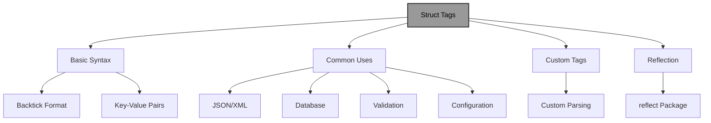
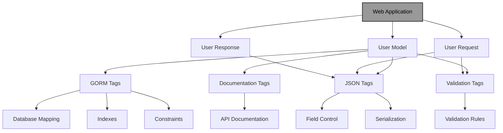

# Struct Tags in Go: A Comprehensive Guide

!!! abstract "Overview"
Master struct tags in Go to add metadata to struct fields for serialization, validation, database mapping, and more. Learn to use standard library tags, create custom tags, and leverage reflection to build declarative, maintainable code with clear separation between data structures and business logic.

!!! tip "Key Points"
- Struct tags are string literals in backticks that provide metadata to other packages about how to handle struct fields
- Use `json:"name"` for JSON serialization, `xml:"name"` for XML, and `gorm:"..."` for database mapping with GORM
- Implement validation with `validate:"required,min=3"` tags using libraries like go-playground/validator
- Create custom tags and parse them with reflection to build domain-specific functionality
- Follow best practices like consistent tag ordering, descriptive names, and proper error handling

## Understanding Struct Tags

Struct tags in Go are metadata attached to struct fields that provide additional information to other code about how to handle those fields. They are string literals placed after the field type in a struct definition, enclosed in backticks.

!!! info "Struct Tag Syntax and Usage"


### Basic Syntax

!!! example "Basic Struct Tag Syntax"
```go title="basic_syntax.go" linenums="1" hl_lines="8-15"
package main

type User struct {
    ID        int    `json:"id" db:"user_id"`
    Username  string `json:"username" db:"username" validate:"required"`
    Email     string `json:"email,omitempty" db:"email" validate:"required,email"`
    Password  string `json:"-" db:"password_hash"` // "-" means ignore in JSON
    CreatedAt time.Time `json:"created_at" db:"created_at"`
}
```

Struct tags follow the format:
```
`key:"value" key2:"value2"`
```

The key is typically the name of the package or tool that will use the tag, and the value is the configuration for that tool.

## Common Uses of Struct Tags

### 1. JSON Encoding/Decoding

The `encoding/json` package uses struct tags to control how structs are converted to and from JSON.

!!! example "JSON Struct Tags"
```go title="json_tags.go" linenums="1" hl_lines="8-25"
package main

import (
    "encoding/json"
    "fmt"
    "log"
)

type Person struct {
    FirstName string `json:"first_name"`
    LastName  string `json:"last_name"`
    Age       int    `json:"age,omitempty"`
    Password  string `json:"-"` // This field will be ignored
}

func main() {
    person := Person{
        FirstName: "John",
        LastName:  "Doe",
        Age:       0, // Will be omitted due to omitempty
        Password:  "secret",
    }

    jsonData, err := json.Marshal(person)
    if err != nil {
        log.Fatal(err)
    }

    fmt.Println(string(jsonData))
    // Output: {"first_name":"John","last_name":"Doe"}
}
```

Common JSON struct tags:
- `json:"field_name"` - Specifies the JSON key name
- `json:"-"` - Omits the field from JSON output
- `json:"omitempty"` - Omits the field if it has a zero value
- `json:",string"` - Encodes the field as a string (useful for numbers)

### 2. XML Encoding/Decoding

Similar to JSON, the `encoding/xml` package uses struct tags for XML conversion.

!!! example "XML Struct Tags"
```go title="xml_tags.go" linenums="1" hl_lines="8-25"
package main

import (
    "encoding/xml"
    "fmt"
    "log"
)

type Person struct {
    XMLName   xml.Name `xml:"person"`
    FirstName string   `xml:"firstName"`
    LastName  string   `xml:"lastName"`
    Age       int      `xml:"age,omitempty"`
}

func main() {
    person := Person{
        FirstName: "John",
        LastName:  "Doe",
    }

    xmlData, err := xml.Marshal(person)
    if err != nil {
        log.Fatal(err)
    }

    fmt.Println(string(xmlData))
    // Output: <person><firstName>John</firstName><lastName>Doe</lastName></person>
}
```

Common XML struct tags:
- `xml:"element_name"` - Specifies the XML element name
- `xml:"-"` - Omits the field
- `xml:",attr"` - Encodes the field as an attribute
- `xml:",chardata"` - Encodes the field as character data
- `xml:",omitempty"` - Omits the field if it has a zero value
- `xml:",innerxml"` - Uses the raw XML

### 3. Database Mapping

Struct tags are commonly used with database libraries to map struct fields to database columns.

!!! example "Database Struct Tags"
```go title="database_tags.go" linenums="1" hl_lines="8-30"
package main

import (
    "database/sql"
    "fmt"
    "log"

    _ "github.com/lib/pq"
)

type User struct {
    ID        int       `db:"id"`
    Username  string    `db:"username"`
    Email     string    `db:"email"`
    CreatedAt time.Time `db:"created_at"`
}

func main() {
    db, err := sql.Open("postgres", "user=postgres dbname=test sslmode=disable")
    if err != nil {
        log.Fatal(err)
    }
    defer db.Close()

    rows, err := db.Query("SELECT id, username, email, created_at FROM users WHERE id = $1", 1)
    if err != nil {
        log.Fatal(err)
    }
    defer rows.Close()

    for rows.Next() {
        var user User
        err := rows.Scan(&user.ID, &user.Username, &user.Email, &user.CreatedAt)
        if err != nil {
            log.Fatal(err)
        }
        fmt.Printf("%+v\n", user)
    }
}
```

With ORM libraries like GORM, struct tags provide even more functionality:

!!! example "GORM Struct Tags"
```go title="gorm_tags.go" linenums="1" hl_lines="8-25"
package main

import (
    "time"

    "gorm.io/driver/sqlite"
    "gorm.io/gorm"
)

type User struct {
    ID        uint      `gorm:"primaryKey"`
    Username  string    `gorm:"uniqueIndex;size:255"`
    Email     string    `gorm:"uniqueIndex;size:255"`
    Password  string    `gorm:"size:255"`
    CreatedAt time.Time `gorm:"autoCreateTime"`
    UpdatedAt time.Time `gorm:"autoUpdateTime"`
    DeletedAt gorm.DeletedAt `gorm:"index"`
}

func main() {
    db, err := gorm.Open(sqlite.Open("test.db"), &gorm.Config{})
    if err != nil {
        panic("failed to connect database")
    }

    // Auto migrate the schema
    db.AutoMigrate(&User{})
}
```

Common GORM struct tags:
- `gorm:"primaryKey"` - Marks the field as primary key
- `gorm:"uniqueIndex"` - Creates a unique index
- `gorm:"index"` - Creates an index
- `gorm:"size:n"` - Specifies the column size
- `gorm:"not null"` - Marks the column as NOT NULL
- `gorm:"autoCreateTime"` - Automatically sets the creation time
- `gorm:"autoUpdateTime"` - Automatically updates the modification time

### 4. Validation

Struct tags are used with validation libraries to define validation rules.

!!! example "Validation Struct Tags"
```go title="validation_tags.go" linenums="1" hl_lines="8-30"
package main

import (
    "fmt"
    "github.com/go-playground/validator/v10"
)

type User struct {
    Username string `validate:"required,min=3,max=20"`
    Email    string `validate:"required,email"`
    Age      int    `validate:"gte=18"`
    Password string `validate:"required,min=8"`
}

func main() {
    validate := validator.New()

    user := User{
        Username: "ab",        // Too short
        Email:    "invalid",   // Invalid email
        Age:      16,          // Too young
        Password: "short",     // Too short
    }

    err := validate.Struct(user)
    if err != nil {
        // Validation failed
        for _, e := range err.(validator.ValidationErrors) {
            fmt.Printf("Field %s failed validation: %s\n", e.Field(), e.Tag())
        }
    }
}
```

Common validation tags:
- `validate:"required"` - Field is required
- `validate:"min=n"` - Minimum length or value
- `validate:"max=n"` - Maximum length or value
- `validate:"email"` - Must be a valid email
- `validate:"gte=n"` - Greater than or equal to n
- `validate:"lte=n"` - Less than or equal to n
- `validate:"oneof=a b c"` - Must be one of the specified values

### 5. Configuration Management

Struct tags can be used with configuration libraries to map environment variables or config files to struct fields.

!!! example "Configuration Struct Tags"
```go title="config_tags.go" linenums="1" hl_lines="8-25"
package main

import (
    "fmt"
    "github.com/spf13/viper"
)

type Config struct {
    ServerPort int    `mapstructure:"server_port"`
    DatabaseURL string `mapstructure:"database_url"`
    DebugMode  bool   `mapstructure:"debug_mode"`
}

func main() {
    viper.SetConfigName("config")
    viper.SetConfigType("yaml")
    viper.AddConfigPath(".")
    
    if err := viper.ReadInConfig(); err != nil {
        panic(fmt.Errorf("fatal error config file: %w", err))
    }
    
    var config Config
    if err := viper.Unmarshal(&config); err != nil {
        panic(fmt.Errorf("unable to decode config: %w", err))
    }
    
    fmt.Printf("%+v\n", config)
}
```

## Custom Struct Tags and Reflection

You can create your own struct tags and use reflection to read them.

### Reading Struct Tags with Reflection

!!! example "Reading Struct Tags with Reflection"
```go title="reflection_tags.go" linenums="1" hl_lines="8-25"
package main

import (
    "fmt"
    "reflect"
)

type Person struct {
    Name string `mytag:"name" other:"value"`
    Age  int    `mytag:"age"`
}

func main() {
    p := Person{Name: "Alice", Age: 30}
    
    // Get the type of the struct
    t := reflect.TypeOf(p)
    
    // Iterate over the fields
    for i := 0; i < t.NumField(); i++ {
        field := t.Field(i)
        
        // Get the tag value for "mytag"
        tag := field.Tag.Get("mytag")
        if tag != "" {
            fmt.Printf("Field %s has mytag: %s\n", field.Name, tag)
        }
        
        // Get all tags
        tags := field.Tag
        fmt.Printf("All tags for field %s: %s\n", field.Name, tags)
    }
}
```

### Parsing Custom Struct Tags

You can create your own parser for custom struct tags:

!!! example "Parsing Custom Struct Tags"
```go title="custom_tag_parsing.go" linenums="1" hl_lines="8-35"
package main

import (
    "fmt"
    "reflect"
    "strings"
)

type Person struct {
    Name string `custom:"name;required"`
    Age  int    `custom:"age;min=18"`
}

func parseCustomTag(tag string) map[string]string {
    result := make(map[string]string)
    
    parts := strings.Split(tag, ";")
    for _, part := range parts {
        kv := strings.SplitN(part, "=", 2)
        if len(kv) == 1 {
            result[kv[0]] = ""
        } else {
            result[kv[0]] = kv[1]
        }
    }
    
    return result
}

func main() {
    p := Person{Name: "Alice", Age: 30}
    
    t := reflect.TypeOf(p)
    
    for i := 0; i < t.NumField(); i++ {
        field := t.Field(i)
        customTag := field.Tag.Get("custom")
        
        if customTag != "" {
            parsed := parseCustomTag(customTag)
            fmt.Printf("Field %s has custom tag: %v\n", field.Name, parsed)
        }
    }
}
```

### Implementing Custom Validation with Struct Tags

!!! example "Custom Validation with Struct Tags"
```go title="custom_validation.go" linenums="1" hl_lines="8-120"
package main

import (
    "fmt"
    "reflect"
    "strconv"
    "strings"
)

type User struct {
    Username string `validate:"required,min=3,max=20"`
    Email    string `validate:"required,email"`
    Age      int    `validate:"gte=18"`
}

type ValidationRule struct {
    Name  string
    Value string
}

func parseValidationTag(tag string) []ValidationRule {
    var rules []ValidationRule
    
    parts := strings.Split(tag, ",")
    for _, part := range parts {
        kv := strings.SplitN(part, "=", 2)
        if len(kv) == 1 {
            rules = append(rules, ValidationRule{Name: kv[0]})
        } else {
            rules = append(rules, ValidationRule{Name: kv[0], Value: kv[1]})
        }
    }
    
    return rules
}

func validateStruct(s interface{}) error {
    v := reflect.ValueOf(s)
    if v.Kind() == reflect.Ptr {
        v = v.Elem()
    }
    
    if v.Kind() != reflect.Struct {
        return fmt.Errorf("input is not a struct")
    }
    
    t := v.Type()
    
    for i := 0; i < t.NumField(); i++ {
        field := t.Field(i)
        fieldValue := v.Field(i)
        
        validateTag := field.Tag.Get("validate")
        if validateTag == "" {
            continue
        }
        
        rules := parseValidationTag(validateTag)
        
        for _, rule := range rules {
            switch rule.Name {
            case "required":
                if isZero(fieldValue) {
                    return fmt.Errorf("%s is required", field.Name)
                }
            case "min":
                min, err := strconv.Atoi(rule.Value)
                if err != nil {
                    return fmt.Errorf("invalid min value for %s", field.Name)
                }
                
                switch fieldValue.Kind() {
                case reflect.String:
                    if len(fieldValue.String()) < min {
                        return fmt.Errorf("%s must be at least %d characters", field.Name, min)
                    }
                case reflect.Int, reflect.Int8, reflect.Int16, reflect.Int32, reflect.Int64:
                    if fieldValue.Int() < int64(min) {
                        return fmt.Errorf("%s must be at least %d", field.Name, min)
                    }
                }
            case "max":
                max, err := strconv.Atoi(rule.Value)
                if err != nil {
                    return fmt.Errorf("invalid max value for %s", field.Name)
                }
                
                switch fieldValue.Kind() {
                case reflect.String:
                    if len(fieldValue.String()) > max {
                        return fmt.Errorf("%s must be at most %d characters", field.Name, max)
                    }
                case reflect.Int, reflect.Int8, reflect.Int16, reflect.Int32, reflect.Int64:
                    if fieldValue.Int() > int64(max) {
                        return fmt.Errorf("%s must be at most %d", field.Name, max)
                    }
                }
            case "email":
                // Simple email validation
                email := fieldValue.String()
                if !strings.Contains(email, "@") || !strings.Contains(email, ".") {
                    return fmt.Errorf("%s must be a valid email", field.Name)
                }
            case "gte":
                min, err := strconv.Atoi(rule.Value)
                if err != nil {
                    return fmt.Errorf("invalid gte value for %s", field.Name)
                }
                
                if fieldValue.Kind() == reflect.Int || fieldValue.Kind() == reflect.Int64 {
                    if fieldValue.Int() < int64(min) {
                        return fmt.Errorf("%s must be greater than or equal to %d", field.Name, min)
                    }
                }
            }
        }
    }
    
    return nil
}

func isZero(v reflect.Value) bool {
    switch v.Kind() {
    case reflect.String:
        return v.String() == ""
    case reflect.Int, reflect.Int8, reflect.Int16, reflect.Int32, reflect.Int64:
        return v.Int() == 0
    case reflect.Uint, reflect.Uint8, reflect.Uint16, reflect.Uint32, reflect.Uint64:
        return v.Uint() == 0
    case reflect.Float32, reflect.Float64:
        return v.Float() == 0
    case reflect.Ptr, reflect.Map, reflect.Slice, reflect.Interface:
        return v.IsNil()
    case reflect.Struct:
        // For structs, check if all fields are zero
        for i := 0; i < v.NumField(); i++ {
            if !isZero(v.Field(i)) {
                return false
            }
        }
        return true
    }
    return false
}

func main() {
    user := User{
        Username: "ab",        // Too short
        Email:    "invalid",   // Invalid email
        Age:      16,          // Too young
    }
    
    err := validateStruct(user)
    if err != nil {
        fmt.Println("Validation errors:")
        fmt.Println(err)
    } else {
        fmt.Println("Validation passed")
    }
}
```

## Best Practices and Common Pitfalls

!!! tip "Use Descriptive Tag Names"
Choose clear, descriptive names for your struct tags to make your code more readable.

!!! example "Descriptive Tag Names"
```go title="descriptive_tags.go" linenums="1" hl_lines="8-15"
package main

// Good
type User struct {
    Username string `json:"username" db:"username" validate:"required,min=3,max=20"`
}

// Bad
type User struct {
    Username string `j:"username" d:"username" v:"required,min=3,max=20"`
}
```

!!! tip "Keep Tags Organized"
Maintain consistent ordering and formatting of struct tags throughout your codebase.

!!! example "Organized Tags"
```go title="organized_tags.go" linenums="1" hl_lines="8-20"
package main

// Good - consistent ordering
type User struct {
    Username string `json:"username" db:"username" validate:"required,min=3,max=20"`
    Email    string `json:"email" db:"email" validate:"required,email"`
}

// Bad - inconsistent ordering
type User struct {
    Username string `validate:"required,min=3,max=20" json:"username" db:"username"`
    Email    string `db:"email" validate:"required,email" json:"email"`
}
```

!!! tip "Use Multiple Tags for Different Purposes"
Leverage multiple tags on the same field to serve different purposes.

!!! example "Multiple Tags"
```go title="multiple_tags.go" linenums="1" hl_lines="8-15"
package main

type User struct {
    Password string `json:"-" db:"password_hash" validate:"required,min=8"`
}
```

!!! tip "Document Custom Tags"
Provide clear documentation for any custom tags you create.

!!! example "Documented Custom Tags"
```go title="documented_custom_tags.go" linenums="1" hl_lines="1-8"
// Custom tag for our application
// format: "permission:read|write|admin"
type Resource struct {
    Name string `access:"permission:read"`
}
```

!!! tip "Handle Tag Parsing Errors Gracefully"
Implement proper error handling when parsing custom struct tags.

!!! example "Error Handling in Tag Parsing"
```go title="tag_parsing_errors.go" linenums="1" hl_lines="8-20"
package main

func parseTag(tag string) (map[string]string, error) {
    // Implementation with error handling
    if tag == "" {
        return nil, fmt.Errorf("empty tag")
    }
    // ... rest of implementation
}
```

!!! warning "Incorrect Tag Syntax"
Be careful to use the correct syntax for struct tags.

!!! example "Incorrect Tag Syntax"
```go title="incorrect_syntax.go" linenums="1" hl_lines="8-15"
package main

// Wrong - missing quotes
type User struct {
    Username string `json:username`
}

// Correct
type User struct {
    Username string `json:"username"`
}
```

!!! warning "Case Sensitivity"
Remember that field names in JSON and other formats are case-sensitive.

!!! example "Case Sensitivity"
```go title="case_sensitivity.go" linenums="1" hl_lines="8-15"
package main

// JSON field names are case-sensitive
type User struct {
    Username string `json:"username"` // Correct
    // Username string `json:"UserName"` // Different field name
}
```

!!! warning "Forgetting omitempty"
Use `omitempty` to exclude zero values from serialized output.

!!! example "OmitEmpty Usage"
```go title="omitempty_usage.go" linenums="1" hl_lines="8-15"
package main

// Without omitempty, zero values will be included
type User struct {
    Age int `json:"age"` // Will include "age": 0 even if not set
}

// With omitempty
type User struct {
    Age int `json:"age,omitempty"` // Will omit age if 0
}
```

!!! warning "Mixing Tag Formats"
Maintain consistent formatting of struct tags.

!!! example "Consistent Tag Formats"
```go title="consistent_formats.go" linenums="1" hl_lines="8-15"
package main

// Inconsistent tag formats
type User struct {
    Username string `json:"username" validate:"required"`
    Email    string `validate:"required,email" json:"email"` // Different order
}
```

!!! warning "Overusing Custom Tags"
Sometimes simpler approaches are better than complex custom tags.

!!! example "Balanced Custom Tag Usage"
```go title="balanced_custom_tags.go" linenums="1" hl_lines="8-15"
package main

// Sometimes simpler is better
type User struct {
    Username string `myapp:"username;required;min=3;max=20"`
}

// Consider using a standard library or a more established approach
type User struct {
    Username string `json:"username" validate:"required,min=3,max=20"`
}
```

## Real-World Example: Complete Application with Struct Tags

Let's create a comprehensive example that demonstrates various uses of struct tags in a web application:

!!! example "Web Application with Struct Tags"
```go title="web_app_struct_tags.go" linenums="1" hl_lines="8-180"
package main

import (
    "encoding/json"
    "log"
    "net/http"
    "time"
    
    "github.com/go-playground/validator/v10"
    "github.com/gorilla/mux"
    "gorm.io/driver/sqlite"
    "gorm.io/gorm"
)

// User model with multiple struct tags
type User struct {
    ID        uint           `json:"id" gorm:"primaryKey" example:"1"`
    Username  string         `json:"username" gorm:"uniqueIndex;size:255" validate:"required,min=3,max=20" example:"johndoe"`
    Email     string         `json:"email" gorm:"uniqueIndex;size:255" validate:"required,email" example:"john@example.com"`
    Password  string         `json:"-" gorm:"size:255" validate:"required,min=8"`
    Age       int            `json:"age" validate:"gte=18" example:"30"`
    IsActive  bool           `json:"is_active" gorm:"default:true" example:"true"`
    CreatedAt time.Time      `json:"created_at" gorm:"autoCreateTime"`
    UpdatedAt time.Time      `json:"updated_at" gorm:"autoUpdateTime"`
    DeletedAt gorm.DeletedAt `json:"deleted_at,omitempty" gorm:"index"`
}

// UserRequest represents a user creation/update request
type UserRequest struct {
    Username string `json:"username" validate:"required,min=3,max=20"`
    Email    string `json:"email" validate:"required,email"`
    Password string `json:"password" validate:"required,min=8"`
    Age      int    `json:"age" validate:"gte=18"`
}

// UserResponse represents a user response (without password)
type UserResponse struct {
    ID        uint      `json:"id"`
    Username  string    `json:"username"`
    Email     string    `json:"email"`
    Age       int       `json:"age"`
    IsActive  bool      `json:"is_active"`
    CreatedAt time.Time `json:"created_at"`
    UpdatedAt time.Time `json:"updated_at"`
}

var (
    db       *gorm.DB
    validate = validator.New()
)

func main() {
    // Initialize database
    var err error
    db, err = gorm.Open(sqlite.Open("test.db"), &gorm.Config{})
    if err != nil {
        log.Fatal("Failed to connect to database:", err)
    }
    
    // Auto migrate the schema
    err = db.AutoMigrate(&User{})
    if err != nil {
        log.Fatal("Failed to migrate database:", err)
    }
    
    // Create router
    r := mux.NewRouter()
    
    // Define routes
    r.HandleFunc("/users", getUsers).Methods("GET")
    r.HandleFunc("/users/{id:[0-9]+}", getUser).Methods("GET")
    r.HandleFunc("/users", createUser).Methods("POST")
    r.HandleFunc("/users/{id:[0-9]+}", updateUser).Methods("PUT")
    r.HandleFunc("/users/{id:[0-9]+}", deleteUser).Methods("DELETE")
    
    // Start server
    log.Println("Server started on :8080")
    log.Fatal(http.ListenAndServe(":8080", r))
}

func getUsers(w http.ResponseWriter, r *http.Request) {
    var users []User
    result := db.Find(&users)
    if result.Error != nil {
        http.Error(w, result.Error.Error(), http.StatusInternalServerError)
        return
    }
    
    // Convert to response (without passwords)
    var responses []UserResponse
    for _, user := range users {
        responses = append(responses, UserResponse{
            ID:        user.ID,
            Username:  user.Username,
            Email:     user.Email,
            Age:       user.Age,
            IsActive:  user.IsActive,
            CreatedAt: user.CreatedAt,
            UpdatedAt: user.UpdatedAt,
        })
    }
    
    w.Header().Set("Content-Type", "application/json")
    json.NewEncoder(w).Encode(responses)
}

func getUser(w http.ResponseWriter, r *http.Request) {
    params := mux.Vars(r)
    id := params["id"]
    
    var user User
    result := db.First(&user, id)
    if result.Error != nil {
        if result.Error == gorm.ErrRecordNotFound {
            http.Error(w, "User not found", http.StatusNotFound)
        } else {
            http.Error(w, result.Error.Error(), http.StatusInternalServerError)
        }
        return
    }
    
    // Convert to response (without password)
    response := UserResponse{
        ID:        user.ID,
        Username:  user.Username,
        Email:     user.Email,
        Age:       user.Age,
        IsActive:  user.IsActive,
        CreatedAt: user.CreatedAt,
        UpdatedAt: user.UpdatedAt,
    }
    
    w.Header().Set("Content-Type", "application/json")
    json.NewEncoder(w).Encode(response)
}

func createUser(w http.ResponseWriter, r *http.Request) {
    var req UserRequest
    err := json.NewDecoder(r.Body).Decode(&req)
    if err != nil {
        http.Error(w, err.Error(), http.StatusBadRequest)
        return
    }
    
    // Validate request
    err = validate.Struct(req)
    if err != nil {
        http.Error(w, err.Error(), http.StatusBadRequest)
        return
    }
    
    // Create user
    user := User{
        Username: req.Username,
        Email:    req.Email,
        Password: req.Password, // In a real app, hash this password
        Age:      req.Age,
        IsActive: true,
    }
    
    result := db.Create(&user)
    if result.Error != nil {
        http.Error(w, result.Error.Error(), http.StatusInternalServerError)
        return
    }
    
    // Convert to response (without password)
    response := UserResponse{
        ID:        user.ID,
        Username:  user.Username,
        Email:     user.Email,
        Age:       user.Age,
        IsActive:  user.IsActive,
        CreatedAt: user.CreatedAt,
        UpdatedAt: user.UpdatedAt,
    }
    
    w.Header().Set("Content-Type", "application/json")
    w.WriteHeader(http.StatusCreated)
    json.NewEncoder(w).Encode(response)
}

func updateUser(w http.ResponseWriter, r *http.Request) {
    params := mux.Vars(r)
    id := params["id"]
    
    var user User
    result := db.First(&user, id)
    if result.Error != nil {
        if result.Error == gorm.ErrRecordNotFound {
            http.Error(w, "User not found", http.StatusNotFound)
        } else {
            http.Error(w, result.Error.Error(), http.StatusInternalServerError)
        }
        return
    }
    
    var req UserRequest
    err := json.NewDecoder(r.Body).Decode(&req)
    if err != nil {
        http.Error(w, err.Error(), http.StatusBadRequest)
        return
    }
    
    // Validate request
    err = validate.Struct(req)
    if err != nil {
        http.Error(w, err.Error(), http.StatusBadRequest)
        return
    }
    
    // Update user
    user.Username = req.Username
    user.Email = req.Email
    user.Password = req.Password // In a real app, hash this password
    user.Age = req.Age
    
    result = db.Save(&user)
    if result.Error != nil {
        http.Error(w, result.Error.Error(), http.StatusInternalServerError)
        return
    }
    
    // Convert to response (without password)
    response := UserResponse{
        ID:        user.ID,
        Username:  user.Username,
        Email:     user.Email,
        Age:       user.Age,
        IsActive:  user.IsActive,
        CreatedAt: user.CreatedAt,
        UpdatedAt: user.UpdatedAt,
    }
    
    w.Header().Set("Content-Type", "application/json")
    json.NewEncoder(w).Encode(response)
}

func deleteUser(w http.ResponseWriter, r *http.Request) {
    params := mux.Vars(r)
    id := params["id"]
    
    result := db.Delete(&User{}, id)
    if result.Error != nil {
        http.Error(w, result.Error.Error(), http.StatusInternalServerError)
        return
    }
    
    if result.RowsAffected == 0 {
        http.Error(w, "User not found", http.StatusNotFound)
        return
    }
    
    w.WriteHeader(http.StatusNoContent)
}
```

### How This Example Demonstrates Struct Tags:

1. **JSON Serialization**:
   - `json:"id"` controls JSON field names
   - `json:"-"` excludes the password field from JSON output
   - `json:"deleted_at,omitempty"` omits the field if it's zero

2. **Database Mapping (GORM)**:
   - `gorm:"primaryKey"` marks the ID as primary key
   - `gorm:"uniqueIndex"` creates unique indexes
   - `gorm:"size:255"` specifies column size
   - `gorm:"autoCreateTime"` and `gorm:"autoUpdateTime"` handle timestamps
   - `gorm:"index"` creates an index for soft deletes

3. **Validation**:
   - `validate:"required"` marks fields as required
   - `validate:"min=3,max=20"` sets length constraints
   - `validate:"email"` validates email format
   - `validate:"gte=18"` sets minimum value

4. **Documentation**:
   - `example:"johndoe"` provides example values for API documentation

5. **Separation of Concerns**:
   - Different structs for requests and responses with appropriate tags
   - Password excluded from response struct

!!! info "Web Application Struct Tag Architecture"


## Quick Reference

!!! success "Key Takeaways"
- **Basic Syntax**: Struct tags are string literals in backticks with format `key:"value" key2:"value2"`
- **JSON Tags**: Use `json:"name"` for field names, `json:"-"` to exclude, and `json:"omitempty"` to omit zero values
- **Database Tags**: GORM uses `gorm:"primaryKey"`, `gorm:"uniqueIndex"`, `gorm:"size:n"`, and others for database mapping
- **Validation Tags**: Use `validate:"required"`, `validate:"min=n"`, `validate:"email"`, etc., for input validation
- **Custom Tags**: Create your own tags and parse them with reflection using `reflect` package
- **Reflection**: Use `reflect.TypeOf()` and `field.Tag.Get()` to read struct tag values
- **Best Practices**: Use descriptive names, keep tags organized, document custom tags, and handle errors gracefully
- **Common Pitfalls**: Avoid incorrect syntax, case sensitivity issues, and inconsistent tag formatting

!!! quote "Remember"
"Struct tags are a powerful feature in Go that enable metadata-driven programming. By mastering struct tags, you can write more declarative, maintainable, and flexible Go code. They provide a clean separation between your data structures and the logic that operates on them, making your code more readable and easier to maintain. Whether you're working with JSON serialization, database mapping, validation, or creating your own domain-specific functionality, struct tags are an essential tool in the Go developer's toolbox."