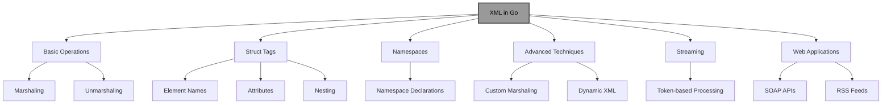
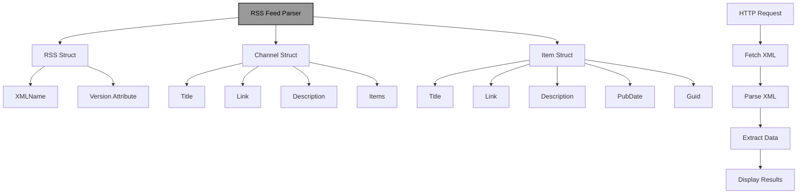

# XML in Go: A Comprehensive Guide

!!! abstract "Overview"
Master XML handling in Go using the `encoding/xml` package. Learn to marshal and unmarshal data, work with struct tags, handle namespaces, implement custom marshaling, stream large documents, and build robust XML-based applications with proper error handling and validation.

!!! tip "Key Points"
- Use `xml.Marshal` and `xml.Unmarshal` for basic XML operations with Go structs
- Struct tags control XML element names, attributes, and nesting (e.g., `xml:"name"`, `xml:"parent>child"`)
- Implement custom marshaling/unmarshaling by implementing `xml.Marshaler` and `xml.Unmarshaler` interfaces
- Use streaming with `xml.Decoder.Token()` for large XML documents to improve memory efficiency
- Handle XML namespaces properly with namespace declarations in struct tags
- Always validate XML input and handle errors gracefully in production code

## Understanding XML in Go

XML (eXtensible Markup Language) is a markup language that defines a set of rules for encoding documents in a format that is both human-readable and machine-readable. In Go, the `encoding/xml` package provides robust support for working with XML data, similar to the JSON package.

!!! info "XML Operations in Go"


## Basic XML Operations

### Marshaling (Go to XML)

Marshaling converts Go data structures into XML format:

!!! example "Marshaling Go Structs to XML"
```go title="marshaling.go" linenums="1" hl_lines="8-25"
package main

import (
    "encoding/xml"
    "fmt"
    "log"
)

type Person struct {
    XMLName   xml.Name `xml:"person"`
    FirstName string   `xml:"firstName"`
    LastName  string   `xml:"lastName"`
    Age       int      `xml:"age,omitempty"`
}

func main() {
    person := Person{
        FirstName: "John",
        LastName:  "Doe",
        // Age is left empty to demonstrate omitempty
    }
    
    // Marshal to XML
    xmlData, err := xml.Marshal(person)
    if err != nil {
        log.Fatal(err)
    }
    
    fmt.Println(string(xmlData))
    // Output: <person><firstName>John</firstName><lastName>Doe</lastName></person>
}
```

### Unmarshaling (XML to Go)

Unmarshaling converts XML data into Go data structures:

!!! example "Unmarshaling XML to Go Structs"
```go title="unmarshaling.go" linenums="1" hl_lines="8-25"
package main

import (
    "encoding/xml"
    "fmt"
    "log"
)

type Person struct {
    XMLName   xml.Name `xml:"person"`
    FirstName string   `xml:"firstName"`
    LastName  string   `xml:"lastName"`
    Age       int      `xml:"age,omitempty"`
}

func main() {
    xmlStr := `<person><firstName>Bob</firstName><lastName>Smith</lastName><age>25</age></person>`
    
    var person Person
    err := xml.Unmarshal([]byte(xmlStr), &person)
    if err != nil {
        log.Fatal(err)
    }
    
    fmt.Printf("%+v\n", person)
    // Output: {XMLName:{Space: Local:person} FirstName:Bob LastName:Smith Age:25}
}
```

## XML Struct Tags

Struct tags provide metadata that control how fields are encoded and decoded in XML:

!!! example "Using XML Struct Tags"
```go title="xml_struct_tags.go" linenums="1" hl_lines="8-35"
package main

import (
    "encoding/xml"
    "fmt"
    "log"
)

type Employee struct {
    XMLName   xml.Name `xml:"employee"`
    ID        int      `xml:"id,attr"`
    FirstName string   `xml:"name>first"`
    LastName  string   `xml:"name>last"`
    Email     string   `xml:"email,omitempty"`
    IsActive  bool     `xml:"active,attr"`
    Roles     []string `xml:"roles>role"`
    Salary    float64  `xml:"salary,omitempty"`
    // Field will be ignored
    password string `xml:"-"`
}

func main() {
    employee := Employee{
        ID:        1001,
        FirstName: "John",
        LastName:  "Doe",
        IsActive:  true,
        Roles:     []string{"admin", "developer"},
        password:  "secret",
    }
    
    xmlData, err := xml.MarshalIndent(employee, "", "  ")
    if err != nil {
        log.Fatal(err)
    }
    
    fmt.Println(string(xmlData))
    /*
    Output:
    <employee id="1001" active="true">
      <name>
        <first>John</first>
        <last>Doe</last>
      </name>
      <roles>
        <role>admin</role>
        <role>developer</role>
      </roles>
    </employee>
    */
}
```

### Common XML Struct Tags

| Tag | Description |
|-----|-------------|
| `xml:"element_name"` | Specifies the XML element name |
| `xml:"element_name,attr"` | Encodes the field as an attribute |
| `xml:"parent>child"` | Creates nested elements |
| `xml:"-"` | Omits the field from XML output |
| `xml:",omitempty"` | Omits the field if it has a zero value |
| `xml:",chardata"` | Encodes the field as character data |
| `xml:",innerxml"` | Uses the raw XML |
| `xml:",comment"` | Encodes the field as an XML comment |

## Working with XML Namespaces

XML namespaces are used to avoid element name conflicts. Go's XML package supports namespaces through struct tags:

!!! example "Handling XML Namespaces"
```go title="xml_namespaces.go" linenums="1" hl_lines="8-50"
package main

import (
    "encoding/xml"
    "fmt"
    "log"
)

type Envelope struct {
    XMLName xml.Name `xml:"soap:Envelope"`
    Soap    string   `xml:"xmlns:soap,attr"`
    Xsi     string   `xml:"xmlns:xsi,attr"`
    Body    Body     `xml:"soap:Body"`
}

type Body struct {
    XMLName  xml.Name `xml:"soap:Body"`
    GetPrice GetPrice `xml:"m:GetPrice"`
}

type GetPrice struct {
    XMLName xml.Name `xml:"m:GetPrice"`
    M       string   `xml:"xmlns:m,attr"`
    Item    Item     `xml:"m:Item"`
}

type Item struct {
    XMLName xml.Name `xml:"m:Item"`
    Name    string   `xml:"m:Name"`
}

func main() {
    envelope := Envelope{
        Soap: "http://www.w3.org/2003/05/soap-envelope",
        Xsi:  "http://www.w3.org/2001/XMLSchema-instance",
        Body: Body{
            GetPrice: GetPrice{
                M: "http://www.example.org/prices",
                Item: Item{
                    Name: "Apple",
                },
            },
        },
    }
    
    xmlData, err := xml.MarshalIndent(envelope, "", "  ")
    if err != nil {
        log.Fatal(err)
    }
    
    fmt.Println(string(xmlData))
    /*
    Output:
    <soap:Envelope xmlns:soap="http://www.w3.org/2003/05/soap-envelope" xmlns:xsi="http://www.w3.org/2001/XMLSchema-instance">
      <soap:Body>
        <m:GetPrice xmlns:m="http://www.example.org/prices">
          <m:Item>
            <m:Name>Apple</m:Name>
          </m:Item>
        </m:GetPrice>
      </soap:Body>
    </soap:Envelope>
    */
}
```

## Handling Dynamic XML

Sometimes you need to work with XML that doesn't have a fixed structure:

!!! example "Handling Dynamic XML"
```go title="dynamic_xml.go" linenums="1" hl_lines="8-40"
package main

import (
    "encoding/xml"
    "fmt"
    "log"
    "strings"
)

func main() {
    // XML with unknown structure
    xmlStr := `
    <person>
        <name>John Doe</name>
        <age>30</age>
        <address>
            <street>123 Main St</street>
            <city>New York</city>
            <zip>10001</zip>
        </address>
        <hobbies>
            <hobby>reading</hobby>
            <hobby>hiking</hobby>
        </hobbies>
    </person>
    `
    
    // Unmarshal into a generic structure
    var data struct {
        XMLName  xml.Name         `xml:"person"`
        Name     string           `xml:"name"`
        Age      int              `xml:"age"`
        Address  map[string]string `xml:"address"`
        Hobbies  []string         `xml:"hobbies>hobby"`
        Other    []xml.Name       `xml:",any"`
    }
    
    decoder := xml.NewDecoder(strings.NewReader(xmlStr))
    err := decoder.Decode(&data)
    if err != nil {
        log.Fatal(err)
    }
    
    fmt.Printf("Name: %s\n", data.Name)
    fmt.Printf("Age: %d\n", data.Age)
    fmt.Printf("Address: %+v\n", data.Address)
    fmt.Printf("Hobbies: %v\n", data.Hobbies)
}
```

## Custom Marshaling and Unmarshaling

You can implement custom XML encoding and decoding by implementing the `xml.Marshaler` and `xml.Unmarshaler` interfaces:

!!! example "Custom Marshaling and Unmarshaling"
```go title="custom_marshaling.go" linenums="1" hl_lines="8-55"
package main

import (
    "encoding/xml"
    "fmt"
    "strings"
    "time"
)

type Date struct {
    time.Time
}

// Implement Marshaler interface
func (d Date) MarshalXML(e *xml.Encoder, start xml.StartElement) error {
    xmlDate := d.Time.Format("2006-01-02")
    return e.EncodeElement(xmlDate, start)
}

// Implement Unmarshaler interface
func (d *Date) UnmarshalXML(dec *xml.Decoder, start xml.StartElement) error {
    var content string
    if err := dec.DecodeElement(&content, &start); err != nil {
        return err
    }
    
    t, err := time.Parse("2006-01-02", content)
    if err != nil {
        return err
    }
    
    d.Time = t
    return nil
}

type Event struct {
    XMLName xml.Name `xml:"event"`
    Name    string   `xml:"name"`
    Date    Date     `xml:"date"`
}

func main() {
    // Custom marshaling
    event := Event{
        Name: "Conference",
        Date: Date{time.Date(2023, 10, 15, 0, 0, 0, 0, time.UTC)},
    }
    
    xmlData, err := xml.MarshalIndent(event, "", "  ")
    if err != nil {
        panic(err)
    }
    
    fmt.Println(string(xmlData))
    /*
    Output:
    <event>
      <name>Conference</name>
      <date>2023-10-15</date>
    </event>
    */
    
    // Custom unmarshaling
    xmlStr := `<event><name>Meeting</name><date>2023-11-20</date></event>`
    var newEvent Event
    err = xml.Unmarshal([]byte(xmlStr), &newEvent)
    if err != nil {
        panic(err)
    }
    
    fmt.Printf("%+v\n", newEvent)
    // Output: {XMLName:{Space: Local:event} Name:Meeting Date:{Time:2023-11-20 00:00:00 +0000 UTC}}
}
```

## Streaming XML

For large XML documents, streaming can be more memory-efficient:

!!! example "Streaming XML"
```go title="streaming_xml.go" linenums="1" hl_lines="8-45"
package main

import (
    "encoding/xml"
    "fmt"
    "io"
    "log"
    "strings"
)

type Product struct {
    XMLName xml.Name `xml:"product"`
    ID      int      `xml:"id,attr"`
    Name    string   `xml:"name"`
    Price   float64  `xml:"price"`
}

func main() {
    // Create a large XML document
    var builder strings.Builder
    builder.WriteString(`<?xml version="1.0" encoding="UTF-8"?><products>`)
    
    for i := 1; i <= 1000; i++ {
        builder.WriteString(fmt.Sprintf(`<product id="%d"><name>Product %d</name><price>%.2f</price></product>`, i, i, float64(i)*0.99))
    }
    
    builder.WriteString(`</products>`)
    xmlData := builder.String()
    
    // Create a decoder
    decoder := xml.NewDecoder(strings.NewReader(xmlData))
    
    // Process the XML in a streaming fashion
    for {
        // Read tokens from the XML document
        token, err := decoder.Token()
        if err != nil {
            if err == io.EOF {
                break
            }
            log.Fatal(err)
        }
        
        // Check for start elements
        if se, ok := token.(xml.StartElement); ok {
            if se.Name.Local == "product" {
                var product Product
                // Decode the product element
                err := decoder.DecodeElement(&product, &se)
                if err != nil {
                    log.Fatal(err)
                }
                
                // Process the product (e.g., print every 100th product)
                if product.ID%100 == 0 {
                    fmt.Printf("Processed product ID: %d, Name: %s, Price: %.2f\n", 
                        product.ID, product.Name, product.Price)
                }
            }
        }
    }
}
```

## Working with XML in Web Applications

XML is commonly used in web applications, especially for SOAP APIs and RSS feeds:

!!! example "XML in Web Applications"
```go title="web_xml.go" linenums="1" hl_lines="8-40"
package main

import (
    "encoding/xml"
    "net/http"
)

type User struct {
    XMLName xml.Name `xml:"user"`
    ID      int      `xml:"id,attr"`
    Name    string   `xml:"name"`
    Email   string   `xml:"email"`
}

var users = []User{
    {ID: 1, Name: "Alice", Email: "alice@example.com"},
    {ID: 2, Name: "Bob", Email: "bob@example.com"},
}

func main() {
    http.HandleFunc("/users", func(w http.ResponseWriter, r *http.Request) {
        w.Header().Set("Content-Type", "application/xml")
        xml.NewEncoder(w).Encode(users)
    })
    
    http.HandleFunc("/user", func(w http.ResponseWriter, r *http.Request) {
        // Parse XML from request body
        var newUser User
        err := xml.NewDecoder(r.Body).Decode(&newUser)
        if err != nil {
            http.Error(w, err.Error(), http.StatusBadRequest)
            return
        }
        
        // Add new user
        newUser.ID = len(users) + 1
        users = append(users, newUser)
        
        // Return the created user
        w.Header().Set("Content-Type", "application/xml")
        w.WriteHeader(http.StatusCreated)
        xml.NewEncoder(w).Encode(newUser)
    })
    
    http.ListenAndServe(":8080", nil)
}
```

## Handling XML Errors

Proper error handling is crucial when working with XML:

!!! example "XML Error Handling"
```go title="xml_errors.go" linenums="1" hl_lines="8-35"
package main

import (
    "encoding/xml"
    "fmt"
    "log"
    "strings"
)

func main() {
    // Invalid XML
    invalidXML := `<person><name>Alice</name><age>30` // Missing closing tags
    
    var person struct {
        XMLName xml.Name `xml:"person"`
        Name    string   `xml:"name"`
        Age     int      `xml:"age"`
    }
    
    decoder := xml.NewDecoder(strings.NewReader(invalidXML))
    err := decoder.Decode(&person)
    if err != nil {
        // Type assertion to get more details about the error
        if syntaxErr, ok := err.(*xml.SyntaxError); ok {
            fmt.Printf("Syntax error at line %d, column %d: %v\n", 
                syntaxErr.Line, syntaxErr.Column, syntaxErr)
        } else {
            fmt.Printf("Error unmarshaling XML: %v\n", err)
        }
        return
    }
    
    fmt.Printf("%+v\n", person)
}
```

## Pretty-Printing XML

For debugging or display purposes, you might want to format XML:

!!! example "Pretty-Printing XML"
```go title="pretty_print_xml.go" linenums="1" hl_lines="8-40"
package main

import (
    "encoding/xml"
    "fmt"
)

type Person struct {
    XMLName  xml.Name `xml:"person"`
    Name     string   `xml:"name"`
    Age      int      `xml:"age,omitempty"`
    Hobbies  []string `xml:"hobbies>hobby"`
    Address  struct {
        Street string `xml:"street"`
        City   string `xml:"city"`
    } `xml:"address"`
}

func main() {
    person := Person{
        Name: "Alice",
        Age:  30,
        Hobbies: []string{"reading", "hiking", "coding"},
        Address: struct {
            Street string `xml:"street"`
            City   string `xml:"city"`
        }{
            Street: "123 Main St",
            City:   "New York",
        },
    }
    
    // Marshal with indentation
    xmlData, err := xml.MarshalIndent(person, "", "  ")
    if err != nil {
        panic(err)
    }
    
    // Add XML declaration
    output := xml.Header + string(xmlData)
    fmt.Println(output)
    /*
    Output:
    <?xml version="1.0" encoding="UTF-8"?>
    <person>
      <name>Alice</name>
      <age>30</age>
      <hobbies>
        <hobby>reading</hobby>
        <hobby>hiking</hobby>
        <hobby>coding</hobby>
      </hobbies>
      <address>
        <street>123 Main St</street>
        <city>New York</city>
      </address>
    </person>
    */
}
```

## Working with XML and CDATA

CDATA sections are used to include text that might contain characters that could be interpreted as XML markup:

!!! example "XML CDATA Sections"
```go title="xml_cdata.go" linenums="1" hl_lines="8-30"
package main

import (
    "encoding/xml"
    "fmt"
)

type Message struct {
    XMLName xml.Name `xml:"message"`
    From    string   `xml:"from"`
    To      string   `xml:"to"`
    Content string   `xml:",innerxml"` // Use innerxml to preserve CDATA
}

func main() {
    message := Message{
        From:    "alice@example.com",
        To:      "bob@example.com",
        Content: "<![CDATA[This message contains <special> & characters]]>",
    }
    
    xmlData, err := xml.MarshalIndent(message, "", "  ")
    if err != nil {
        panic(err)
    }
    
    fmt.Println(string(xmlData))
    /*
    Output:
    <message>
      <from>alice@example.com</from>
      <to>bob@example.com</to>
      <![CDATA[This message contains <special> & characters]]>
    </message>
    */
}
```

## Real-World Example: RSS Feed Parser

Let's create a comprehensive example that demonstrates parsing an RSS feed:

!!! example "RSS Feed Parser"
```go title="rss_parser.go" linenums="1" hl_lines="8-80"
package main

import (
    "encoding/xml"
    "fmt"
    "io"
    "net/http"
    "time"
)

// RSS 2.0 structure
type RSS struct {
    XMLName xml.Name `xml:"rss"`
    Version string   `xml:"version,attr"`
    Channel Channel  `xml:"channel"`
}

type Channel struct {
    Title         string `xml:"title"`
    Link          string `xml:"link"`
    Description   string `xml:"description"`
    Language      string `xml:"language"`
    LastBuildDate string `xml:"lastBuildDate"`
    Items         []Item `xml:"item"`
}

type Item struct {
    Title       string `xml:"title"`
    Link        string `xml:"link"`
    Description string `xml:"description"`
    PubDate     string `xml:"pubDate"`
    Guid        string `xml:"guid"`
}

// Custom unmarshaler for date
func (i *Item) UnmarshalXML(d *xml.Decoder, start xml.StartElement) error {
    type ItemAlias Item
    var alias ItemAlias
    
    if err := d.DecodeElement(&alias, &start); err != nil {
        return err
    }
    
    *i = Item(alias)
    return nil
}

func main() {
    // Fetch RSS feed
    resp, err := http.Get("https://example.com/rss.xml")
    if err != nil {
        panic(err)
    }
    defer resp.Body.Close()
    
    body, err := io.ReadAll(resp.Body)
    if err != nil {
        panic(err)
    }
    
    // Parse RSS feed
    var rss RSS
    err = xml.Unmarshal(body, &rss)
    if err != nil {
        panic(err)
    }
    
    // Print channel information
    fmt.Printf("Channel: %s\n", rss.Channel.Title)
    fmt.Printf("Link: %s\n", rss.Channel.Link)
    fmt.Printf("Description: %s\n", rss.Channel.Description)
    fmt.Printf("Language: %s\n", rss.Channel.Language)
    fmt.Printf("Last Build Date: %s\n", rss.Channel.LastBuildDate)
    fmt.Println()
    
    // Print items
    fmt.Printf("Found %d items:\n", len(rss.Channel.Items))
    for i, item := range rss.Channel.Items {
        fmt.Printf("%d. %s\n", i+1, item.Title)
        fmt.Printf("   Link: %s\n", item.Link)
        fmt.Printf("   Published: %s\n", item.PubDate)
        fmt.Printf("   Description: %.50s...\n", item.Description)
        fmt.Println()
    }
}
```

### How This Example Demonstrates XML Concepts:

1. **Complex XML Structure**:
   - Handles nested XML elements (RSS > Channel > Item)
   - Works with XML attributes (version)

2. **Real-World Data**:
   - Fetches XML from a real URL
   - Parses a standard format (RSS)

3. **Date Handling**:
   - Includes a custom unmarshaler for date fields
   - Demonstrates how to handle special data types

4. **Error Handling**:
   - Includes proper error handling for network and parsing operations

!!! info "RSS Feed Parser Architecture"


## Best Practices for XML in Go

!!! tip "Use Struct Tags Effectively"
Use struct tags to control XML element names, attributes, and nesting.

!!! example "Effective Struct Tags"
```go title="effective_struct_tags.go" linenums="1" hl_lines="8-15"
package main

type User struct {
    ID       int    `xml:"id,attr"`
    Username string `xml:"username"`
    Email    string `xml:"email,omitempty"`
    Password string `xml:"-"` // Never expose passwords
}
```

!!! tip "Handle Namespaces Properly"
Use namespace declarations in struct tags to handle XML namespaces correctly.

!!! example "Namespace Handling"
```go title="namespace_handling.go" linenums="1" hl_lines="8-20"
package main

type SOAPEnvelope struct {
    XMLName xml.Name `xml:"soap:Envelope"`
    SoapNS  string   `xml:"xmlns:soap,attr"`
    Body    SOAPBody `xml:"soap:Body"`
}

type SOAPBody struct {
    XMLName xml.Name `xml:"soap:Body"`
    Content string   `xml:",innerxml"`
}
```

!!! tip "Use Streaming for Large Documents"
For large XML documents, use token-based streaming to improve memory efficiency.

!!! example "Streaming Large XML"
```go title="streaming_large_xml.go" linenums="1" hl_lines="8-30"
package main

import (
    "encoding/xml"
    "io"
)

func processLargeXML(r io.Reader) error {
    decoder := xml.NewDecoder(r)
    
    for {
        token, err := decoder.Token()
        if err != nil {
            if err == io.EOF {
                break
            }
            return err
        }
        
        // Process tokens
        if se, ok := token.(xml.StartElement); ok {
            // Handle start elements
        }
    }
    
    return nil
}
```

!!! tip "Validate XML Input"
Always validate XML input before processing it in production code.

!!! example "XML Input Validation"
```go title="xml_validation.go" linenums="1" hl_lines="8-25"
package main

import (
    "encoding/xml"
    "errors"
)

func validateUserXML(xmlData []byte) error {
    var user User
    if err := xml.Unmarshal(xmlData, &user); err != nil {
        return err
    }
    
    if user.Name == "" {
        return errors.New("name is required")
    }
    
    if user.Age < 0 || user.Age > 120 {
        return errors.New("invalid age")
    }
    
    return nil
}
```

!!! tip "Use CDATA for Special Content"
Use CDATA sections for content that might contain special XML characters.

!!! example "CDATA Usage"
```go title="cdata_usage.go" linenums="1" hl_lines="8-20"
package main

type Message struct {
    Content string `xml:",innerxml"`
}

func main() {
    msg := Message{
        Content: "<![CDATA[This contains <special> & characters]]>",
    }
    
    xmlData, _ := xml.Marshal(msg)
    fmt.Println(string(xmlData))
}
```

## Common Pitfalls and Solutions

!!! warning "Case Sensitivity"
XML element names are case-sensitive, but Go struct tags can handle this.

!!! example "Handling Case Sensitivity"
```go title="case_sensitivity.go" linenums="1" hl_lines="8-15"
package main

type Person struct {
    FirstName string `xml:"firstName"` // Maps to XML "firstName"
    LastName  string `xml:"lastName"`  // Maps to XML "lastName"
}
```

!!! warning "Handling Mixed Content"
XML can contain mixed content (text and elements mixed together).

!!! example "Mixed Content Handling"
```go title="mixed_content.go" linenums="1" hl_lines="8-25"
package main

type Description struct {
    Text string `xml:",chardata"`
    Em   string `xml:"em"`
}

func main() {
    xmlStr := `<description>This is <em>important</em> text</description>`
    
    var desc Description
    xml.Unmarshal([]byte(xmlStr), &desc)
    
    fmt.Println(desc.Text) // "This is "
    fmt.Println(desc.Em)   // "important"
}
```

!!! warning "XML Namespaces"
Namespaces can be tricky to handle correctly.

!!! example "Namespace Handling"
```go title="namespace_handling.go" linenums="1" hl_lines="8-20"
package main

type Element struct {
    XMLName  xml.Name
    Value    string `xml:",chardata"`
    LocalNS  string `xml:"local,attr"`
    GlobalNS string `xml:"http://example.com/ns,attr"`
}
```

!!! warning "Character Encoding"
XML documents can have different character encodings.

!!! example "Character Encoding"
```go title="character_encoding.go" linenums="1" hl_lines="8-25"
package main

import (
    "encoding/xml"
    "io"
    "golang.org/x/text/encoding/charmap"
)

func decodeXML(r io.Reader) error {
    decoder := xml.NewDecoder(r)
    // Set the charset reader if needed
    decoder.CharsetReader = func(charset string, input io.Reader) (io.Reader, error) {
        if charset == "iso-8859-1" {
            return charmap.ISO8859_1.NewDecoder().Reader(input), nil
        }
        return input, nil
    }
    
    // Decode as usual
    var data interface{}
    return decoder.Decode(&data)
}
```

## Quick Reference

!!! success "Key Takeaways"
- **Basic Operations**: Use `xml.Marshal` and `xml.Unmarshal` for converting between Go structs and XML
- **Struct Tags**: Control XML element names with `xml:"name"`, attributes with `xml:"name,attr"`, and nesting with `xml:"parent>child"`
- **Namespaces**: Handle XML namespaces with namespace declarations in struct tags like `xml:"xmlns:prefix,attr"`
- **Custom Marshaling**: Implement `xml.Marshaler` and `xml.Unmarshaler` interfaces for special data types
- **Streaming**: Use `xml.Decoder.Token()` for large XML documents to improve memory efficiency
- **Web Applications**: XML is commonly used in SOAP APIs and RSS feeds; use `xml.Encoder` and `xml.Decoder` for HTTP handling
- **Error Handling**: Always validate XML input and handle errors gracefully in production code
- **CDATA**: Use `xml:",innerxml"` for content that might contain special XML characters

!!! quote "Remember"
"XML handling in Go is powerful and flexible. The `encoding/xml` package provides all the tools you need for robust XML processing, from simple data structures to complex document formats. By mastering XML handling in Go, you can effectively work with APIs, configuration files, and data interchange in your applications. Whether you're building SOAP web services, parsing RSS feeds, or working with configuration files, Go's XML support has you covered."