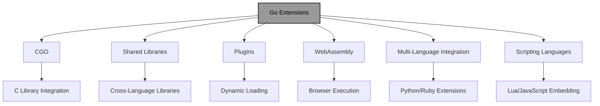

# Go Extensions: Extending Go Functionality

!!! abstract "Overview"
Master the various mechanisms for extending Go functionality beyond its standard library. Learn to integrate with C libraries using CGO, build shared libraries and plugins, compile to WebAssembly, and embed scripting languages to create flexible, extensible applications.

!!! tip "Key Points"
- Use CGO sparingly to integrate with C libraries, being mindful of memory management and performance overhead
- Build shared libraries with `go build -buildmode=c-shared` for cross-language integration
- Create dynamic plugins using Go's plugin package for runtime extensibility
- Compile Go to WebAssembly with `GOOS=js GOARCH=wasm` for browser-based applications
- Embed scripting languages like Lua or JavaScript for runtime configuration and extensibility

## Understanding Go Extensions

Go provides several mechanisms for extending the language's functionality beyond its standard library. Unlike some languages that have built-in extension systems, Go offers different approaches to integrate with external code, libraries, and even other programming languages.

!!! info "Go Extension Mechanisms"


## 1. CGO: Integrating with C Libraries

CGO is Go's foreign function interface that allows Go programs to call C code and use C libraries.

### Basic CGO Usage

!!! example "Basic CGO Usage"
```go title="basic_cgo.go" linenums="1" hl_lines="8-35"
package main

/*
#include <stdio.h>
#include <stdlib.h>

void printMessage(char* message) {
    printf("C says: %s\n", message);
}

int add(int a, int b) {
    return a + b;
}
*/
import "C"
import (
    "fmt"
    "unsafe"
)

func main() {
    // Call C function
    message := C.CString("Hello from Go!")
    C.printMessage(message)
    C.free(unsafe.Pointer(message))
    
    // Call C function with return value
    result := C.add(C.int(5), C.int(3))
    fmt.Printf("Go received result from C: %d\n", result)
}
```

### Using External C Libraries

!!! example "Using External C Libraries"
```go title="external_c_library.go" linenums="1" hl_lines="8-40"
package main

/*
#cgo pkg-config: zlib
#include <zlib.h>
*/
import "C"
import (
    "fmt"
    "unsafe"
)

func main() {
    // Compress data using zlib
    data := []byte("Hello, World! This is a test string for compression.")
    
    // Calculate required buffer size
    destSize := C.compressBound(C.uLong(len(data)))
    dest := make([]byte, destSize)
    
    // Compress
    result := C.compress(
        (*C.Bytef)(unsafe.Pointer(&dest[0])),
        (*C.uLongf)(&destSize),
        (*C.Bytef)(unsafe.Pointer(&data[0])),
        C.uLong(len(data)),
    )
    
    if result != C.Z_OK {
        fmt.Println("Compression failed")
        return
    }
    
    fmt.Printf("Original size: %d, Compressed size: %d\n", len(data), destSize)
    fmt.Printf("Compressed data: %v\n", dest[:destSize])
}
```

### CGO Best Practices

!!! tip "Minimize CGO Usage"
CGO adds overhead and complexity, so use it sparingly and isolate it to specific packages.

!!! example "CGO Best Practices"
```go title="cgo_best_practices.go" linenums="1" hl_lines="8-20"
package main

/*
#cgo pkg-config: someclib
#include <someclib.h>
*/
import "C"
import (
    "errors"
    "unsafe"
)

// Isolate CGO code to specific functions
func ProcessWithC(input []byte) ([]byte, error) {
    if len(input) == 0 {
        return nil, errors.New("empty input")
    }
    
    // Use CGO only when necessary
    result := C.some_c_function(
        (*C.char)(unsafe.Pointer(&input[0])),
        C.size_t(len(input)),
    )
    
    // Handle errors appropriately
    if result == nil {
        return nil, errors.New("C function failed")
    }
    
    // Convert result back to Go slice
    // ... conversion code ...
    
    return []byte("result"), nil
}
```

## 2. Shared Libraries and Plugins

Go can build shared libraries that can be used by other programming languages, and load plugins dynamically at runtime.

### Building a Shared Library

!!! example "Building a Shared Library"
```go title="shared_library.go" linenums="1" hl_lines="8-20"
package main

import "C"

//export Add
func Add(a, b int) int {
    return a + b
}

//export Hello
func Hello() *C.char {
    return C.CString("Hello from Go shared library!")
}

func main() {}
```

Build with:
```bash
go build -buildmode=c-shared -o libmath.so
```

### Using Go Shared Library in C

!!! example "Using Go Shared Library in C"
```go title="c_using_go_library.c" linenums="1" hl_lines="1-35"
#include <stdio.h>
#include <dlfcn.h>
#include "libmath.h"

int main() {
    void* handle = dlopen("./libmath.so", RTLD_LAZY);
    if (!handle) {
        fprintf(stderr, "Error: %s\n", dlerror());
        return 1;
    }
    
    // Load functions
    int (*add)(int, int) = dlsym(handle, "Add");
    char* (*hello)() = dlsym(handle, "Hello");
    
    if (!add || !hello) {
        fprintf(stderr, "Error: %s\n", dlerror());
        return 1;
    }
    
    // Use functions
    printf("5 + 3 = %d\n", add(5, 3));
    printf("%s\n", hello());
    
    dlclose(handle);
    return 0;
}
```

### Dynamic Plugins with the plugin Package

Go's `plugin` package allows loading Go plugins at runtime.

#### Plugin Code (plugin.go)

!!! example "Plugin Code"
```go title="plugin.go" linenums="1" hl_lines="8-35"
package main

import "fmt"

type Greeter interface {
    Greet() string
}

type EnglishGreeter struct{}

func (g EnglishGreeter) Greet() string {
    return "Hello!"
}

type SpanishGreeter struct{}

func (g SpanishGreeter) Greet() string {
    return "¡Hola!"
}

// Export symbols
var English = EnglishGreeter{}
var Spanish = SpanishGreeter{}

func init() {
    fmt.Println("Plugin loaded")
}
```

Build with:
```bash
go build -buildmode=plugin -o greeter.so plugin.go
```

#### Main Application (main.go)

!!! example "Main Application Using Plugins"
```go title="main_app.go" linenums="1" hl_lines="8-40"
package main

import (
    "fmt"
    "plugin"
)

type Greeter interface {
    Greet() string
}

func main() {
    // Load plugin
    p, err := plugin.Open("greeter.so")
    if err != nil {
        fmt.Printf("Failed to load plugin: %v\n", err)
        return
    }
    
    // Look up symbols
    englishSym, err := p.Lookup("English")
    if err != nil {
        fmt.Printf("Failed to look up English: %v\n", err)
        return
    }
    
    spanishSym, err := p.Lookup("Spanish")
    if err != nil {
        fmt.Printf("Failed to look up Spanish: %v\n", err)
        return
    }
    
    // Type assert symbols
    english, ok := englishSym.(Greeter)
    if !ok {
        fmt.Println("English symbol is not a Greeter")
        return
    }
    
    spanish, ok := spanishSym.(Greeter)
    if !ok {
        fmt.Println("Spanish symbol is not a Greeter")
        return
    }
    
    // Use the plugins
    fmt.Println("English:", english.Greet())
    fmt.Println("Spanish:", spanish.Greet())
}
```

## 3. WebAssembly (WASM) Extensions

Go can compile to WebAssembly, allowing Go code to run in browsers and other WASM environments.

### Basic WASM Example

!!! example "Basic WASM Example"
```go title="wasm_example.go" linenums="1" hl_lines="8-30"
package main

import (
    "fmt"
    "syscall/js"
)

func main() {
    // Create a channel to keep the program running
    c := make(chan struct{}, 0)
    
    // Register a function to be called from JavaScript
    js.Global().Set("add", js.FuncOf(add))
    
    fmt.Println("Go WebAssembly module initialized")
    <-c // Wait forever
}

func add(this js.Value, args []js.Value) interface{} {
    if len(args) != 2 {
        return "Invalid number of arguments"
    }
    
    a := args[0].Int()
    b := args[1].Int()
    
    return a + b
}
```

Build with:
```bash
GOOS=js GOARCH=wasm go build -o main.wasm
```

### HTML to Load WASM

!!! example "HTML to Load WASM"
```go title="wasm_loader.html" linenums="1" hl_lines="1-35"
<!DOCTYPE html>
<html>
<head>
    <meta charset="utf-8"/>
    <title>Go WASM Example</title>
</head>
<body>
    <script src="wasm_exec.js"></script>
    <script>
        const go = new Go();
        WebAssembly.instantiateStreaming(fetch("main.wasm"), go.importObject)
            .then(result => {
                go.run(result.instance);
            });
            
        function callAdd() {
            const a = parseInt(document.getElementById("a").value);
            const b = parseInt(document.getElementById("b").value);
            const result = add(a, b);
            document.getElementById("result").textContent = result;
        }
    </script>
    
    <input type="number" id="a" value="5">
    <input type="number" id="b" value="3">
    <button onclick="callAdd()">Add</button>
    <p>Result: <span id="result"></span></p>
</body>
</html>
```

## 4. Extending Go with Other Languages

### Python Extensions

You can create Python extensions in Go using CGO and Python's C API.

!!! example "Python Extension in Go"
```go title="python_extension.go" linenums="1" hl_lines="8-50"
package main

/*
#include <Python.h>
*/
import "C"
import (
    "unsafe"
)

//export add_numbers
func add_numbers(self, args *C.PyObject) *C.PyObject {
    var a, b C.int
    
    // Parse arguments
    if C.PyArg_ParseTuple(args, "ii", &a, &b) == 0 {
        return nil
    }
    
    // Call Go function
    result := add(int(a), int(b))
    
    // Return result as Python int
    return C.PyLong_FromLong(C.long(result))
}

func add(a, b int) int {
    return a + b
}

//export initmath
func initmath() {
    // Create module
    module := C.PyImport_AddModule("math")
    
    // Add function to module
    methods := [1]C.PyMethodDef{
        {C.CString("add_numbers"), C.PyCFunction(add_numbers), C.METH_VARARGS, C.CString("Add two numbers")},
        {nil, nil, 0, nil},
    }
    
    C.PyModule_Create(module, &methods[0])
}

func main() {}
```

### Ruby Extensions

Similarly, you can create Ruby extensions in Go.

!!! example "Ruby Extension in Go"
```go title="ruby_extension.go" linenums="1" hl_lines="8-45"
package main

/*
#include <ruby.h>
*/
import "C"
import (
    "unsafe"
)

//export add
func add(argc C.int, argv *C.VALUE, self C.VALUE) C.VALUE {
    // Check argument count
    if argc != 2 {
        C.rb_raise(C.rb_eArgError, C.CString("wrong number of arguments (expected 2)"))
    }
    
    // Convert arguments to Go values
    a := int(C.NUM2INT(*(*C.VALUE)(unsafe.Pointer(uintptr(unsafe.Pointer(argv)))))
    b := int(C.NUM2INT(*(*C.VALUE)(unsafe.Pointer(uintptr(unsafe.Pointer(argv)) + unsafe.Sizeof(C.VALUE{})))))
    
    // Call Go function
    result := a + b
    
    // Return result as Ruby int
    return C.INT2NUM(C.long(result))
}

//export Init_math
func Init_math() {
    // Define module
    module := C.rb_define_module(C.CString("Math"))
    
    // Define method
    C.rb_define_module_function(module, C.CString("add"), C.PyCFunction(add), -1)
}

func main() {}
```

## 5. Extending Go with Scripting Languages

### Embedding Lua in Go

!!! example "Embedding Lua in Go"
```go title="lua_embedding.go" linenums="1" hl_lines="8-50"
package main

/*
#cgo pkg-config: lua5.3
#include <lua.h>
#include <lauxlib.h>
#include <lualib.h>
*/
import "C"
import (
    "fmt"
    "unsafe"
)

func main() {
    // Create Lua state
    L := C.luaL_newstate()
    defer C.lua_close(L)
    
    // Load Lua libraries
    C.luaL_openlibs(L)
    
    // Define a Go function to be called from Lua
    C.lua_pushcfunction(L, (*[0]byte)(C.goAdd))
    C.lua_setglobal(L, C.CString("go_add"))
    
    // Execute Lua script
    script := `
    print("Lua script started")
    result = go_add(5, 3)
    print("5 + 3 =", result)
    `
    
    if C.luaL_dostring(L, C.CString(script)) != 0 {
        fmt.Printf("Error: %s\n", C.GoString(C.lua_tostring(L, -1)))
    }
}

//export goAdd
func goAdd(L *C.lua_State) C.int {
    // Get arguments
    a := int(C.lua_tonumber(L, 1))
    b := int(C.lua_tonumber(L, 2))
    
    // Call Go function
    result := a + b
    
    // Push result
    C.lua_pushnumber(L, C.lua_Number(result))
    
    // Return number of results
    return 1
}
```

### Embedding JavaScript in Go with Otto

!!! example "Embedding JavaScript in Go"
```go title="javascript_embedding.go" linenums="1" hl_lines="8-35"
package main

import (
    "fmt"
    "github.com/robertkrimen/otto"
)

func main() {
    vm := otto.New()
    
    // Define a Go function to be called from JavaScript
    vm.Set("goAdd", func(call otto.FunctionCall) otto.Value {
        a, _ := call.Argument(0).ToInteger()
        b, _ := call.Argument(1).ToInteger()
        
        result, _ := vm.ToValue(a + b)
        return result
    })
    
    // Execute JavaScript
    script := `
    console.log("JavaScript script started");
    var result = goAdd(5, 3);
    console.log("5 + 3 =", result);
    `
    
    _, err := vm.Run(script)
    if err != nil {
        fmt.Println("Error:", err)
    }
}
```

## Best Practices for Go Extensions

!!! tip "Minimize CGO Usage"
CGO adds overhead and complexity, so use it sparingly and isolate it to specific packages.

!!! example "CGO Minimization"
```go title="cgo_minimization.go" linenums="1" hl_lines="8-25"
package main

/*
#cgo pkg-config: someclib
#include <someclib.h>
*/
import "C"
import (
    "errors"
    "unsafe"
)

// Isolate CGO code to specific functions
func ProcessWithC(input []byte) ([]byte, error) {
    if len(input) == 0 {
        return nil, errors.New("empty input")
    }
    
    // Use CGO only when necessary
    result := C.some_c_function(
        (*C.char)(unsafe.Pointer(&input[0])),
        C.size_t(len(input)),
    )
    
    // Handle errors appropriately
    if result == nil {
        return nil, errors.New("C function failed")
    }
    
    // Convert result back to Go slice
    // ... conversion code ...
    
    return []byte("result"), nil
}
```

!!! tip "Memory Management"
Be careful with memory allocation and deallocation across language boundaries.

!!! example "Memory Management"
```go title="memory_management.go" linenums="1" hl_lines="8-25"
package main

/*
#include <stdlib.h>
*/
import "C"
import (
    "runtime"
    "unsafe"
)

func allocateAndProcess(size int) ([]byte, error) {
    // Allocate memory in C
    ptr := C.malloc(C.size_t(size))
    if ptr == nil {
        return nil, errors.New("memory allocation failed")
    }
    
    // Ensure memory is freed even if panic occurs
    runtime.SetFinalizer(&ptr, func(p *unsafe.Pointer) {
        if *p != nil {
            C.free(*p)
        }
    })
    
    // Convert to Go slice without copying
    return C.GoBytes(ptr, C.int(size)), nil
}
```

!!! tip "Error Handling"
Translate errors between Go and the target language appropriately.

!!! example "Error Handling"
```go title="error_handling.go" linenums="1" hl_lines="8-25"
package main

/*
#include <errno.h>
*/
import "C"
import (
    "errors"
    "syscall"
)

func callCFunction() error {
    result := C.some_c_function()
    if result == -1 {
        // Convert C errno to Go error
        errno := int(C.errno)
        return syscall.Errno(errno)
    }
    
    return nil
}

func handleCGOError(err error) string {
    // Translate Go error to C error message
    if err != nil {
        return err.Error()
    }
    return "Success"
}
```

!!! tip "Performance Considerations"
Be aware of the overhead of language boundaries and minimize data copying.

!!! example "Performance Considerations"
```go title="performance_considerations.go" linenums="1" hl_lines="8-30"
package main

import "unsafe"

// Bad: Excessive copying across language boundary
func processDataSlow(data []byte) {
    for i := 0; i < 1000; i++ {
        // Copy data to C on each iteration
        processInC(data)
    }
}

// Good: Minimize copying across language boundary
func processDataFast(data []byte) {
    // Pass pointer to avoid copying
    ptr := unsafe.Pointer(&data[0])
    size := len(data)
    
    for i := 0; i < 1000; i++ {
        // Pass pointer and size directly
        processInCWithPtr(ptr, size)
    }
}

// In C:
// void processInCWithPtr(void* ptr, int size) {
//     // Process data directly without copying
// }
```

!!! warning "Security Considerations"
Validate input from external code and use appropriate sandboxing for untrusted code.

!!! example "Security Considerations"
```go title="security_considerations.go" linenums="1" hl_lines="8-30"
package main

import (
    "errors"
    "path/filepath"
    "plugin"
)

func loadPluginSafely(pluginPath string) (*plugin.Plugin, error) {
    // Validate plugin path to prevent directory traversal
    cleanPath := filepath.Clean(pluginPath)
    if filepath.IsAbs(cleanPath) {
        return nil, errors.New("absolute paths not allowed")
    }
    
    // Check if plugin is in allowed directory
    if !filepath.HasPrefix(cleanPath, "./plugins/") {
        return nil, errors.New("plugin must be in plugins directory")
    }
    
    // Load plugin
    p, err := plugin.Open(cleanPath)
    if err != nil {
        return nil, err
    }
    
    return p, nil
}
```

## Quick Reference

!!! success "Key Takeaways"
- **CGO**: Use `import "C"` and special comments to integrate with C libraries, but minimize usage due to overhead
- **Shared Libraries**: Build with `go build -buildmode=c-shared` for cross-language integration
- **Plugins**: Use Go's plugin package with `go build -buildmode=plugin` for dynamic loading
- **WebAssembly**: Compile with `GOOS=js GOARCH=wasm` for browser-based applications
- **Python/Ruby Extensions**: Create language-specific extensions using CGO and the target language's C API
- **Scripting Languages**: Embed Lua or JavaScript for runtime extensibility using appropriate libraries
- **Memory Management**: Be careful with memory allocation and deallocation across language boundaries
- **Error Handling**: Translate errors appropriately between languages and handle panics gracefully
- **Security**: Validate input from external code and use appropriate sandboxing

!!! quote "Remember"
"Go provides several mechanisms for extending its functionality, from CGO for C integration to WebAssembly for browser execution. By understanding these extension mechanisms, you can leverage Go's strengths while integrating with existing codebases and extending your applications' functionality. Whether you need to use C libraries, create plugin systems, or embed scripting languages, Go provides the tools you need to build flexible and extensible applications."